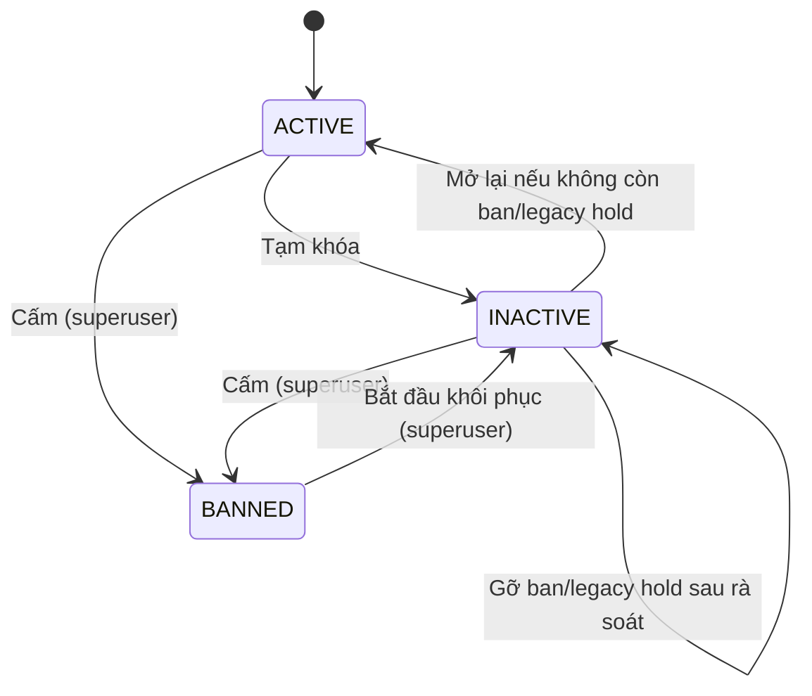

# Account status enforcement — thiết kế dữ liệu và bất biến

## 1. Mục tiêu

Trạng thái tài khoản là một lớp kiểm soát truy cập, không phải trạng thái nghiệp
vụ của chiến dịch, tin tuyển dụng, CV hay hồ sơ ứng tuyển. Vì vậy workflow quản
trị **không ghi đè** `RecruitmentCampaign.status`, `Job.status` hoặc
`Application.status` chỉ vì tài khoản bị khóa/cấm.

Hai tài nguyên recruiter-owned có lớp phủ `policy_hold`:

| Giá trị | Ý nghĩa | Cách gỡ |
| --- | --- | --- |
| `temporary_lock` | Tạm ẩn do tài khoản bị tạm khóa | Tự gỡ khi mở lại |
| `ban_review` | Giữ sau khi cấm để rà soát thủ công | Workflow gỡ hold riêng |
| `legacy_lock` | Backfill fail-closed cho dữ liệu khóa cũ | Workflow gỡ hold riêng |
| rỗng | Không bị giữ bởi account policy | Không áp dụng |

`AccountStatusTransition` lưu actor, quyết định, evidence, snapshot tác động và
kết quả. Bản ghi không chứa token, OTP, mật khẩu, OAuth profile hoặc MFA secret.

## 2. State machine

Không có cạnh `BANNED → ACTIVE`. Quy trình bắt buộc là:

1. `BANNED → INACTIVE`;
2. rà soát tài nguyên;
3. gỡ `ban_review`/`legacy_lock`;
4. `INACTIVE → ACTIVE`.

## 3. Bất biến theo vai trò

### Nhà tuyển dụng

- Tạm khóa/cấm chỉ ảnh hưởng recruiter mục tiêu; công ty và recruiter khác giữ
  nguyên.
- Tin/chiến dịch chưa kết thúc được gắn hold; trạng thái gốc giữ nguyên.
- Public job selector yêu cầu đồng thời job, campaign, poster và campaign owner
  đều khả dụng; mọi đường public/saved/tracking dùng cùng selector.
- Mọi mutation recruiter-owned khóa `User` trước rồi mới khóa resource để đóng
  race với thao tác quản trị.

### Ứng viên

- CV, version snapshot và application được giữ nguyên.
- Khi ứng viên không còn active, nhà tuyển dụng không được đưa hồ sơ tiến lên
  pipeline; chỉ được chuyển sang `rejected`.
- API employer trả `candidate_account_status` và
  `candidate_account_restricted` để giao diện cảnh báo rõ.

### Thông tin xác thực

- Mọi chuyển sang `inactive`/`banned` tăng `auth_revision`, revoke session/JWT/
  refresh, hủy password-reset/MFA/verification email job cũ và xóa artifact
  xác thực tạm.
- Verification link bị consume fail-closed khi tài khoản không active.
- Email thông báo trạng thái dùng outbox transactional và không chứa reason hay
  evidence nội bộ.

## 4. Preview/confirm

Impact token bind:

- input đã chuẩn hóa;
- trạng thái, `auth_revision`, `updated_at`;
- số phiên;
- histogram status/hold của tài nguyên theo vai trò;
- số CV/application/candidate bị tác động;
- global admin audit revision.

Confirm khóa user và resource, tính lại snapshot rồi mới decode token. Mọi thay
đổi giữa preview/confirm trả 409 và giao diện chỉ tải lại preview, không tự
confirm.
