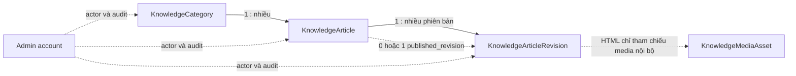

# Đặc tả chức năng FAQ và hướng dẫn sử dụng

> Trạng thái: **Đang triển khai — KB-P0 đến KB-P2 hoàn tất**
>
> Phạm vi ưu tiên: **Cổng ứng viên, public help center và workspace quản trị**
>
> Ngày lập: **2026-08-05**
>
> Phiên bản quyết định: **1.0**
>
> Nguồn quyết định: [Biên bản chatbot local](../02-tong-quan/chatbot-local-decision-log.md)
>
> Nguồn tham khảo UX: [TopCV FAQ](https://www.topcv.vn/faqs/)

Tài liệu này tách chức năng FAQ/hướng dẫn khỏi kế hoạch chatbot để có thể xây
dựng, kiểm thử và đưa vào sử dụng độc lập trước. Kho nội dung sau khi hoàn thiện
sẽ trở thành một nguồn kiến thức đã kiểm duyệt cho chatbot, nhưng chatbot, RAG,
embedding và `KnowledgeChunk` **không nằm trong release FAQ đầu tiên**.

Không sao chép nguyên văn bài viết, hình ảnh, thương hiệu hoặc dữ liệu của
TopCV. Nguồn tham khảo chỉ được dùng để phân tích information architecture và
trải nghiệm sử dụng.

### Nhật ký rà soát triển khai 2026-08-05

- Đã đối chiếu trực tiếp trang danh sách và trang chi tiết TopCV: giữ mô hình
  sidebar + search + card câu hỏi + điều hướng kế tiếp, nhưng dùng shell/màu và
  nội dung riêng của ProCV như đặc tả.
- RBAC của repo là catalogue do code sở hữu. Vì vậy permission knowledgebase
  được thêm đồng thời vào registry, dependency map, role matrix và data
  migration để lệnh sync không vô hiệu hóa grant sau deploy.
- Media abstraction chung chấp nhận GIF cho các domain cũ; knowledgebase đã
  khóa riêng JPEG/PNG/WebP và lưu width/height đã xác minh ở service upload.
- Sanitizer giàu nội dung đã được chuyển từ ownership của blog sang
  `common/content_html.py`; blog dùng lại policy tương thích, knowledgebase dùng
  policy HTTPS/internal chặt hơn. Đây là thay đổi kiến trúc đã dự kiến ở mục 8.7.

## 1. Vấn đề hiện tại

Dự án chưa có help center thật:

- nút “Hướng dẫn tìm việc an toàn” và “Các câu hỏi thường gặp” trong
  `FloatingActions` chỉ báo “Nội dung sẽ sớm ra mắt”;
- mục “Hướng dẫn viết CV” trên header cũng đang ở trạng thái sắp ra mắt;
- `candidate-assistant` chỉ có một kịch bản trả lời mẫu viết cứng ở frontend;
- backend chưa có app, model hoặc API cho FAQ/hướng dẫn đã kiểm duyệt.

Vì vậy không được coi kịch bản mẫu, tài liệu kỹ thuật trong `docs/` hoặc nội
dung của website khác là kho kiến thức chính thức của ProCV.

## 2. Mục tiêu

1. Cung cấp một trung tâm trợ giúp công khai cho khách và ứng viên.
2. Cho phép duyệt nội dung theo chuyên mục, tìm câu hỏi và đọc bài chi tiết.
3. Cho quản trị viên soạn, gửi duyệt, duyệt, xuất bản và lưu trữ nội dung.
4. Giữ lịch sử phiên bản; bản đang xuất bản không bị thay đổi khi bản sửa mới
   còn là nháp hoặc đang chờ duyệt.
5. Chỉ trả nội dung đã duyệt và đang xuất bản qua public API.
6. Tạo nguồn dữ liệu gốc có chất lượng để chatbot sử dụng trong giai đoạn sau.
7. Giữ chức năng trong Django monolith hiện tại, không tạo project hoặc service
   triển khai riêng.

### 2.1. Công nghệ chốt cho chức năng

| Phần | Công nghệ/quyết định |
| --- | --- |
| Backend | Django + Django REST Framework, app `apps.knowledgebase` trong monolith |
| Database | PostgreSQL hiện tại; relational model + `unaccent`, chưa dùng vector |
| Search MVP | `common.db.search.search_q` trên title/plain text đã publish |
| Nội dung | TipTap/RichTextEditor hiện có, sanitized HTML + plain text dẫn xuất |
| Media | storage abstraction và Pillow qua `common.media_storage` hiện có |
| Frontend | React, React Router, TanStack Query, Ant Design theo FSD hiện tại |
| Bảo mật render | sanitize backend + DOMPurify frontend |
| Test | pytest/DRF, Vitest/Testing Library và Playwright |

Không tách thành project/microservice riêng. FAQ cần dùng chung admin RBAC,
account audit, site settings, media storage, PostgreSQL và frontend shell; tách
service ở giai đoạn này chỉ tăng cấu hình, auth/network failure và đồng bộ dữ
liệu mà chưa đem lại lợi ích vận hành. Ranh giới app/module và public service là
đủ để có thể tách sau này nếu thật sự xuất hiện nhu cầu scale độc lập.

Các endpoint `/api/knowledgebase/...` trong tài liệu là API **nội bộ** giữa
React và Django cùng chạy local, không phải API AI/cloud trả phí. FAQ hoạt động
không cần Ollama, Internet hoặc API key bên ngoài.

## 3. Ngoài phạm vi release đầu tiên

- Chatbot, Ollama, prompt, tool calling và streaming chat.
- Embedding, pgvector, `KnowledgeChunk`, semantic search và RAG.
- Help center cho nhà tuyển dụng hoặc quản trị viên sử dụng như người đọc.
- Cá nhân hóa bài viết theo CV, hồ sơ, việc đã lưu hoặc lịch sử ứng tuyển.
- Bình luận, đánh giá bài viết, ticket hỗ trợ hoặc live chat.
- Sao chép nội dung FAQ từ TopCV hoặc bất kỳ website bên thứ ba nào.
- Tự động xuất bản nội dung do AI sinh ra.

## 4. Điều học từ trang tham khảo

Trang FAQ của TopCV hiện sử dụng:

- cột chuyên mục bên trái và nội dung bên phải trên desktop;
- ô tìm kiếm câu hỏi đặt ở đầu danh sách;
- mỗi chuyên mục có một trang danh sách câu hỏi riêng;
- mỗi câu hỏi mở thành một trang chi tiết có breadcrumb, chuyên mục, ngày cập
  nhật, nội dung có ảnh và liên kết tới câu tiếp theo;
- trang chi tiết vẫn giữ danh sách chuyên mục/câu hỏi ở cột bên để chuyển nhanh.

ProCV nên học cách tổ chức thông tin trên, nhưng cần điều chỉnh:

- chỉ tạo chuyên mục tương ứng với tính năng ProCV thật sự đang có;
- dùng header/footer và hệ thống màu của ProCV;
- mobile không giữ sidebar dài; thay bằng select hoặc danh sách chip chuyên mục;
- nội dung và ảnh hướng dẫn phải được đội dự án tự biên soạn, kiểm chứng;
- public route nằm trong `MainLayout` hiện tại thay vì tạo một shell mới.

Nguồn đối chiếu:

- [Trang tổng hợp FAQ TopCV](https://www.topcv.vn/faqs/)
- [Ví dụ chuyên mục tìm việc và ứng tuyển](https://www.topcv.vn/faqs/find-job-and-apply/)
- [Ví dụ chuyên mục tìm việc an toàn](https://www.topcv.vn/faqs/find-a-safe-job/)
- [Ví dụ trang chi tiết](https://www.topcv.vn/faqs/account-setting/toi-gap-loi-khi-xac-thuc-tai-khoan.html)

## 5. Phạm vi UX đã chốt

### 5.1. URL public — đã chốt

URL canonical đã được xác nhận:

| Màn hình | URL |
| --- | --- |
| Trang help center | `/tro-giup` |
| Danh sách theo chuyên mục | `/tro-giup/:categorySlug` |
| Chi tiết bài viết | `/tro-giup/:categorySlug/:articleSlug` |

Không dùng route catch-all ở root và không đặt dưới `/blog`, vì FAQ/hướng dẫn là
nội dung hỗ trợ sản phẩm, khác với cẩm nang nghề nghiệp.

### 5.2. Trang help center và chuyên mục

Desktop dùng bố cục hai cột:

- cột trái: tiêu đề “Chuyên mục”, danh sách category, active state rõ ràng;
- cột phải: ô tìm kiếm, tên category hoặc tiêu đề help center, danh sách article;
- mỗi item hiển thị tiêu đề, loại `FAQ`/`GUIDE` khi cần và affordance mở chi tiết;
- URL là nguồn chuẩn cho category, từ khóa tìm kiếm và page.

Mobile/tablet:

- ô tìm kiếm nằm đầu trang;
- category hiển thị bằng select hoặc chip cuộn ngang;
- danh sách một cột, touch target tối thiểu 44 px;
- không tạo sidebar cao hơn nội dung và không gây cuộn ngang.

Trạng thái bắt buộc:

- loading skeleton;
- không có nội dung trong category;
- không có kết quả tìm kiếm;
- lỗi tải dữ liệu có nút thử lại;
- payload có item lỗi chỉ bỏ item đó, không làm hỏng toàn trang.

### 5.3. Trang chi tiết

Trang chi tiết gồm:

1. breadcrumb `Trợ giúp > Chuyên mục > Tiêu đề`;
2. tiêu đề bài viết;
3. badge chuyên mục, loại nội dung và ngày cập nhật của revision đang xuất bản;
4. nội dung đã sanitize, hỗ trợ heading, đoạn văn, danh sách, liên kết và ảnh;
5. khối bài liên quan hoặc bài trước/sau trong cùng chuyên mục;
6. CTA liên hệ hỗ trợ lấy từ site settings hiện có khi bài viết chưa giải quyết
   được vấn đề.

Không hiển thị tên nội bộ, revision nháp, ghi chú kiểm duyệt hoặc thông tin tài
khoản quản trị ở public page.

### 5.4. Tìm kiếm

Release đầu tiên dùng tìm kiếm server-side trên nội dung đang xuất bản:

- tìm theo `title` và `body_plain_text` của revision đang publish;
- dùng `common.db.search.search_q`, vì dự án đã có PostgreSQL `unaccent` và cơ
  chế tìm không phân biệt dấu/hoa thường theo từng token;
- trim, gộp khoảng trắng; từ khóa tối thiểu 2 và tối đa 120 ký tự;
- frontend debounce **300 ms** và hủy request cũ khi người dùng tiếp tục gõ;
- phân trang ở backend;
- sắp xếp xác định theo `category.order`, `article.order`, tiêu đề và
  `public_id`; không hứa hẹn xếp hạng độ liên quan trong MVP;
- không dùng embedding hoặc gọi Ollama trong chức năng tìm kiếm đầu tiên.

Không thêm PostgreSQL full-text, trigram hoặc search engine riêng trong release
đầu. Chỉ nâng cấp sau khi có bộ truy vấn benchmark và bằng chứng tìm kiếm hiện
tại không đạt yêu cầu.

## 6. Taxonomy nội dung ban đầu — đã chốt

Seed đúng bảy category đã được chủ dự án xác nhận:

| Thứ tự | Chuyên mục / slug canonical | Phạm vi bài viết | Chu kỳ xác minh |
| ---: | --- | --- | ---: |
| 1 | Tài khoản và đăng nhập<br>`tai-khoan-va-dang-nhap` | đăng ký, xác thực email, đăng nhập, quên mật khẩu, social login | 180 ngày |
| 2 | Bảo mật và quyền riêng tư<br>`bao-mat-va-quyen-rieng` | đổi mật khẩu, 2FA, bảo mật tài khoản, quyền riêng tư | 90 ngày |
| 3 | Tìm việc và gợi ý việc làm<br>`tim-viec-va-goi-y-viec-lam` | tìm kiếm, bộ lọc, xem tin, lưu việc, việc phù hợp | 180 ngày |
| 4 | Ứng tuyển và theo dõi hồ sơ<br>`ung-tuyen-va-theo-doi-ho-so` | cách ứng tuyển, chọn CV, xem việc đã ứng tuyển | 180 ngày |
| 5 | CV và mẫu CV<br>`cv-va-mau-cv` | chọn mẫu, tạo, sửa, lưu, xem và chia sẻ CV | 180 ngày |
| 6 | Tìm việc an toàn<br>`tim-viec-an-toan` | dấu hiệu bất thường, bảo vệ thông tin, cách liên hệ hỗ trợ | 90 ngày |
| 7 | Liên hệ hỗ trợ<br>`lien-he-ho-tro` | hotline, Zalo và các kênh hỗ trợ đã cấu hình | 90 ngày |

Không tạo category về gói trả phí, quà tặng, nhóm cộng đồng hoặc tính năng chưa
tồn tại chỉ vì trang tham khảo có các category đó.

## 7. Quy tắc biên soạn nội dung

Mỗi article phải đáp ứng:

- mô tả đúng hành vi đang chạy trong dự án;
- dùng tên nút, route và thuật ngữ giống giao diện hiện tại;
- có `source_reference` trỏ tới route, đặc tả, test hoặc owner đã kiểm chứng;
- không hứa hẹn tính năng chưa triển khai;
- không chứa token, email cá nhân, CV thật hoặc dữ liệu người dùng thật;
- ảnh minh họa phải thuộc ProCV, che dữ liệu cá nhân và có alt text;
- liên kết nội bộ dùng route canonical; liên kết ngoài chỉ dùng `https://`;
- bài liên quan đến an toàn phải nêu rõ ProCV không yêu cầu ứng viên chuyển tiền
  để được ứng tuyển;
- khi thay đổi luồng sản phẩm, owner phải cập nhật hoặc lưu trữ bài cũ.

FAQ nên trả lời một vấn đề cụ thể và ngắn gọn. GUIDE dùng khi cần nhiều bước,
ảnh hoặc nhiều nhánh xử lý. Không tách một quy trình dài thành quá nhiều FAQ chỉ
để tăng số lượng bài.

### 7.1. Quy tắc category và slug — đã chốt

- mỗi article thuộc **đúng một** category bắt buộc; FK dùng `PROTECT`;
- `slug` dùng trong URL và unique theo cặp `(category, slug)`;
- khi tạo article, slug sinh từ tiêu đề revision đầu, loại dấu tiếng Việt và tự
  thêm hậu tố `-2`, `-3` nếu trùng;
- trước lần publish đầu, người có `knowledgebase.manage` được sửa category,
  slug và loại article;
- sau lần publish đầu, category, slug và loại article bị khóa để tránh làm hỏng
  URL, bookmark và canonical; thay đổi cấu trúc phải là migration nội dung có
  redirect được phê duyệt riêng;
- category slug bị khóa khi category đã có article từng được publish;
- chỉ `order`, lifecycle và revision nội dung tiếp tục thay đổi bình thường.

### 7.2. Định dạng nội dung — đã chốt

`body` là **sanitized HTML** và là bản nội dung canonical. Backend sinh
`body_plain_text` cùng `content_hash` SHA-256 từ title + sanitized body đã chuẩn
hóa; hai field này không cho admin sửa trực tiếp. Hash dùng phát hiện lần lưu
không đổi và làm nền cho embedding sau này, nhưng chưa tạo embedding trong
release này.

Allowlist tối thiểu gồm heading `h2`–`h4`, đoạn văn, strong/emphasis, danh sách,
blockquote, code/pre, bảng, figure/caption, liên kết và ảnh. `h1` thuộc page,
không nằm trong body. Cấm script, iframe, style tùy ý, event handler, form và
URL scheme nguy hiểm. Liên kết chỉ nhận route nội bộ bắt đầu bằng `/`, `https`,
`mailto` hoặc `tel`; không nhận protocol-relative URL, URL chứa credentials,
`javascript:` hoặc `data:`.

Ảnh trong body chỉ được trỏ tới media đã upload vào chính hệ thống; không nhúng
ảnh ngoài để tránh tracking, link chết và nội dung không kiểm soát. Mỗi ảnh bắt
buộc có alt text có nghĩa, trừ ảnh trang trí được đánh dấu rõ là decorative.

## 8. Kiến trúc backend

### 8.1. App sở hữu

Tạo app `backend/apps/knowledgebase` trong Django monolith hiện tại, theo
ADR-0010:

```text
knowledgebase/
├── api/
│   ├── serializers/
│   └── views/
├── models/
├── selectors/
├── services/
├── tasks/
├── tests/
└── urls.py
```

Chiều phụ thuộc: `api → services/selectors → models`; `tasks → services`.
Public read chạy qua selector; mọi mutation và chuyển trạng thái chạy qua
service, không viết nghiệp vụ trong serializer/view.



### 8.2. Quy ước ID public

Không đưa database PK ra API và không tạo một chuẩn UUID riêng. Dùng helper
`common.public_id.generate_public_id` đang có của dự án:

| Model | Prefix | Ví dụ |
| --- | --- | --- |
| `KnowledgeCategory` | `kbc` | `kbc_a1b2c3d4e5f6` |
| `KnowledgeArticle` | `kba` | `kba_a1b2c3d4e5f6` |
| `KnowledgeArticleRevision` | `kbr` | `kbr_a1b2c3d4e5f6` |
| `KnowledgeMediaAsset` | `kbm` | `kbm_a1b2c3d4e5f6` |

`public_id` là bất biến, unique và indexed. API admin dùng public ID; public API
đọc article bằng cặp category/article slug.

### 8.3. `KnowledgeCategory` — model phẳng đã chốt

| Field | Contract |
| --- | --- |
| `public_id` | ID public prefix `kbc`, bất biến |
| `name` | tên hiển thị, tối đa 120 ký tự |
| `slug` | unique toàn bảng, tối đa 160 ký tự, dùng trong URL |
| `description` | mô tả ngắn, tối đa 300 ký tự, có thể trống |
| `order` | số nguyên không âm, thứ tự hiển thị |
| `is_active` | tắt category mà không xóa dữ liệu |
| `review_interval_days` | chu kỳ xác minh mặc định, từ 30 đến 365 ngày |
| `seo_title`, `seo_description` | metadata tùy chọn, có giới hạn độ dài |
| `revision_token` | optimistic concurrency cho admin mutation |
| timestamps | `created_at`, `updated_at` |

Category phẳng trong release đầu, không có `parent`. Article FK dùng `PROTECT`.
Không có hard-delete trong UI; category được deactivate sau khi kiểm tra ảnh
hưởng. Deactivate category đang có bài public là hành động xuất bản và cần
`knowledgebase.publish`, vì nó làm ẩn tất cả bài thuộc category. Public API chỉ
trả category active có ít nhất một article public.

Seed đúng bảy category ở mục 6 bằng data migration idempotent, ban đầu
`is_active=true` và đúng thứ tự/chu kỳ xác minh trong bảng. Category chưa có bài
public vẫn không xuất hiện ở public API. Migration không seed nội dung trả lời
và không ghi đè tên/thứ tự đã được admin chỉnh sau này.

### 8.4. `KnowledgeArticle` — bản ghi ổn định

| Field | Contract |
| --- | --- |
| `public_id` | ID public prefix `kba`, bất biến |
| `category` | FK bắt buộc tới `KnowledgeCategory`, `PROTECT` |
| `slug` | unique trong category, tối đa 180 ký tự, khóa sau lần publish đầu |
| `article_type` | `FAQ` hoặc `GUIDE`, khóa sau lần publish đầu |
| `order` | số nguyên không âm trong category |
| `lifecycle_state` | `ACTIVE` hoặc `ARCHIVED` |
| `published_revision` | FK nullable `SET_NULL` tới revision đang public |
| `revision_token` | optimistic concurrency cho article mutation |
| `review_due_at` | hạn xác minh lại nội dung; không tự động unpublish |
| `created_by`, `archived_by` | FK tài khoản nullable, `SET_NULL` |
| timestamps | created/updated, first/current published, archived |

Tiêu đề, body và SEO content không lưu lặp lại ở article.
`first_published_at` bất biến sau lần đầu; `current_published_at` cập nhật ở mỗi
lần publish/rollback và chỉ dùng vận hành. Ngày cập nhật hiển thị public lấy từ
`reviewed_at` của revision đang publish, nên rollback không giả vờ nội dung cũ
vừa được cập nhật. Khi publish, `review_due_at` lấy theo
`category.review_interval_days`; người publish được chọn hạn sớm hơn.
Quá hạn chỉ hiện cảnh báo/filter admin, không tự ẩn bài. Article không hard-delete
qua API quản trị.

Constraint bắt buộc:

- unique `(category, slug)`;
- check `order >= 0`;
- `published_revision` phải thuộc chính article và có status `APPROVED` — kiểm
  ở service trong transaction, vì database FK đơn không biểu diễn đủ điều kiện;
- nếu `lifecycle_state=ARCHIVED`, public selector luôn ẩn bài dù vẫn giữ pointer
  tới revision đã publish để có thể phục hồi chính xác.

### 8.5. `KnowledgeArticleRevision` — lịch sử nội dung

| Field | Contract |
| --- | --- |
| `public_id` | ID public prefix `kbr`, bất biến |
| `article` | FK tới article, `CASCADE` |
| `number` | tăng tuần tự, unique theo article |
| `status` | `DRAFT`, `IN_REVIEW`, `APPROVED`, `REJECTED` |
| `title` | tiêu đề/câu hỏi, tối đa 240 ký tự |
| `body` | sanitized HTML canonical |
| `body_plain_text` | text dẫn xuất để search, không cho client ghi |
| `content_hash` | SHA-256 của title + sanitized body canonical, không cho client ghi |
| `seo_title`, `seo_description` | metadata của revision, tùy chọn |
| `change_summary` | lý do thay đổi, bắt buộc khi sửa bài đã publish |
| `source_reference` | route, đặc tả, test hoặc owner đã kiểm chứng; chỉ admin |
| `review_note` | bắt buộc khi reject; chỉ admin |
| actor fields | created/submitted/reviewed/first published by, nullable `SET_NULL` |
| timestamps | created/updated/submitted/reviewed/first published |

Mỗi article chỉ có tối đa **một revision mở**, trong đó revision mở là `DRAFT`
hoặc `IN_REVIEW`; enforce bằng partial unique constraint. `number` được cấp
trong transaction có `select_for_update` trên article để không trùng khi hai
request tạo revision đồng thời.

Revision `APPROVED` và `REJECTED` là immutable. Muốn sửa revision bị reject hoặc
bài đang public phải tạo revision số mới, clone nội dung cũ rồi chỉnh. Có thể
publish lại một revision `APPROVED` cũ để rollback nội dung; hành động này vẫn
ghi audit và cập nhật `published_at` của lần phát hành tương ứng.

### 8.6. `KnowledgeMediaAsset` — ảnh hướng dẫn

Release đầu **có upload ảnh**, vì GUIDE cần screenshot. Model tối thiểu:

| Field | Contract |
| --- | --- |
| `public_id` | ID public prefix `kbm`, bất biến |
| `storage_key` | key trong storage, unique |
| `original_name`, `content_type`, `size_bytes` | metadata upload |
| `width`, `height` | kích thước sau xử lý |
| `default_alt_text` | alt gợi ý, có thể sửa khi chèn vào bài |
| `uploaded_by` | FK nullable `SET_NULL` |
| `created_at` | thời điểm upload |

Dùng `common.media_storage.save_image_upload` với thư mục
`knowledgebase/content`, chỉ nhận JPEG/PNG/WebP, tối đa **5 MB**, kích thước tối
đa **1600×1600**. Không nhận SVG, GIF hoặc ảnh remote trong release đầu. Backend
kiểm chữ ký file, không tin extension/MIME do client gửi.

Media không tự xóa khi revision thay đổi vì revision cũ phải còn render được.
Không cung cấp hard-delete trong MVP; công việc dọn file chỉ được thêm sau khi có
reference scan chắc chắn asset không được revision nào sử dụng.

### 8.7. Sanitization và renderer

Không import `apps.blog.services.content` từ knowledgebase. Khi triển khai, tách
allowlist HTML giàu nội dung thành module dùng chung
`backend/common/content_html.py`; blog và knowledgebase gọi helper chung, còn
policy riêng nếu có phải truyền bằng cấu hình rõ ràng. Sanitize tại service
trước khi ghi database, sinh plain text/hash từ chính kết quả đã sanitize và
validate mọi ảnh thuộc `KnowledgeMediaAsset` hợp lệ.

Frontend vẫn sanitize bằng `frontend/src/shared/lib/sanitize-html.js` trước khi
render để phòng thủ nhiều lớp và tái sử dụng
`frontend/src/shared/ui/RichTextEditor` ở admin. Entity knowledgebase sở hữu
renderer domain riêng; không import entity/feature blog.

### 8.8. Lifecycle revision và article

```text
Revision: DRAFT → IN_REVIEW → APPROVED
                           ↘ REJECTED

Article:  ACTIVE ⇄ ARCHIVED
                     │
                     └─ public luôn bị ẩn
```

- `manage`: tạo article/draft, sửa draft và submit;
- `review`: approve hoặc reject revision `IN_REVIEW`;
- `publish`: chọn revision `APPROVED` để publish, archive/restore article và
  activate/deactivate category có ảnh hưởng public;
- submit yêu cầu title/body/source hợp lệ; reject bắt buộc `review_note`;
- publish đổi `published_revision` trong transaction, tăng `revision_token` và
  xóa/invalidate public cache; publish article đang archived trả `409`, bắt buộc
  restore trước;
- archive chỉ ẩn public, không xóa pointer/revision; restore đưa article về
  `ACTIVE` và làm revision đã publish trước đó xuất hiện lại, nhưng không chọn
  hoặc tạo một revision mới;
- mutation với `revision_token` cũ trả `409 Conflict`, không tự retry;
- transition lặp lại hoặc sai trạng thái trả `409`, input thiếu/sai trả `400`.

### 8.9. Permission và ownership

Tái sử dụng RBAC admin hiện có:

| Permission | Khả năng |
| --- | --- |
| `knowledgebase.view` | xem article, revision, preview và audit |
| `knowledgebase.manage` | tạo article/category, sửa nháp, gửi duyệt |
| `knowledgebase.review` | duyệt hoặc từ chối revision |
| `knowledgebase.publish` | publish, rollback, archive/restore, đổi trạng thái public của category |

Seed role mặc định trong department `content-cv`:

- staff: `knowledgebase.view`, `knowledgebase.manage`;
- manager: cả bốn permission.

Đây là phân công theo vai trò, không gắn cứng tên một người. Một admin local có
thể giữ cả bốn quyền. Ứng viên/nhà tuyển dụng không truy cập admin API. Endpoint
admin dùng permission class của hệ thống hiện tại và khai báo permission chính
xác trên từng action; frontend chỉ hỗ trợ UX, backend là nguồn kiểm quyền cuối.

MVP không enforce `reviewer != author` vì hiện có thể chỉ có một admin local;
mọi action vẫn có audit. Khi có đội nội dung thật, có thể bật policy “bốn mắt”
cho category bảo mật/an toàn mà không đổi model revision hoặc permission names.

Mọi mutation ghi audit qua public service của app `accounts`: actor, action,
public ID, revision number/status và metadata nhỏ. Không ghi toàn bộ body,
`review_note`, query tìm kiếm thô hoặc dữ liệu nhạy cảm vào audit/log.

## 9. API contract đã chốt

### 9.1. Public API

| Method | Endpoint | Mục đích |
| --- | --- | --- |
| `GET` | `/api/knowledgebase/categories/` | category active có số bài public |
| `GET` | `/api/knowledgebase/articles/` | list/search/filter bài public |
| `GET` | `/api/knowledgebase/articles/:categorySlug/:articleSlug/` | chi tiết revision đang publish |

Query list đã chốt:

- `category`: category slug;
- `type`: `faq` hoặc `guide`;
- `q`: từ khóa;
- `page`, `page_size`; mặc định 20, tối đa 60 theo `StandardPagination`.

Public selector bắt buộc đồng thời:

- article chưa `ARCHIVED`;
- category đang active;
- `published_revision` khác null;
- revision hiện hành có status `APPROVED`.

Public response không trả actor, review note, source nội bộ, revision token hoặc
revision chưa publish. List query phải giữ số query phẳng theo số bản ghi và có
query-budget test.

Contract public tối thiểu:

- category: `public_id`, `name`, `slug`, `description`, `order`, `article_count`;
- article list: `public_id`, category tóm tắt, `slug`, `article_type`, `title`,
  `excerpt`, `order`, `updated_at`;
- article detail: các field list cộng `body`, SEO metadata, `published_at`,
  `updated_at` và tối đa 6 bài liên quan/trước-sau trong cùng category;
- `published_at` là lần article xuất bản đầu tiên; `updated_at` là thời điểm
  review revision đang hiển thị, không phải timestamp kỹ thuật của cache;
- `excerpt` sinh từ plain text, không nhận HTML từ client;
- timestamp là ISO-8601 có timezone; body không bao giờ trả unsanitized HTML.

Category/article không tồn tại, inactive hoặc không public đều trả cùng `404`
để không làm lộ draft. Query sai kiểu/độ dài trả `400`; page vượt phạm vi theo
contract pagination chung của dự án. Không dùng auth và không cá nhân hóa public
response trong release đầu.

Public GET có thể dùng `Cache-Control: public, max-age=60,
stale-while-revalidate=300` cùng `ETag`/`Last-Modified`. Publish, rollback,
archive/restore và category activation phải invalidate cache liên quan. Admin
API luôn `private, no-store`.

### 9.2. Admin API

| Method | Endpoint | Permission chính |
| --- | --- | --- |
| `GET/POST` | `/api/knowledgebase/admin/categories/` | view/manage |
| `GET/PATCH` | `/api/knowledgebase/admin/categories/:publicId/` | view/manage |
| `POST` | `/api/knowledgebase/admin/categories/reorder/` | manage |
| `POST` | `/api/knowledgebase/admin/categories/:publicId/activate/` | publish |
| `POST` | `/api/knowledgebase/admin/categories/:publicId/deactivate/` | publish |
| `GET/POST` | `/api/knowledgebase/admin/articles/` | view/manage |
| `GET/PATCH` | `/api/knowledgebase/admin/articles/:publicId/` | view/manage |
| `POST` | `/api/knowledgebase/admin/articles/reorder/` | manage |
| `GET/POST` | `/api/knowledgebase/admin/articles/:publicId/revisions/` | view/manage |
| `GET/PATCH` | `/api/knowledgebase/admin/articles/:publicId/revisions/:number/` | view/manage, PATCH chỉ draft |
| `POST` | `/api/knowledgebase/admin/articles/:publicId/revisions/:number/submit/` | manage |
| `POST` | `/api/knowledgebase/admin/articles/:publicId/revisions/:number/approve/` | review |
| `POST` | `/api/knowledgebase/admin/articles/:publicId/revisions/:number/reject/` | review |
| `POST` | `/api/knowledgebase/admin/articles/:publicId/publish/` | publish |
| `POST` | `/api/knowledgebase/admin/articles/:publicId/archive/` | publish |
| `POST` | `/api/knowledgebase/admin/articles/:publicId/restore/` | publish |
| `GET/POST` | `/api/knowledgebase/admin/media/` | view/manage |

Admin article list nhận `category`, `type`, `lifecycle`, `revision_status`,
`review_due`, `q`, `ordering`, `page`, `page_size`. Ordering whitelist gồm
`title`, `category`, `article_type`, `lifecycle_state`, `updated_at`,
`review_due_at`, `order` và dạng giảm dần có prefix `-`; mặc định category/order
ổn định. Giá trị ngoài whitelist trả `400`, không bỏ qua âm thầm.
`review_due` chỉ nhận `overdue` hoặc `due_soon` (30 ngày tới); bỏ query để xem
mọi hạn review.

Create article nhận category/type/title/body/source và tạo article + revision 1
trong một transaction. PATCH article không nhận title/body. PATCH revision chỉ
nhận field nội dung được phép và bắt buộc gửi `revision_token` hiện tại. Publish
nhận `revision_number` cùng `revision_token`; không mặc định publish revision mới
nhất. Category reorder gửi toàn bộ category ID; article reorder gửi toàn bộ
article ID trong một category. Cả hai được validate không thiếu/trùng/cross-scope
ID và chạy transaction.

Preview admin lấy revision cụ thể qua API có permission, không tạm publish để
xem trước. Media POST dùng multipart; response chỉ trả URL nội bộ cùng metadata
đã xác minh. Không tạo endpoint giả trước khi service tương ứng hoàn thiện.

### 9.3. Error và concurrency contract

- `400`: validation, HTML/link/media không hợp lệ, reject thiếu lý do;
- `401`: chưa đăng nhập admin;
- `403`: thiếu permission;
- `404`: public ID/slug không tồn tại hoặc resource không được phép nhìn thấy;
- `409`: stale `revision_token`, revision mở đã tồn tại hoặc transition sai;
- `413`: upload vượt giới hạn;
- `429`: vượt throttle.

Error body dùng chuẩn lỗi chung của dự án; OpenAPI phải có ví dụ cho `400`, `403`
và `409`. Frontend không tự retry mutation. Khi gặp `409`, giữ nội dung editor,
thông báo có thay đổi mới trên server và cho người dùng chủ động tải lại/đối
chiếu.

## 10. Kiến trúc frontend đã chốt

Phải đọc và tuân thủ `frontend/ARCHITECTURE.md` trước khi triển khai.

Ownership đã chốt:

```text
app/router
  → pages/main/help-center
    → widgets/help-center-browser, widgets/help-article-detail
      → features/search-knowledge-articles
      → entities/knowledgebase

app/router
  → pages/admin/app/KnowledgeBase, KnowledgeArticleEditor
    → widgets/admin-knowledgebase-management
      → features/edit-knowledge-revision
      → features/manage-knowledge-category
      → features/review-knowledge-revision
      → features/publish-knowledge-article
      → entities/knowledgebase, entities/admin-access
```

Quy tắc:

- page chỉ compose và lấy route/search params;
- `entities/knowledgebase` là một slice domain duy nhất, sở hữu DTO, API/query
  key, path builder, formatter và renderer sanitized dùng chung; không tách
  category/article thành hai entity vì kiến trúc cấm import chéo entity;
- feature sở hữu hành động người dùng và không import feature khác;
- widget compose nhiều feature/entity;
- route public/admin đăng ký qua lazy registry tương ứng, không import page trực
  tiếp vào `AppRouter`;
- admin route phải theo thứ tự `AuthGuard` rồi `RoleGuard` và backend vẫn là
  nguồn kiểm quyền cuối.

Route quản trị canonical:

| Màn hình | URL |
| --- | --- |
| Danh sách/category | `/admin/app/knowledgebase` |
| Tạo bài | `/admin/app/knowledgebase/new` |
| Editor/lịch sử | `/admin/app/knowledgebase/:publicId` |

Route admin yêu cầu role admin và `knowledgebase.view`; mutation kiểm permission
chi tiết tại action. Danh sách dùng URL làm nguồn chuẩn cho `category`, `type`,
`lifecycle`, `revision_status`, `q`, `ordering`, `page` và `page_size`. Public
list dùng path cho category, còn `q`, `type`, `page` ở query string. Đổi filter
đưa page về 1; back/forward phải phục hồi đúng state.

Tái sử dụng `shared/ui/RichTextEditor`, sanitizer, API client, loading/error
component hiện có. Không copy editor blog, không deep-import nội bộ blog và
không đưa logic knowledgebase xuống `shared`. Route public/admin phải lazy-load;
ảnh rich content có `loading=lazy`, giới hạn kích thước và không gây layout
shift/overflow.

Sau khi public help center hoạt động:

- nút FAQ trong `FloatingActions` điều hướng tới `/tro-giup`;
- nút hướng dẫn tìm việc an toàn điều hướng tới category tương ứng;
- mục hướng dẫn viết CV điều hướng tới category CV;
- không giữ toast “Nội dung sẽ sớm ra mắt” cho các link đã có dữ liệu public.

## 11. Workspace quản trị

Màn hình quản trị tối thiểu gồm:

1. bảng article với filter category, type, lifecycle và trạng thái revision mới;
2. tạo article và revision nháp;
3. rich-text editor, media library/upload, preview desktop/mobile và kiểm tra
   link/alt text;
4. gửi duyệt;
5. màn hình review có diff với revision đang publish;
6. approve/reject, reject bắt buộc nhập lý do;
7. publish revision đã duyệt;
8. archive article;
9. xem lịch sử revision và audit event;
10. quản lý category và thứ tự hiển thị.

Autosave không nằm trong MVP để tránh ghi đè/concurrency khó hiểu. Editor có
trạng thái dirty, cảnh báo khi rời trang, nút lưu rõ ràng và giữ bản nhập local
tạm thời khi request lỗi; dữ liệu tạm không được coi là revision server. Khi
save thành công mới cập nhật `revision_token`.

Diff review so sánh title/body plain text với revision đang publish gần nhất;
preview dùng chính renderer của entity và dữ liệu revision được API trả về.
Mọi cột dữ liệu trong bảng admin có sorter; sort/pagination chạy server-side.
Action kéo reorder là ngoại lệ không có sorter và chỉ bật trong phạm vi một
category.

Editor không được tự publish chỉ vì có quyền manage. UI ẩn/disable action theo
permission để dễ dùng, nhưng API phải kiểm quyền độc lập cho mọi mutation.

## 12. SEO, accessibility và public readiness

### 12.1. SEO rollout

Help center là public content nhưng release đầu rollout **`noindex, nofollow`**
cho tới khi qua content readiness gate. Vẫn xây đúng SEO shell ngay từ đầu:

- backend knowledgebase resolve metadata động qua `common/seo.py` cho
  `/tro-giup`, category và article detail;
- canonical tuyệt đối, title/description, Open Graph và `BreadcrumbList`;
- article dùng `WebPage` hoặc `Article`; không dùng `FAQPage` schema nếu trang
  không hiển thị đầy đủ một danh sách hỏi–đáp theo yêu cầu schema;
- 404 trả HTTP 404 thật và `noindex`, không chỉ render React NotFound;
- sitemap riêng `/sitemaps/knowledgebase.xml`, được thêm vào sitemap index khi
  bật index;
- reverse proxy phải route ba pattern `/tro-giup` qua SEO shell; SPA fallback
  không được coi là trang indexable.

Chỉ bật `index,follow` khi: cả bảy category active có ít nhất một bài approved,
toàn bộ bài an toàn đã review, không có link/ảnh lỗi, metadata/canonical đúng và
SEO regression pass. Bật/tắt index là rollout configuration, không sửa từng row.

### 12.2. Accessibility

- một `h1` mỗi page; body bắt đầu từ `h2`;
- sidebar/category control có label và active state cho screen reader;
- search có label, trạng thái số kết quả và thông báo cập nhật qua live region
  không gây spam khi đang gõ;
- toàn bộ action dùng keyboard, focus visible, thứ tự focus hợp lý;
- ảnh có alt; màu/badge không phải tín hiệu trạng thái duy nhất;
- touch target tối thiểu 44 px và hỗ trợ `prefers-reduced-motion`;
- nội dung zoom 200% vẫn đọc được, không tràn ngang ở mobile 320 px.

## 13. Nội dung khởi tạo đề xuất

Không seed câu trả lời giả. Trước khi viết bài, lập checklist xác minh với route
và hành vi thật. Backlog câu hỏi ban đầu có thể gồm:

### Tài khoản và đăng nhập

- Làm thế nào để đăng ký tài khoản ứng viên?
- Tôi chưa nhận được email xác thực thì làm gì?
- Làm thế nào để đặt lại mật khẩu?
- Tôi có thể đăng nhập bằng tài khoản mạng xã hội không?

### Bảo mật và quyền riêng tư

- Làm thế nào để đổi mật khẩu?
- Làm thế nào để bật xác thực hai lớp?
- Tôi nên làm gì khi nghi ngờ tài khoản bị truy cập trái phép?

### Tìm việc và gợi ý việc làm

- Làm thế nào để tìm việc theo địa điểm và từ khóa?
- Làm thế nào để lưu một tin tuyển dụng?
- Danh sách việc làm phù hợp được sử dụng như thế nào?

### Ứng tuyển và theo dõi hồ sơ

- Làm thế nào để ứng tuyển một công việc?
- Tôi chọn CV nào khi ứng tuyển?
- Tôi xem lại các công việc đã ứng tuyển ở đâu?

### CV và mẫu CV

- Làm thế nào để chọn mẫu và tạo CV?
- CV được lưu và quản lý ở đâu?
- Làm thế nào để xem hoặc chia sẻ CV?

### Tìm việc an toàn

- Dấu hiệu nào cho thấy tin tuyển dụng có thể không an toàn?
- Tôi nên làm gì khi bị yêu cầu chuyển tiền để ứng tuyển?

### Liên hệ hỗ trợ

- Tôi liên hệ ProCV qua kênh nào khi cần hỗ trợ?
- Tôi cần cung cấp thông tin gì để được hỗ trợ nhanh hơn?
- Tôi có thể gửi góp ý về sản phẩm ở đâu?

Mỗi câu trên chỉ được publish sau khi câu trả lời đã được kiểm chứng trên phiên
bản hệ thống hiện tại và được người có quyền review phê duyệt.

## 14. Thứ tự triển khai đã khóa

Mỗi phase phải chạy test theo phạm vi và có thể review độc lập; không gom toàn
bộ chức năng vào một thay đổi lớn.

| Giai đoạn | Kết quả bàn giao | Điều kiện qua phase |
| --- | --- | --- |
| `KB-P0` | Đặc tả này; route, taxonomy, body, search, media, RBAC và SEO đã chốt | **Hoàn tất 2026-08-05** |
| `KB-P1` | app skeleton, common HTML sanitizer, models/migrations, 7 category, permissions/role mapping | **Hoàn tất 2026-08-05** — targeted test và import-linter pass |
| `KB-P2` | services/selectors, workflow revision, media upload, admin API, audit và OpenAPI | **Hoàn tất 2026-08-05** — 22 targeted/regression tests, permission/concurrency/query-budget pass |
| `KB-P3` | entity/features/widgets/pages admin, editor, preview, diff và media library | workflow admin E2E pass |
| `KB-P4` | public API/search/cache + ba public page `/tro-giup` và SEO shell `noindex` | public leak/404/accessibility/SEO tests pass |
| `KB-P5` | nội dung ProCV thật, review đủ bảy category và nối các placeholder hiện có | content readiness checklist pass |
| `KB-P6` | hardening, observability, sitemap/index rollout, runbook và rollback rehearsal | toàn bộ Definition of Done đạt |
| `KB-AI` | chunking, embedding, pgvector và tích hợp chatbot | chỉ bắt đầu sau `KB-P6` |

Chưa code gì trong `KB-P0`. Bước code tiếp theo duy nhất là `KB-P1`; không triển
khai frontend trước model/contract và không triển khai `KB-AI` sớm.

## 15. Bảo mật, vận hành và rollout

### 15.1. Security/privacy

- public endpoint dùng `AllowAny` có chủ đích và `ClientIPScopedRateThrottle`
  scope `knowledgebase_public`, khởi điểm `120/min` mỗi client IP;
- admin endpoint dùng auth/RBAC hiện có, CSRF/cookie policy hiện có và `no-store`;
- search không thực thi SQL thô; ordering/filter phải whitelist;
- không ghi raw `q` vào log/analytics vì người dùng có thể nhập email, số điện
  thoại hoặc dữ liệu cá nhân; chỉ ghi độ dài/bucket, có-kết-quả và latency;
- upload kiểm chữ ký, kích thước, pixel dimensions và storage path; filename do
  người dùng gửi không được dùng trực tiếp làm path;
- sanitize ở write boundary và render boundary; không dùng `dangerouslySetInnerHTML`
  với dữ liệu chưa qua renderer của entity;
- backup/restore database và media phải giữ đồng bộ; revision/audit không có
  hard-delete trong release đầu.

### 15.2. Content maintenance

Admin dashboard có filter “sắp đến hạn/quá hạn xác minh”. Quá hạn không tự
unpublish vì có thể làm mất toàn bộ hướng dẫn khi chưa có bản thay thế, nhưng
manager phải review:

- bài bảo mật/tìm việc an toàn/liên hệ hỗ trợ: tối đa mỗi 90 ngày;
- bài khác: tối đa mỗi 180 ngày, theo cấu hình category ở mục 6;
- khi route, copy nút, auth policy hoặc quy trình ứng tuyển thay đổi, PR thay
  đổi tính năng phải kèm kiểm tra các article có `source_reference` liên quan;
- sửa dù nhỏ vẫn tạo revision mới nếu bài đã publish;
- bài sai nghiêm trọng được archive ngay, sau đó sửa/duyệt/publish lại.

### 15.3. Feature switch và rollback

Backend setting `KNOWLEDGEBASE_PUBLIC_ENABLED` là nguồn chuẩn, mặc định `true`
ở local/test sau khi KB-P4 sẵn sàng và `false` ở production cho tới content
readiness. Public site-settings trả capability
`knowledgebase_public_enabled` để frontend ẩn/hiện link; không tạo thêm một env
flag frontend độc lập dễ lệch trạng thái.

Khi switch tắt:

- public API và SEO shell trả 404/noindex;
- frontend ẩn ba link entry và route direct hiển thị NotFound;
- admin workspace vẫn hoạt động để sửa nội dung;
- không xóa category, article, revision hoặc media.

Rollback release ưu tiên tắt switch và quay code; không reverse migration có
nguy cơ mất dữ liệu. Trước khi bật production phải diễn tập: bật → browse →
search → detail → tắt → xác nhận 404/noindex → bật lại và dữ liệu còn nguyên.

### 15.4. Observability

Theo dõi request count, error rate, latency public/admin, tỷ lệ search không có
kết quả, số bài active/archived/overdue và lỗi media. Metrics dùng category/loại
bài và mã lỗi; không dùng title/body/search query thô làm label. Alert production
chỉ được thêm khi có baseline thực tế; local dùng structured log và test.

## 16. Kiểm thử bắt buộc

### 16.1. Backend

- model check/unique/partial unique, prefix public ID và seed idempotent;
- cấp revision number đồng thời không trùng;
- mọi transition hợp lệ/không hợp lệ; approved/rejected immutable;
- publish/rollback/archive/restore transaction và stale revision token;
- category/slug/type khóa sau lần publish đầu;
- public selector không rò draft, rejected, archived, inactive category hoặc
  source/review/actor nội bộ;
- permission matrix cho bốn permission và role seed staff/manager;
- sanitize allowlist, URL scheme, ảnh remote, ảnh không thuộc media library;
- upload signature/MIME/size/dimensions và tên file nguy hiểm;
- search không dấu, nhiều token, min/max length, pagination và ordering ổn định;
- cache invalidation sau mọi thay đổi public;
- query-budget list/detail; số query không tăng theo số item;
- SEO status/title/canonical/robots/JSON-LD/sitemap;
- audit/log không chứa body, review note hoặc raw search query;
- feature switch fail-closed.

### 16.2. Frontend

- URL là nguồn chuẩn; back/forward và direct navigation phục hồi state;
- loading/empty/no-result/error/retry và hủy search request cũ;
- desktop hai cột, tablet/mobile một cột, 320 px không overflow;
- keyboard, focus, live region, landmark/heading và reduced motion;
- rich content sanitize, link an toàn, ảnh alt/lazy-load/broken-image;
- permission-aware action và server 403/409/413 handling;
- editor dirty guard, preview, diff, media upload và giữ input khi save lỗi;
- bảng admin sort/pagination server-side;
- regression cho ba placeholder được nối sang help center;
- E2E: public browse/search/detail/404 và admin
  draft→review→reject/new draft→approve→publish→rollback→archive→restore.

### 16.3. Content và SEO QA

- mỗi bài đối chiếu route/copy/hành vi thật và có `source_reference`;
- ảnh không chứa dữ liệu người dùng thật, có alt và hiển thị được;
- link checker không có link nội bộ 404 hoặc external HTTP;
- bài an toàn được manager duyệt riêng;
- title không trùng/khó phân biệt trong cùng category;
- canonical và sitemap chỉ chứa article public/indexable.

### 16.4. Lệnh kiểm tra

Backend:

```bash
cd backend
ruff check . && ruff format --check .
lint-imports
python manage.py makemigrations --check --dry-run
pytest --cov --cov-fail-under=84
```

Frontend:

```bash
cd frontend
npm run lint
npm run check:architecture
npm run test:coverage
npm run build
npm run test:e2e:smoke
```

Hoặc chạy toàn repo bằng `./scripts/check_all.sh`. Không tăng query budget,
whitelist kiến trúc hoặc bỏ test chỉ để làm gate xanh.

## 17. Definition of Done

Chức năng FAQ/hướng dẫn chỉ được xem là hoàn thiện khi:

- guest và candidate browse category, search và đọc detail bằng route canonical;
- chỉ revision approved/published xuất hiện public;
- admin workflow, concurrency và bốn permission hoạt động đúng;
- bài đang public không đổi khi revision mới còn draft/in-review/rejected;
- ảnh/nội dung render an toàn, responsive và accessible;
- link từ floating actions/header không còn placeholder;
- đủ ít nhất một bài đã kiểm duyệt trong mỗi category active;
- content freshness owner/hạn review nhìn thấy trong admin;
- API/OpenAPI, SEO shell, sitemap, tài liệu vận hành và test được cập nhật;
- backend/frontend quality gate theo phạm vi đều pass;
- đo/query budget không tăng tuyến tính theo số bài;
- kill switch và rollback rehearsal chứng minh không mất dữ liệu;
- production chỉ bật index sau content readiness gate.

## 18. Failure modes bắt buộc xử lý

| Tình huống | Hành vi |
| --- | --- |
| Public API lỗi | hiển thị lỗi gọn, giữ layout và cho thử lại |
| Category không tồn tại/inactive | trả 404, không fallback sang category khác |
| Article draft/rejected/archived | public API và SEO shell trả 404/noindex |
| Article/category đổi giữa hai request | response mới là nguồn chuẩn; query key invalidated |
| Revision token cũ | trả 409, giữ editor và cho đối chiếu/tải lại |
| Đã có revision mở | trả 409 và điều hướng tới revision đó |
| Reject không có lý do | trả 400 với field error |
| Publish revision không approved/không thuộc bài | trả 409, không đổi pointer |
| HTML/URL/media nguy hiểm | loại bỏ hoặc từ chối theo contract, không render thô |
| Upload quá lớn/sai định dạng | trả 413/400; không tạo asset DB hoặc file mồ côi |
| Ảnh public tải lỗi | giữ alt text, giới hạn khung và không vỡ layout |
| Search rỗng | trả danh sách theo category, không hiểu là lỗi |
| Search quá ngắn/dài | frontend không gửi hoặc backend trả 400 rõ field |
| Không có kết quả | trả danh sách rỗng cùng metadata pagination hợp lệ |
| Admin mất quyền giữa phiên | backend trả 403; frontend refresh access có kiểm soát |
| Cache/Redis lỗi | đọc DB trực tiếp hoặc cache fail-safe; không phục vụ draft cũ |
| Feature switch tắt | public 404/noindex, admin và dữ liệu vẫn nguyên |
| Nội dung quá hạn review | cảnh báo/filter admin, không tự unpublish |

## 19. Sổ quyết định KB-P0

| Chủ đề | Quyết định cuối |
| --- | --- |
| Vị trí hệ thống | app `knowledgebase` trong Django monolith, không project/service riêng |
| Public route | `/tro-giup`, category slug, category/article slug |
| Taxonomy | bảy category phẳng ở mục 6 |
| Quan hệ article | đúng một category; category/type/slug khóa sau publish đầu |
| ID | prefixed opaque public ID theo helper hiện có, không lộ PK |
| Nội dung | sanitized HTML canonical + plain text/hash dẫn xuất |
| Ảnh | upload nội bộ JPEG/PNG/WebP, 5 MB, 1600×1600, bắt buộc alt |
| Revision | một revision mở; approved/rejected immutable; hỗ trợ rollback |
| Search MVP | PostgreSQL unaccent qua helper hiện có, chưa full-text/vector |
| RBAC | content-cv staff biên tập; manager review/publish; local admin có thể đủ quyền |
| SEO | xây SEO shell nhưng noindex tới khi content readiness đạt |
| Dữ liệu seed | chỉ permission/role/category; không seed câu trả lời giả |
| Xóa dữ liệu | archive/deactivate; không hard-delete article/revision/media trong MVP |
| Rollout | một backend capability switch; frontend đọc capability từ server |

Không còn quyết định mở chặn code cho phạm vi KB-P1. Thay đổi một quyết định
trong bảng này phải cập nhật tài liệu trước, nêu migration/compatibility/redirect
và được review như thay đổi kiến trúc.

## 20. Hợp đồng nâng cấp sang chatbot/RAG

Release FAQ không tạo `KnowledgeChunk` hay embedding. Khi `KB-P6` hoàn tất,
knowledgebase mới bổ sung dữ liệu dẫn xuất theo nguyên tắc:

- `KnowledgeArticleRevision.body` đang publish là nguồn chuẩn duy nhất;
- chunk/embedding gắn với revision public ID, `content_hash`, embedding model và
  version thuật toán chunk để có thể rebuild/dedupe;
- publish/rollback/archive phát tác vụ reindex idempotent; index lỗi không làm
  mất hoặc sửa nội dung gốc;
- chatbot chỉ nhận article đang active, category active, revision approved và
  đang được publish;
- public read function được triển khai trong selector của knowledgebase và
  re-export qua `apps.knowledgebase.services.__init__` theo contract cross-app
  của ADR-0010; app `chatbot` không deep-import model, selector hoặc service nội
  bộ;
- source trả cho chatbot gồm title và URL canonical của article; không lộ
  `source_reference`, review note hoặc actor admin;
- embedding miễn phí/local đã chốt cho chatbot là `qwen3-embedding:0.6b` qua
  Ollama và vector lưu ở PostgreSQL/pgvector, nhưng đây là phase `KB-AI`, không
  phải phụ thuộc để FAQ/search thường hoạt động.

Nhờ ranh giới này, help center vẫn chạy được khi Ollama tắt; chatbot có thể nâng
cấp/rebuild index mà không đổi quy trình biên tập hay public URL.
