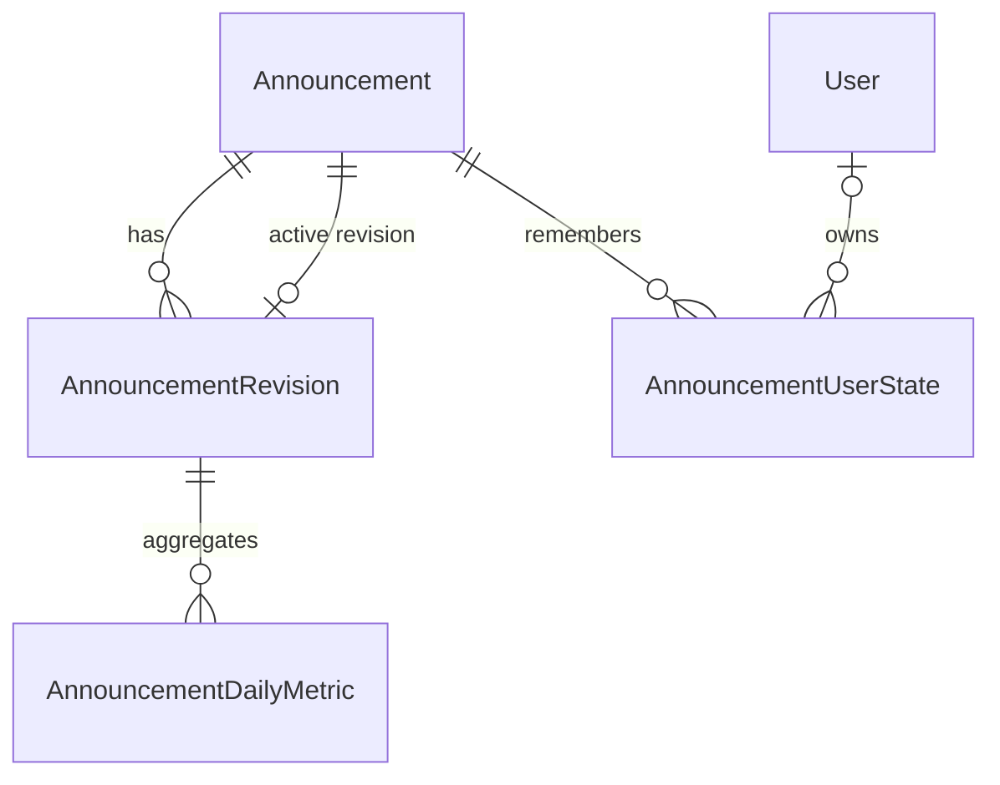
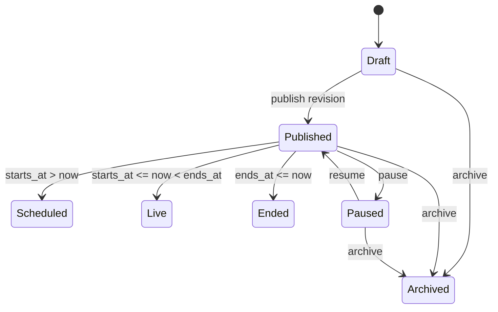

# Hệ thống thông báo chạy đa cổng

Trạng thái: **AN-P1 backend foundation đã triển khai; runtime UI bắt đầu ở AN-P2**
Epic theo dõi: `AN-P0` đến `AN-P6` trong
[`docs/TIEN-DO-DU-AN.md`](../TIEN-DO-DU-AN.md).

## 1. Mục tiêu

Hệ thống cung cấp đúng một dải thông báo sticky ngay dưới header cho bốn
surface:

- `candidate`: cổng ứng viên có header chính;
- `employer_marketing`: landing/marketing nhà tuyển dụng;
- `employer_workspace`: không gian làm việc nhà tuyển dụng;
- `admin_workspace`: không gian quản trị nội bộ.

Dải hợp nhất hai nguồn:

1. **Thông báo hệ thống theo trạng thái tài khoản**, ví dụ xác thực email,
   thỏa thuận xử lý dữ liệu hoặc nhu cầu công việc.
2. **Thông báo do quản trị viên phát hành**, có target, lịch, revision, CTA,
   animation, dismiss và đo hiệu quả.

Mục tiêu phát hành là không còn lỗi đã biết và mọi failure của remote feed phải
fail-safe: header, điều hướng và cảnh báo bảo mật cục bộ tiếp tục hoạt động.

## 2. Ngoài phạm vi

- Không xây hộp thư, notification center hoặc thông báo cá nhân theo từng user.
- Không gửi email, push notification hoặc WebSocket.
- Không hỗ trợ HTML/rich text, ảnh banner, video hoặc marquee chạy ngang.
- Không cho nhập regex route hoặc JavaScript URL.
- Không thay đổi URL, token/storage key, role/guard và payload hiện hữu.
- Không dùng analytics khi người dùng chưa cấp analytics consent.

## 3. Quyết định UX

### 3.1. Thứ tự ưu tiên

| Tier | Nguồn | Dismiss mặc định |
| ---: | --- | --- |
| 1 | Critical/sự cố toàn hệ thống | Không |
| 2 | Xác thực email/bảo mật | Không |
| 3 | Pháp lý/tuân thủ NTD | Không |
| 4 | Cảnh báo vận hành/bảo trì | Theo cấu hình |
| 5 | Nhu cầu công việc ứng viên | Snooze 7 ngày |
| 6 | Thông tin/sự kiện/tính năng/thành công | Có |

Chỉ tier cao nhất còn hợp lệ được hiển thị. Các mục cùng tier xếp theo
`priority` giảm dần, `starts_at` tăng dần rồi `public_id` tăng dần để kết quả
deterministic. Vì vậy cảnh báo xác thực email luôn thắng lời nhắc nhu cầu công
việc; chỉ critical được phép vượt cảnh báo xác thực.

### 3.2. Chuyển động và accessibility

- Animation mặc định là slide dọc kết hợp fade, mỗi mục 6 giây.
- Admin được chọn `slide`, `fade`, `static`; khoảng chạy hợp lệ 4–15 giây.
- Tự dừng khi hover, focus hoặc tab bị ẩn.
- Khi `prefers-reduced-motion: reduce`, strip dùng `static`; nếu có nhiều mục
  cùng tier thì hiển thị nút trước/sau có accessible name.
- Nội dung tự chuyển không dùng `aria-live`; thao tác thủ công mới thông báo
  trạng thái bằng vùng `polite`.
- Desktop giữ một dòng. Mobile tối đa hai dòng, CTA không làm document tràn
  ngang và không giảm touch target dưới 44px.
- Strip tự đo chiều cao bằng `ResizeObserver` và công bố CSS custom property
  cho workspace; không thêm phép trừ `100dvh` hard-code.

### 3.3. Nội dung và URL

Một revision có:

- message tiếng Việt bắt buộc và tiếng Anh tùy chọn;
- badge/CTA tiếng Việt bắt buộc theo ngữ cảnh và tiếng Anh tùy chọn;
- icon lấy từ allowlist code-owned;
- CTA URL tùy chọn.

Tiếng Anh thiếu sẽ fallback nguyên trường sang tiếng Việt. Nội dung là plain
text. URL nội bộ phải bắt đầu bằng một dấu `/`; URL ngoài chỉ nhận `https://`.
Client tự mở internal URL trong cùng tab và external URL trong tab mới với
`noopener noreferrer`. Các scheme `javascript:`, `data:`, URL protocol-relative
và URL chứa credential đều bị từ chối.

## 4. Kiến trúc dữ liệu



### 4.1. `Announcement`

| Field | Contract |
| --- | --- |
| `public_id` | Public ID bất biến, prefix `ann` |
| `internal_name` | Tên vận hành, không trả public feed |
| `lifecycle_state` | `draft`, `published`, `paused`, `archived` |
| `active_revision` | Revision đã được publisher promote |
| `dismissal_version` | Tăng có chủ đích khi cần hiện lại sau dismiss |
| `created_by`, `published_by` | FK nullable `SET_NULL` |
| timestamps | created/updated/published/paused/archived |

### 4.2. `AnnouncementRevision`

Revision đã từng publish là immutable ở service boundary. Mọi chỉnh sửa tạo
revision tăng tuần tự:

- nội dung song ngữ, badge, icon và CTA;
- `kind`: `critical`, `security`, `compliance`, `warning`, `maintenance`,
  `info`, `success`, `event`, `feature`;
- target surfaces, auth audiences, roles, include/exclude path prefixes;
- `starts_at`, `ends_at`, `priority`;
- `animation`, `display_seconds`;
- `dismiss_mode`: `locked`, `close`, `snooze`; `snooze_seconds`;
- tác giả, revision number và timestamps.

Mảng target/path lưu JSON nhưng được serializer/service chuẩn hóa và selector
lọc trên tập announcement active nhỏ; không phụ thuộc lookup JSON khác nhau
giữa PostgreSQL và SQLite.

### 4.3. `AnnouncementUserState`

Khóa duy nhất `(user, announcement, dismissal_version)`. `dismissed_at` hoặc
`snoozed_until` được ghi idempotent. Guest dùng local storage theo cùng
`public_id:dismissal_version`; không gửi định danh guest chỉ để dismiss.

### 4.4. `AnnouncementDailyMetric`

Khóa duy nhất `(announcement_revision, date, surface)`. Lưu tổng và unique cho
impression/click cùng số dismiss. Unique event được Redis dedupe theo
viewer–revision–event–ngày. Redis lỗi không làm request runtime fail và không
được ghi số liệu có nguy cơ đếm trùng.

## 5. Lifecycle và concurrency



`scheduled`, `live`, `ended` là presentation status được suy ra; database chỉ
lưu lifecycle state. Publish/pause/resume/archive chạy trong
`transaction.atomic()` và khóa `Announcement` bằng `select_for_update()`.
Mutation nhận revision token; token stale trả:

```json
{
  "code": "announcement_revision_stale",
  "detail": "Thông báo đã được thay đổi. Hãy tải lại và kiểm tra trước khi tiếp tục."
}
```

Không tự retry mutation. Publish critical yêu cầu `ends_at`; mọi lịch yêu cầu
`starts_at < ends_at` khi có cả hai. Thời gian lưu UTC, admin nhập và xem theo
`Asia/Ho_Chi_Minh`.

## 6. Targeting

Public request chỉ gửi `surface`, `path`, `locale`. Backend suy ra user, role và
authenticated state từ request; không nhận user ID hoặc role do client tự khai.

Path phải là absolute application path, tối đa 500 ký tự, bỏ query/hash trước
khi match. Include/exclude chỉ dùng normalized prefix có boundary segment:
`/viec-lam` khớp `/viec-lam` và `/viec-lam/...`, không khớp `/viec-lam-moi`.
Exclude luôn thắng include. Mảng include rỗng nghĩa là toàn surface.

`admin_workspace` chỉ trả dữ liệu cho admin authenticated.
`employer_workspace` chỉ trả cho employer authenticated. Marketing/candidate
có thể nhận target guest hoặc authenticated phù hợp.

## 7. API contract

Namespace giữ tiền tố sitecontent hiện hành:

- `GET /api/site/announcements/active/`
- `POST /api/site/announcements/events/`
- `PUT /api/site/announcements/{public_id}/state/`
- `GET/POST /api/site/admin/announcements/`
- `GET/PATCH /api/site/admin/announcements/{public_id}/`
- `POST /api/site/admin/announcements/{public_id}/revisions/`
- `POST /api/site/admin/announcements/{public_id}/{publish|pause|resume|archive|duplicate}/`
- `GET /api/site/admin/announcements/{public_id}/metrics/`

AN-P1 cung cấp active feed và toàn bộ API quản trị revision/lifecycle. Functional
state, event batch và metrics API được giữ ngoài URLconf đến AN-P4; không tạo
endpoint giả trả dữ liệu chưa được xử lý.

Public feed trả `200` với `items: []` khi không có dữ liệu. Dismiss/snooze dùng
`PUT` để idempotent. Event batch trả `202`; tracking best-effort không chặn CTA.
Chi tiết field được khóa trong
[`frontend-response-contracts.md`](../04-api/frontend-response-contracts.md).

## 8. Permission và audit

| Permission | Khả năng |
| --- | --- |
| `announcement.view` | list/detail/preview/revision/metrics |
| `announcement.manage` | tạo announcement và revision draft, duplicate |
| `announcement.publish` | publish/schedule/pause/resume/archive |

`announcement.manage` và `announcement.publish` phụ thuộc
`announcement.view`. Backend là nguồn kiểm quyền cuối. Mọi mutation gọi
`record_admin_action` qua public service của accounts; payload chỉ chứa public
ID, revision, lifecycle/diff metadata, không ghi cookie, token hoặc nội dung
nhạy cảm.

## 9. Failure modes

| Failure | Hành vi bắt buộc |
| --- | --- |
| Active feed timeout/5xx | Giữ system message; dùng cache in-memory còn hạn hoặc ẩn remote item |
| Payload item không hợp lệ | Bỏ riêng item, không làm hỏng strip |
| Redis lỗi | Bỏ analytics event; không chặn UI |
| Event 429/5xx | Không retry vô hạn, không chặn CTA |
| Revision stale | Trả 409, giữ editor mở và buộc reload preview |
| Permission đổi giữa phiên | Backend trả 403; frontend refresh access có cooldown |
| Schedule boundary | Refetch tại `next_transition_at`, khi focus và fallback 60 giây |
| Layout/ResizeObserver thiếu | Dùng chiều cao nội dung tự nhiên, không che main content |

Public feed personalized trả `Cache-Control: private, no-store`. React Query key
phải chứa surface, normalized path, locale và session identity boundary để
không tái sử dụng feed qua logout/login.

## 10. Analytics, consent và retention

- Chỉ record impression/click/dismiss metric khi analytics consent đang bật.
- Functional dismiss state không phụ thuộc analytics consent.
- Không lưu raw path, IP hoặc user-agent trong daily metric.
- Redis dedupe TTL kết thúc sau ngày đo; daily aggregates giữ theo policy vận
  hành chung. User state được xóa theo vòng đời tài khoản hoặc khi announcement
  bị hard-delete theo policy tương lai; v1 chỉ archive, không hard-delete.
- Admin report phải ghi rõ metric phụ thuộc consent và không đại diện toàn bộ
  người xem.

## 11. Rollout và rollback

1. Deploy migration/permission/API additive; chưa có active announcement.
2. Deploy unified strip sau cờ `announcement_strip_v2_surfaces`; surface chưa
   bật tiếp tục dùng banner hiện hành.
3. Bật admin → employer marketing → employer workspace → candidate.
4. `announcement_remote_enabled_surfaces` là kill switch lâu dài; tắt remote
   feed không tắt system security/compliance message.
5. Giữ compatibility một release. Cleanup legacy ở PR riêng sau khi full gate
   và staging ổn định.

Rollback application code không xóa permission, revision, audit hay metric.
Không reverse schema trên production chỉ để tắt giao diện; ưu tiên kill switch
và rollback code tương thích schema additive.

Migration AN-P1 là `accounts/0019_announcement_permissions.py` và
`sitecontent/0016_announcement_announcementrevision_and_more.py`. Reverse đã
được test trên test database; permission/grant cố ý được giữ lại khi rollback
để không làm mất lịch sử phân quyền. Schema announcement có thể reverse trong
môi trường kiểm thử nhưng production rollback chỉ lùi application code.

## 12. Definition of Done

- Backend architecture, migration, OpenAPI, permission, concurrency, consent
  và query-budget tests pass.
- Frontend lint, architecture, coverage, build, bundle budget và smoke E2E pass.
- Không có page error, console error, unexpected 5xx hoặc horizontal overflow.
- Candidate, employer marketing/workspace và admin được kiểm ở mobile, tablet
  `834x1112` và desktop.
- Runbook, admin guide, OpenAPI, changelog và tiến độ khớp kết quả thực tế.
- Không còn lỗi đã biết hoặc test flaky tại thời điểm phát hành.
