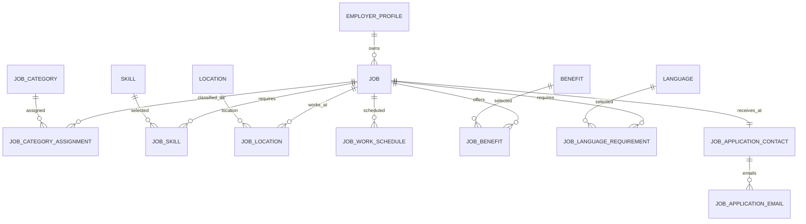

# Kế hoạch nâng cấp database tin tuyển dụng

**Trạng thái:** Đã triển khai qua migration `jobs.0013` và `skills.0002` ngày 11/07/2026  
**Phạm vi:** Dữ liệu đăng tin của nhà tuyển dụng, trang chi tiết việc làm, bộ lọc và dữ liệu phục vụ matching  
**Nguồn đối chiếu:** Schema hiện tại và tài liệu “mô tả bài đăng tin của nhà tuyển dụng” ngày 11/07/2026

## 1. Mục tiêu thiết kế

Thiết kế mới phải đồng thời đáp ứng các mục tiêu sau:

1. Nhà tuyển dụng có thể tạo và sửa tin theo quy trình nhiều bước mà không phải nhập lặp dữ liệu.
2. Trang chi tiết việc làm có dữ liệu có cấu trúc để hiển thị, lọc và tìm kiếm.
3. Nội dung dài vẫn được nhập bằng rich-text nhưng các thuộc tính cần lọc không bị chôn trong HTML.
4. Tận dụng `Job`, `JobCategory`, `Skill`, `JobSkill` và `Location` hiện có.
5. Không tạo bảng danh mục trùng nghĩa hoặc thêm JSON chỉ để né quan hệ database.
6. Các dữ liệu nội bộ như người nhận hồ sơ không bị trả ra public API.
7. Migration có thể backfill dữ liệu hiện tại trước khi xóa cột cũ.

## 2. Đánh giá schema hiện tại

### 2.1. Các thành phần nên giữ

| Thành phần hiện tại | Quyết định | Lý do |
|---|---|---|
| `Job.public_id`, `slug` | Giữ | Định danh public và URL ổn định |
| `employer`, `employer_profile` | Giữ trong giai đoạn hiện tại | Phù hợp mô hình một tài khoản nhà tuyển dụng gắn một công ty |
| `title` | Giữ | UI có thể giới hạn 50 ký tự, không cần hạ giới hạn DB ngay |
| `description`, `requirements`, `benefits` | Giữ | Ba khối rich-text chính của trang chi tiết |
| `work_type`, `employment_type` | Giữ | Hai khái niệm khác nhau: nơi làm việc và loại hợp đồng/công việc |
| `experience_years`, `position_level`, `education_level` | Giữ và mở rộng choices | Là dữ liệu có cấu trúc dùng cho hiển thị và lọc |
| `number_of_vacancies` | Giữ | Hiển thị ở cột phải và dùng thống kê |
| `salary_min`, `salary_max`, `currency` | Giữ | Hỗ trợ mức lương dạng khoảng |
| `deadline` | Giữ | Hạn nhận hồ sơ |
| `status` và các mốc duyệt/đăng/đóng | Giữ | Cần cho vòng đời tin |
| `view_count`, `application_count` | Giữ tạm thời | Counter nhanh; cần cập nhật bằng service/transaction |
| `JobCategory` | Giữ và bổ sung loại taxonomy | Đã có cây danh mục ba cấp, không tạo bảng “chuyên môn” mới |
| `Skill` và `JobSkill` | Giữ, mở rộng taxonomy kỹ năng | `JobSkill.importance` đã biểu diễn được bắt buộc/ưu tiên |
| `Location` | Giữ | Đã có tỉnh/thành và phường/xã theo dữ liệu hành chính hiện tại |

### 2.2. Các trường đang trùng hoặc sai ngữ nghĩa

| Trường | Vấn đề | Hướng xử lý |
|---|---|---|
| `experience_level` | Intern/Junior/Senior bị dùng thay cho số năm kinh nghiệm; trùng một phần với `position_level` | Backfill nếu cần rồi xóa. Trang chi tiết dùng `experience_years` |
| `short_description` | Không có input riêng trong quy trình đăng tin; có thể sinh từ `description` khi cần card/SEO | Ngừng ghi, backfill nơi tiêu thụ rồi xóa |
| `responsibilities` | Trùng với “Mô tả công việc” | Gộp nội dung cũ vào `description`, sau đó xóa |
| `nice_to_have` | Trùng với `requirements` và kỹ năng `preferred` | Gộp nội dung cũ vào `requirements`, sau đó xóa |
| `address` | Một chuỗi không thể ánh xạ nhiều địa chỉ theo từng phường/xã | Chuyển sang `JobLocation`, sau backfill thì xóa |
| `locations` M2M trực tiếp | Không lưu được địa chỉ cụ thể và có thể chọn tỉnh mà không chọn phường/xã | Đã chuyển sang `JobLocation`; API ghi mới chỉ nhận phường/xã |
| `work_schedule` | Text tự do không hỗ trợ nhiều khung giờ có cấu trúc | Đổi vai trò thành ghi chú lịch làm việc; lịch chuẩn nằm ở `JobWorkSchedule` |
| `weekend_policy` | Chỉ biểu diễn thứ Bảy và trùng với lịch làm việc mới | Backfill sang lịch/ghi chú rồi xóa |
| `is_salary_visible` | “Thỏa thuận” không đồng nghĩa với “ẩn lương” | Thay bằng `salary_type` |
| `application_instructions` | Luồng ứng tuyển nội bộ đã cố định bằng nút “Ứng tuyển ngay” | Dùng text mặc định ở giao diện; chỉ giữ nếu sản phẩm cho phép hướng dẫn tùy chỉnh |
| `category` FK đơn | Không phân biệt vị trí chuyên môn chính và nhiều kiến thức chuyên ngành | Chuyển sang `JobCategoryAssignment` có `role` |

### 2.3. Các thiếu hụt chính

- Chưa có giới tính và khoảng tuổi.
- Chưa có địa chỉ riêng cho từng phường/xã.
- Chưa có nhiều lịch làm việc có cấu trúc.
- Chưa có yêu cầu ngoại ngữ.
- Chưa có quyền lợi dạng tag chuẩn hóa.
- Chưa có người nhận và tối đa năm email nhận hồ sơ.
- Chưa phân biệt vị trí chuyên môn chính và các kiến thức chuyên ngành.
- Chưa có validation xuyên trường cho lương, tuổi, địa điểm và lịch.

## 3. Mô hình dữ liệu đích

### 3.1. Bảng `jobs` sau khi tinh gọn

Các trường nghiệp vụ chính đề xuất:

| Nhóm | Trường | Kiểu/ghi chú |
|---|---|---|
| Định danh | `public_id`, `slug` | Giữ hiện tại |
| Chủ sở hữu | `employer`, `employer_profile` | Giữ hiện tại |
| Nội dung | `title` | `CharField(255)`, serializer/form giới hạn 50 hoặc theo cấu hình sản phẩm |
| Nội dung | `description` | Rich-text HTML đã sanitize |
| Nội dung | `requirements` | Rich-text HTML đã sanitize |
| Nội dung | `benefits` | Rich-text HTML đã sanitize; khác với tag quyền lợi |
| Phân loại | `position_level` | Nhân viên, trưởng nhóm, quản lý… |
| Phân loại | `employment_type` | Full-time, part-time, seasonal, internship, freelance… |
| Phân loại | `work_type` | Onsite, remote, hybrid |
| Kỳ vọng | `education_level` | Bổ sung THCS và cao học nếu choices hiện tại chưa đủ |
| Kỳ vọng | `experience_years` | Không yêu cầu/chưa có, dưới 1, 1…5, trên 5 |
| Kỳ vọng | `gender_requirement` | `any`, `male`, `female`; mặc định `any` |
| Kỳ vọng | `age_min`, `age_max` | Nullable; `age_max >= age_min` |
| Tuyển dụng | `number_of_vacancies` | `PositiveIntegerField`, bắt buộc `>= 1` khi gửi duyệt |
| Lương | `salary_type` | `negotiable`, `range`, `fixed`, `from`, `up_to` |
| Lương | `salary_min`, `salary_max`, `currency` | Ràng buộc theo `salary_type` |
| Lịch | `work_schedule_note` | Text tùy chọn cho mô tả như “đăng ký 11 ca/tuần” |
| Nhận hồ sơ | `deadline` | Ngày hạn nhận hồ sơ |
| Vòng đời | `status`, `published_at`, `closed_at`, `approved_at`, `rejected_reason` | Giữ hiện tại |
| Hiển thị | `tier`, `is_hot`, `is_urgent`, `has_flash_badge` | Giữ tạm đến khi module dịch vụ thay thế |
| Thống kê | `view_count`, `application_count` | Giữ hiện tại |
| Audit | `created_at`, `updated_at` | Giữ hiện tại |

#### Ràng buộc cho `jobs`

- `age_min` và `age_max` nằm trong khoảng hợp lý do sản phẩm quy định, đề xuất 15–100.
- Nếu cùng có hai giá trị tuổi thì `age_max >= age_min`.
- `number_of_vacancies >= 1` khi trạng thái là `pending` hoặc `active`.
- `salary_type = negotiable`: `salary_min` và `salary_max` phải null.
- `salary_type = range`: cần cả hai giá trị và `salary_max >= salary_min`.
- `salary_type = fixed`: hai đầu bằng nhau hoặc chỉ lưu một trường `salary_min`; serializer phải thống nhất một quy ước.
- `salary_type = from`: chỉ bắt buộc `salary_min`.
- `salary_type = up_to`: chỉ bắt buộc `salary_max`.
- Tin onsite/hybrid gửi duyệt phải có ít nhất một `JobLocation`.
- Tin active phải có `deadline >= published_at::date`, trừ khi hệ thống cho phép tự đóng ngay.

### 3.2. Phân loại tin: `JobCategoryAssignment`

Tận dụng `JobCategory` hiện tại và thêm trường `category_type` cho taxonomy, ví dụ:

- `occupation_group`: nhóm nghề.
- `domain`: kiến thức chuyên ngành/lĩnh vực kiến thức.
- `specialization`: vị trí chuyên môn cụ thể.

Bảng trung gian:

| Trường | Kiểu | Ghi chú |
|---|---|---|
| `job` | FK `Job` | CASCADE |
| `category` | FK `JobCategory` | PROTECT |
| `role` | enum | `primary_specialization`, `domain_knowledge` |
| `sort_order` | PositiveSmallInteger | Thứ tự hiển thị |

Ràng buộc:

- Unique `(job, category, role)`.
- Mỗi job chỉ có một `primary_specialization` bằng conditional unique constraint.
- Có thể có nhiều `domain_knowledge`.
- Category được chọn phải có `category_type` tương thích với `role`.

Không tạo thêm bảng `JobSpecialization` hoặc `JobKnowledge` vì sẽ trùng taxonomy hiện có.

### 3.3. Địa điểm: `JobLocation`

Mỗi bản ghi là một phường/xã làm việc và địa chỉ chi tiết tại phường/xã đó.

| Trường | Kiểu | Ghi chú |
|---|---|---|
| `job` | FK `Job` | CASCADE |
| `location` | FK `Location` | API ghi mới chỉ chấp nhận `level=ward`; dữ liệu tỉnh cũ được giữ để không mất dữ liệu |
| `address_detail` | CharField(500) | Ví dụ `556 Núi Thành` |
| `sort_order` | PositiveSmallInteger | Thứ tự hiển thị |
| `created_at`, `updated_at` | DateTime | Audit |

Với dữ liệu mới, tỉnh/thành được suy ra từ `location.parent`; không lưu thêm `province_id` để tránh lệch dữ liệu. Các liên kết cấp tỉnh tồn tại trước migration được bảo toàn trong cùng FK và được đánh dấu bằng `location.level`; form tạo/sửa không cho phát sinh thêm bản ghi kiểu này.

Ràng buộc:

- Serializer tạo/sửa không cho lưu `Location` cấp tỉnh.
- Unique `(job, location, address_detail)`.
- `address_detail` bắt buộc đối với onsite/hybrid nếu sản phẩm yêu cầu địa chỉ cụ thể.
- Xóa `Job.address` và M2M `Job.locations` cũ sau khi backfill hoàn tất.

### 3.4. Lịch làm việc: `JobWorkSchedule`

| Trường | Kiểu | Ghi chú |
|---|---|---|
| `job` | FK `Job` | CASCADE |
| `weekday_from` | SmallInteger | 1=Thứ 2 … 7=Chủ nhật |
| `weekday_to` | SmallInteger | Có thể bằng `weekday_from` |
| `start_time` | TimeField nullable | Bắt đầu ca |
| `end_time` | TimeField nullable | Kết thúc ca |
| `is_overnight` | Boolean | Dùng khi giờ kết thúc thuộc ngày sau |
| `note` | CharField(500), blank | Ghi chú riêng của khung giờ |
| `sort_order` | PositiveSmallInteger | Thứ tự hiển thị |

`Job.work_schedule_note` giữ phần mô tả không thể/không cần chuẩn hóa, ví dụ “Đăng ký 11 ca/tuần, tương đương 44 giờ/tuần”. Không lưu toàn bộ lịch dưới JSON vì lịch cần validation và có thể dùng cho tìm kiếm sau này.

### 3.5. Kỹ năng: tiếp tục dùng `JobSkill`

`JobSkill.importance` đã có hai giá trị phù hợp:

- `required`: kỹ năng cần có.
- `preferred`: kỹ năng nên có.

Cần nâng cấp `Skill.category` từ choices IT hard-code hiện tại thành taxonomy mở rộng. Phương án gọn nhất:

1. Tạo `SkillGroup(id, name, slug, parent, is_active)`.
2. Đổi `Skill.category` thành FK nullable `group`.
3. Backfill các nhóm Frontend, Backend, Database… hiện tại.
4. Sau khi backfill, xóa cột choices cũ.

Không cho nhà tuyển dụng tạo skill mới trực tiếp khi gõ. Autocomplete chỉ tìm trong danh mục; yêu cầu thêm skill mới đi qua quy trình kiểm duyệt để tránh `.NET`, `dotnet`, `.Net` trở thành ba bản ghi.

### 3.6. Quyền lợi chuẩn hóa

Giữ `Job.benefits` cho nội dung chi tiết và thêm danh mục tag để hiển thị/tìm kiếm.

#### `Benefit`

- `name`, `slug`, `icon`, `description`, `is_active`, `sort_order`.
- Ví dụ: Bảo hiểm xã hội, Thưởng tháng 13, Phụ cấp, Đào tạo, Du lịch.

#### `JobBenefit`

- `job`, `benefit`, `note`, `sort_order`.
- Unique `(job, benefit)`.

Không lưu danh sách benefit dưới JSON hoặc comma-separated text.

### 3.7. Ngoại ngữ

#### `Language`

- `name`, `code`, `slug`, `is_active`.
- `code` dùng mã chuẩn khi có thể, ví dụ `en`, `ko`, `ja`.

#### `JobLanguageRequirement`

| Trường | Kiểu | Ghi chú |
|---|---|---|
| `job` | FK `Job` | CASCADE |
| `language` | FK `Language` | PROTECT |
| `proficiency_level` | enum nullable | basic, conversational, working, professional, native |
| `certificate` | CharField(255), blank | TOPIK 1, IELTS 6.5… |
| `note` | CharField(500), blank | Mô tả bổ sung |
| `is_required` | Boolean | Bắt buộc hay ưu tiên |
| `sort_order` | PositiveSmallInteger | Thứ tự hiển thị |

Unique `(job, language)` ở phiên bản đầu. Nếu sau này một ngôn ngữ cần nhiều chứng chỉ thay thế, bổ sung bảng chứng chỉ thay vì nhét mảng JSON.

### 3.8. Thông tin nhận hồ sơ

Thông tin này thuộc tin tuyển dụng nhưng là dữ liệu nội bộ, không trả trong `JobDetailSerializer` public.

#### `JobApplicationContact`

- OneToOne `job`.
- `recipient_name`.
- `phone`.
- `created_at`, `updated_at`.

#### `JobApplicationEmail`

- FK `contact`.
- `email`.
- `sort_order`.
- Unique `(contact, email)`.

Serializer giới hạn tối đa năm email. Database không biểu diễn tốt ràng buộc “tối đa 5 hàng con” bằng check constraint; service phải khóa bản ghi contact trong transaction khi thêm/xóa để tránh race condition.

Không đưa email và số điện thoại này vào API công khai. Hệ thống dùng chúng để gửi thông báo khi có application mới.

### 3.9. “Chiến dịch” và dịch vụ gia tăng

Không thêm `campaign` dạng text hoặc JSON vào `Job` ở migration này vì nghiệp vụ chưa rõ.

Khi xây module chiến dịch, mô hình tối thiểu nên là:

- `RecruitmentCampaign`: thuộc employer/company, có tên, mục tiêu, thời gian và trạng thái.
- `CampaignJob`: quan hệ nhiều-nhiều giữa campaign và job nếu một tin có thể tái sử dụng.

Tương tự, dịch vụ trả phí nên nằm ở module order/entitlement riêng. `tier`, `is_hot`, `is_urgent`, `has_flash_badge` hiện có thể giữ làm trạng thái hiển thị tương thích. Sau khi module dịch vụ hoạt động, các cờ này nên được suy ra từ entitlement đang hiệu lực, không để nhà tuyển dụng tự gửi qua Job API.

## 4. Mapping form đăng tin sang database

### Bước 1 — Thông tin chung

| Input | Lưu vào |
|---|---|
| Tiêu đề tin | `Job.title` |
| Vị trí chuyên môn, chọn 1 | `JobCategoryAssignment(role=primary_specialization)` |
| Kiến thức chuyên ngành, chọn nhiều | `JobCategoryAssignment(role=domain_knowledge)` |
| Cấp bậc | `Job.position_level` |
| Loại công việc | `Job.employment_type` |
| Hình thức làm việc | `Job.work_type` |
| Lương từ/đến, thỏa thuận, tiền tệ | `salary_type`, `salary_min`, `salary_max`, `currency` |

### Bước 2 — Mô tả công việc

| Input | Lưu vào |
|---|---|
| Mô tả công việc | `Job.description` |
| Yêu cầu ứng viên | `Job.requirements` |
| Quyền lợi ứng viên | `Job.benefits` và tùy chọn `JobBenefit` |
| Mỗi phường/xã + địa chỉ | Một hàng `JobLocation` |
| Mỗi khung ngày/giờ | Một hàng `JobWorkSchedule` |
| Mô tả lịch tự do | `Job.work_schedule_note` |

### Bước 3 — Kỳ vọng ứng viên

| Input | Lưu vào |
|---|---|
| Học vấn tối thiểu | `Job.education_level` |
| Số năm kinh nghiệm | `Job.experience_years` |
| Giới tính | `Job.gender_requirement` |
| Tuổi từ/đến | `Job.age_min`, `Job.age_max` |
| Kỹ năng cần có | `JobSkill(importance=required)` |
| Kỹ năng nên có | `JobSkill(importance=preferred)` |
| Ngoại ngữ | `JobLanguageRequirement` |

### Bước 4 — Thông tin nhận hồ sơ

| Input | Lưu vào |
|---|---|
| Hạn nhận hồ sơ | `Job.deadline` |
| Số lượng tuyển | `Job.number_of_vacancies` |
| Họ tên, số điện thoại | `JobApplicationContact` |
| Tối đa 5 email | `JobApplicationEmail` |
| Chiến dịch | Chưa lưu cho đến khi có nghiệp vụ Campaign rõ ràng |

### Bước 5 — Dịch vụ

Không thêm cột mới vào `Job` trong giai đoạn này. Form hiển thị trạng thái “sẽ phát triển sau”.

## 5. Mapping sang trang chi tiết việc làm

### Cột trái — thông tin chung

- Mức lương: dựng từ `salary_type`, min/max và currency.
- Địa điểm: lấy danh sách tỉnh/thành duy nhất qua `JobLocation.location.parent`, fallback chính location cho dữ liệu tỉnh cũ.
- Kinh nghiệm: chỉ dùng `experience_years`, không fallback sang Junior/Senior.
- Không hiển thị số lượng tuyển tại khối này.

### Cột trái — chi tiết tuyển dụng

- Yêu cầu dạng tag: kinh nghiệm, tuổi, học vấn, giới tính và kỹ năng bắt buộc.
- Quyền lợi dạng tag: `JobBenefit`; nội dung dài dùng `Job.benefits`.
- Chuyên môn: vị trí chuyên môn chính và các kiến thức chuyên ngành.
- Mô tả công việc: `Job.description`.
- Yêu cầu ứng viên: `Job.requirements`.
- Địa điểm làm việc: nhóm `JobLocation` theo tỉnh/thành, liệt kê phường/xã và địa chỉ.
- Thời gian làm việc: `JobWorkSchedule` cộng `work_schedule_note`.
- Cách thức ứng tuyển: text sản phẩm cố định và nút ứng tuyển; không cần đọc từ dữ liệu nhà tuyển dụng nếu không có use case tùy chỉnh.

### Cột phải

- Thông tin công ty: từ `EmployerProfile`.
- Cấp bậc: `position_level`.
- Học vấn: `education_level`, hiển thị “Từ … trở lên”.
- Số lượng tuyển: `number_of_vacancies`.
- Hình thức làm việc: `work_type`.
- Loại hình làm việc: `employment_type`.

## 6. API và quyền truy cập

Nên tách serializer theo mục đích thay vì một `JobSerializer` dùng cho mọi endpoint:

1. `JobListSerializer`: dữ liệu card, không chứa HTML dài hoặc contact.
2. `JobPublicDetailSerializer`: toàn bộ dữ liệu trang chi tiết, loại bỏ contact nội bộ.
3. `EmployerJobWriteSerializer`: nested write cho categories, locations, schedules, skills, benefits, languages và contact.
4. `EmployerJobManageSerializer`: dữ liệu quản lý, trạng thái duyệt, lý do từ chối và thống kê.

Nested create/update phải chạy trong `transaction.atomic()`. Cần xác minh toàn bộ ID taxonomy đang active và thuộc đúng loại trước khi ghi.

Không cho employer ghi trực tiếp:

- `status=active`, `approved_at`, `published_at`.
- `view_count`, `application_count`.
- `tier`, `is_hot`, `is_urgent`, `has_flash_badge`.
- Taxonomy master như `Skill`, `Benefit`, `Language`, `JobCategory`.

## 7. Kế hoạch migration an toàn

### Giai đoạn 0 — Khóa thiết kế và test dữ liệu — Hoàn thành

- Chốt enum/choices bằng tiếng Việt và giá trị lưu ổn định bằng tiếng Anh.
- Chốt quy tắc lương fixed/range/from/up_to.
- Chốt việc `application_instructions` có thật sự cho phép tùy chỉnh hay không.
- Viết test fixture đại diện cho onsite nhiều địa điểm, remote, nhiều lịch, nhiều ngoại ngữ và lương thỏa thuận.

### Giai đoạn 1 — Additive migration — Hoàn thành

- Thêm các field mới vào `Job` dưới dạng nullable/default an toàn.
- Tạo các bảng assignment/location/schedule/benefit/language/contact.
- Thêm `category_type` cho `JobCategory` và taxonomy nhóm kỹ năng.
- Các bảng/cột mới được tạo trước khi chạy data migration; cột cũ vẫn tồn tại ở thời điểm backfill.

### Giai đoạn 2 — Backfill — Hoàn thành

- `Job.category` → `JobCategoryAssignment(primary_specialization)`.
- M2M `Job.locations` → `JobLocation.location`:
  - Cả 61 liên kết cũ được bảo toàn, gồm 60 liên kết cấp tỉnh và 1 liên kết cấp phường/xã.
  - Không tự đoán phường/xã cho dữ liệu cấp tỉnh.
  - `Job.address` chỉ được gắn vào bản ghi mới khi job cũ có đúng một location.
- `work_schedule` và `weekend_policy` → `work_schedule_note`; chỉ parse thành lịch cấu trúc khi pattern chắc chắn.
- `is_salary_visible=false` hoặc không có min/max → xác định `salary_type` theo quy tắc đã chốt.
- `responsibilities` nối có tiêu đề vào `description` nếu không rỗng.
- `nice_to_have` nối có tiêu đề vào `requirements` nếu không rỗng.
- `experience_level` không tự động ánh xạ Junior/Senior thành số năm. Chỉ backfill các mapping chắc chắn như Intern/Fresher nếu sản phẩm phê duyệt.

Migration đã được kiểm chứng bằng test database và đối soát số lượng trước/sau trên PostgreSQL cục bộ.

### Giai đoạn 3 — Chuyển API/frontend — Hoàn thành

- API đọc/ghi cấu trúc mới; một số alias chỉ-đọc như `category`, `locations_detail` và `short_description` được tính động để giữ tương thích frontend, không còn là cột database.
- Form employer chỉ ghi cấu trúc mới.
- Trang chi tiết và bộ lọc chuyển sang cấu trúc mới.
- Chạy script kiểm tra mọi job active có dữ liệu bắt buộc.

### Giai đoạn 4 — Cleanup migration — Hoàn thành

Sau khi backfill hoàn tất trong đúng thứ tự operation của migration `0013`, các cột sau đã được xóa:

- `Job.category` FK cũ.
- M2M `Job.locations` cũ và `Job.address`.
- `experience_level`.
- `short_description` (API compatibility tính động từ `description`).
- `responsibilities`, `nice_to_have`.
- `weekend_policy` và field `work_schedule` cũ sau khi đổi sang note/bảng lịch.
- `is_salary_visible` sau khi tất cả consumer dùng `salary_type`.
- `application_instructions`; giao diện dùng hướng dẫn ứng tuyển cố định.

Migration tạo schema mới, backfill và đối soát trước, sau đó mới chạy các `RemoveField`; vì vậy dữ liệu cũ không bị xóa trước khi chuyển đổi.

## 8. Index và constraint đề xuất

- Index `Job(status, published_at)` cho danh sách public.
- Index `Job(employer, status, -created_at)` cho trang quản lý employer.
- Index cho `work_type`, `employment_type`, `experience_years`, `position_level`, `education_level` nếu các trường là filter thực tế.
- Index `JobCategoryAssignment(category, role, job)`.
- Index `JobLocation(location, job)`; truy vấn theo tỉnh dùng `location__parent` và fallback location cho dữ liệu legacy.
- Index `JobSkill(skill, importance, job)`.
- Index `JobLanguageRequirement(language, proficiency_level)` khi có filter ngoại ngữ.
- Conditional unique cho một primary specialization mỗi job.
- Check constraint cho tuổi và lương; validation nghiệp vụ phức tạp đặt thêm ở service/serializer.

Không tạo index cho mọi cột mặc định; chỉ thêm theo truy vấn danh sách, bộ lọc và trang quản lý thực tế.

## 9. Thứ tự triển khai đề xuất

1. **P0 — Sửa ngữ nghĩa hiện tại:** kinh nghiệm dùng `experience_years`, bỏ số lượng tuyển khỏi cột trái, sửa tag quyền lợi.
2. **P1 — Core posting:** salary type, tuổi, giới tính, category assignment, địa điểm chi tiết, lịch làm việc, contact nhận hồ sơ.
3. **P1 — Form employer:** wizard bốn bước đầu, lưu draft theo từng bước, validate đầy đủ khi gửi duyệt.
4. **P2 — Taxonomy mở rộng:** skill groups, benefit tags, language requirements.
5. **P2 — Cleanup:** backfill, dual-read, xóa field cũ sau khi xác nhận không còn consumer.
6. **P3 — Campaign và dịch vụ:** chỉ triển khai sau khi nghiệp vụ, thanh toán và entitlement được chốt.

## 10. Tiêu chí hoàn thành

- Một job onsite có thể lưu nhiều tỉnh, mỗi tỉnh nhiều phường/xã và mỗi phường/xã có địa chỉ riêng.
- Không thể gửi duyệt job onsite/hybrid chỉ có tỉnh mà không có phường/xã.
- Kinh nghiệm “Dưới 1 năm” không bao giờ hiển thị thành “Junior”.
- Form lưu được nhiều lịch, nhiều kỹ năng và nhiều ngoại ngữ.
- Lương thỏa thuận không bị biểu diễn bằng cờ “ẩn lương”.
- Trang public không lộ tên, số điện thoại hoặc email nhận hồ sơ.
- Tối đa năm email nhận hồ sơ được kiểm soát trong transaction.
- Không còn dữ liệu phân loại hoặc quyền lợi lưu bằng chuỗi phân cách dấu phẩy.
- Không còn consumer của các trường được đánh dấu xóa trước cleanup migration.
- Migration có báo cáo đối soát và không làm mất nội dung cũ.
