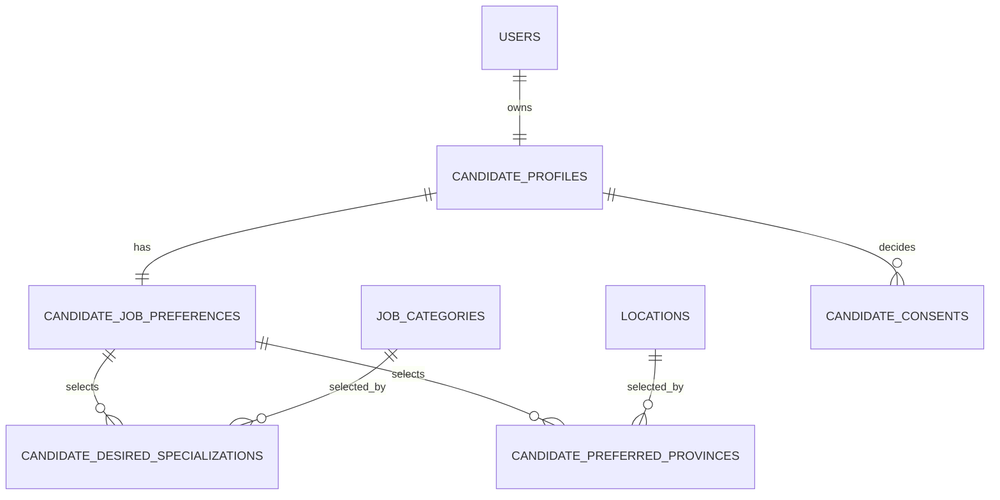

# Thiết kế onboarding ứng viên

## 1. Mục tiêu và phạm vi

Onboarding là luồng tùy chọn cho ứng viên mới. Sau đăng nhập bằng mật khẩu,
ứng viên chưa cấu hình có thể được đưa thẳng vào luồng; social/OAuth luôn vào
trang chủ trước và chỉ mở onboarding khi người dùng bấm label:

```text
/onboard-user → /onboard-user-setting → hoàn thành hoặc bỏ qua → /
```

Luồng thu thập nhu cầu tìm việc để cá nhân hóa gợi ý; không thay thế CV, không
can thiệp onboarding của nhà tuyển dụng, và không dùng query hay URL làm căn cứ
phân quyền. Hai route onboarding luôn yêu cầu candidate đã đăng nhập; backend
kiểm tra `request.user.role == candidate`.

Các yêu cầu chính:

- Chọn từ 1 đến 5 vị trí chuyên môn trong taxonomy `job_categories`.
- Có thể nhập thêm một vị trí tự do; chuỗi được `trim`, chuỗi rỗng thành `NULL`.
- Lương kỳ vọng là VND/tháng, bắt buộc, là số nguyên lớn hơn 0. Giá trị `0`
  bị từ chối.
- Kinh nghiệm và ít nhất một tỉnh/thành là bắt buộc khi hoàn thành.
- Hai consent AI và hiển thị với nhà tuyển dụng không được tick sẵn, đồng thời
  phải lưu được quyết định, thời điểm và phiên bản chính sách.
- Bỏ qua không cần lưu trạng thái. Khi chưa cấu hình đủ preference, label nhắc
  cập nhật vẫn hiển thị và dẫn đến onboarding hoặc trang cài đặt sau này.
- Sau đăng nhập bằng email/mật khẩu, nếu chưa cấu hình preference thì có thể
  đưa thẳng vào onboarding. Sau đăng nhập social/OAuth luôn vào trang chủ
  trước; label nhắc cập nhật vẫn hiển thị bình thường khi cờ còn `false`.
  Người dùng bấm label ở cả hai trường hợp đều có thể mở onboarding.

## 2. Kết quả rà soát hiện trạng

### Đang tồn tại và tái sử dụng

| Thành phần | Trạng thái | Dùng cho onboarding mới |
| --- | --- | --- |
| `candidate_profiles` | Có, tự tạo khi candidate đăng ký | Giữ thông tin hồ sơ chung; là owner của preference mới. |
| `job_categories` | Có taxonomy 3 cấp | Chỉ nhận category `specialization`, active. |
| `locations` | Có, 2 cấp tỉnh/xã | Chỉ nhận `province`, active. |
| `GET /api/jobs/categories/?all=1&category_type=specialization` | Có | Catalog chọn vị trí chuyên môn. |
| `GET /api/locations/?level=province` | Có | Catalog chọn nơi làm việc. |
| `/tai-khoan/cai-dat-goi-y-viec-lam` | Route/menu đã có | Đã dùng chung form preference; bổ sung giới tính từ candidate profile, sidebar hồ sơ sticky trên desktop. |

### Không còn trong source nhưng phải dọn trước khi triển khai

Hai file `.pyc` bị bỏ lại trong thư mục `__pycache__` cho thấy một bản thử
nghiệm chưa từng được migrate:

- `accounts/0007_user_onboarding_status`: thêm `User.onboarding_status` với
  `not_started/completed/skipped`.
- `candidates/0002_candidate_onboarding_preferences`: thêm trực tiếp nhiều
  preference và boolean consent vào `CandidateProfile`.

Hai migration `.py` tương ứng không tồn tại, không được Git theo dõi và DB cục
bộ chỉ ghi nhận `accounts.0001…0006`, `candidates.0001`. Vì vậy không có bảng
hay cột onboarding cũ trong database cục bộ. Hai artifact đã được xóa; không
phục hồi hay chạy các migration cũ đó.

Frontend cũng chưa có page, API, route hay `OnboardingGuard` cho ứng viên.
ADR 0004 và tài liệu phase 4 đã chuẩn bị policy guard, nhưng file guard đã bị
xóa trong đợt FSD refactor. Onboarding của `employers` là luồng xác thực công
ty khác domain, không được tái sử dụng cho ứng viên.

## 3. Mô hình dữ liệu đề xuất

Không thêm `onboarding_status` vào bảng `users` hay tạo bảng trạng thái
onboarding: chỉ dùng một cờ cấu hình preference trên candidate profile. Không
nhét selection, location và consent vào JSON hay các chuỗi cũ của
`candidate_profiles` vì chúng cần ràng buộc, lọc và audit.

Tên bảng dưới đây là tên vật lý cần khai báo bằng `Meta.db_table` (không để
Django tự sinh tên theo app), giữ đúng quy ước tên số nhiều đang dùng trong tài
liệu database.



### Cờ `job_preferences_configured` trên `candidate_profiles`

Không tạo bảng `candidate_onboardings`. Thêm một cờ boolean duy nhất vào
`candidate_profiles`:

| Cột | Kiểu / ràng buộc | Ý nghĩa |
| --- | --- | --- |
| `job_preferences_configured` | boolean, default `false`, not null | `true` khi ứng viên đã lưu form preference hợp lệ; `false` khi mới đăng ký hoặc bấm bỏ qua. |

Tên cờ mô tả dữ liệu nghiệp vụ thay vì trạng thái UI: form có thể được mở từ
`/onboard-user-setting` hoặc `/tai-khoan/cai-dat-goi-y-viec-lam`, nhưng cả hai
đều chỉ đánh dấu `true` sau khi lưu đủ vị trí chuyên môn, kinh nghiệm và
tỉnh/thành hợp lệ. Không lưu `current_step`, status hay timestamp onboarding.

Nguồn đăng nhập không phải dữ liệu hồ sơ và không được lưu vĩnh viễn trong
`users` hay `candidate_profiles`. Backend chỉ cần biết nguồn đăng nhập trong
luồng điều hướng sau khi xác thực:

| Giá trị | Nguồn xác thực | Điểm đến sau đăng nhập khi cờ là `false` |
| --- | --- | --- |
| `password` | `POST /api/auth/login/` (kể cả bước xác nhận 2FA sau mật khẩu) | Nếu cờ `false`, luôn điều hướng tới `/onboard-user`. |
| `social` | Hoàn tất OAuth Google/Facebook/LinkedIn | Điều hướng thẳng tới `/`; label vẫn hiển thị nếu cờ `false`. |

Việc user từng liên kết social account hoặc có mật khẩu không làm thay đổi cờ.
Ví dụ, user có cả hai cách đăng nhập: vào bằng OAuth thì vào trang chủ và vẫn
thấy label; vào bằng email/mật khẩu thì được đưa thẳng tới onboarding khi cờ
chưa cấu hình.

### `candidate_job_preferences`

Quan hệ 1–1 với `candidate_profiles`, là tập preference đang hiệu lực.

| Cột | Kiểu / ràng buộc | Ý nghĩa |
| --- | --- | --- |
| `candidate_profile_id` | OneToOne FK, CASCADE | Owner của preference. |
| `desired_position_other` | varchar(255), nullable | Vị trí nhập thêm, đã trim; không lưu rỗng. |
| `desired_salary_vnd` | bigint nullable, `> 0` | Lương kỳ vọng VND/tháng; optional. |
| `experience_level` | enum candidate-specific | `no_experience`, `under_1`, `1`…`5`, `over_5`; bắt buộc khi complete. |
| `willing_to_relocate` | boolean nullable | Ba trạng thái: chưa trả lời / có / không. |
| `created_at`, `updated_at` | timestamptz | Audit kỹ thuật. |

`experience_level` là enum của candidate, không tái dùng enum yêu cầu tuyển
dụng của `Job`: cùng biểu diễn năm kinh nghiệm nhưng khác ngữ nghĩa.

### `candidate_desired_specializations`

| Cột | Kiểu / ràng buộc | Ý nghĩa |
| --- | --- | --- |
| `job_preference_id` | FK `candidate_job_preferences`, CASCADE | Preference sở hữu lựa chọn. |
| `job_category_id` | FK `job_categories`, PROTECT | Category chuyên môn được chọn. |
| `sort_order` | smallint, `>= 0` | Thứ tự người dùng chọn. |

`UNIQUE(job_preference_id, job_category_id)` chặn trùng. API/service xác nhận
category active, `category_type=specialization` và tổng số phần tử từ 1 đến 5;
hai điều kiện liên hàng này không thể biểu diễn đáng tin cậy bằng `CHECK`
chuẩn SQL nên phải được test ở service.

### `candidate_preferred_provinces`

| Cột | Kiểu / ràng buộc | Ý nghĩa |
| --- | --- | --- |
| `job_preference_id` | FK `candidate_job_preferences`, CASCADE | Preference sở hữu lựa chọn. |
| `location_id` | FK `locations`, PROTECT | Tỉnh/thành mong muốn làm việc. |
| `sort_order` | smallint, `>= 0` | Thứ tự hiển thị. |

`UNIQUE(job_preference_id, location_id)` chặn trùng. Service chỉ nhận location
active có `level=province`; không nhận phường/xã. Không đặt giới hạn tùy tiện
về số tỉnh ở phase này (tập dữ liệu chỉ gồm các tỉnh/thành).

### `candidate_consents`

Consent cần audit riêng; “không tick” không đồng nghĩa với quyền sử dụng dữ
liệu. Mỗi lần người dùng lưu form sẽ upsert quyết định hiện hành.

| Cột | Kiểu / ràng buộc | Ý nghĩa |
| --- | --- | --- |
| `candidate_profile_id` | FK `candidate_profiles`, CASCADE | Chủ thể đồng ý/từ chối. |
| `consent_type` | enum `ai_recommendation`, `recruiter_visibility` | Mục đích xử lý dữ liệu. |
| `decision` | enum `granted`, `denied` | Quyết định rõ ràng, mặc định API là `denied` nếu chưa có record. |
| `policy_version` | varchar(64) | Phiên bản chính sách đã hiển thị. |
| `decided_at` | timestamptz | Thời điểm quyết định. |
| `updated_at` | timestamptz | Lần thay đổi gần nhất. |

`UNIQUE(candidate_profile_id, consent_type)` bảo đảm một quyết định hiện hành
cho mỗi mục đích. Nếu yêu cầu pháp lý cần lịch sử bất biến, thêm
`candidate_consent_events` ở phase compliance; không ghi lịch sử vào JSON.

## 4. Quy tắc API và transaction

Các endpoint thuộc `apps/candidates`, yêu cầu `IsCandidate`:

| Endpoint | Mục đích |
| --- | --- |
| `GET /api/candidate/job-preferences/` | Đọc preference, consent effective và `job_preferences_configured`. |
| `PUT /api/candidate/job-preferences/` | Validate toàn bộ form, thay thế hai danh sách chọn trong một transaction, upsert consent và đặt cờ `job_preferences_configured=true`. Cùng endpoint cho onboarding và trang cài đặt. |

`PUT /api/candidate/job-preferences/` dùng `transaction.atomic()` và khóa row preference/
profile (`select_for_update`) trước khi replace các bảng liên kết. Nếu một
category/location/consent không hợp lệ, không có dữ liệu dở dang nào được
lưu và cờ không đổi. Backend vẫn validate cả khi frontend đã disable nút Hoàn
thành.

Các lỗi contract tối thiểu:

- `desired_specialization_ids`: bắt buộc, 1–5, không trùng, chỉ specialization active.
- `desired_position_other`: optional; trim, `null` khi trống, tối đa 255 ký tự.
- `desired_salary_vnd`: bắt buộc, integer `>= 1`, không nhận `null`, float,
  số âm hay `0`.
- `experience_level`: bắt buộc, thuộc enum candidate.
- `preferred_province_ids`: bắt buộc, không trùng, chỉ province active.
- Hai checkbox consent mặc định `false` ở client; backend ghi `denied` khi
  payload gửi `false`, tuyệt đối không suy diễn `granted`.

## 5. Luồng hoạt động và điều hướng

```mermaid
flowchart TD
    A[Đăng nhập candidate] --> B{auth_method}
    B -->|social| H[Trang chủ, label vẫn hiển thị nếu cờ false]
    B -->|password| C{job_preferences_configured}
    C -->|false| E[/onboard-user]
    C -->|true| H
    H -->|Người dùng bấm label| E
    E -->|Bắt đầu| F[/onboard-user-setting]
    F -->|Form hợp lệ, Hoàn thành| G[Transaction lưu preferences + consent]
    G --> I[Đặt job_preferences_configured=true]
    I --> H[Trang chủ hoặc returnUrl an toàn]
    E -->|Hoàn thiện sau| H
    F -->|Hoàn thiện sau| H
    H -->|CTA settings| J[/tai-khoan/cai-dat-goi-y-viec-lam]
    J -->|Lưu form hợp lệ| G
```

Không dùng `OnboardingGuard`. `GET /api/candidate/job-preferences/` trả cờ;
header/account layout hiển thị label khi cờ là `false`, không phụ thuộc nguồn
đăng nhập. Sau OAuth, ứng viên vào trang chủ và label vẫn có mặt; khi bấm label
thì mở `http://localhost:5173/onboard-user` trong môi trường local. Hai route
onboarding không chặn social; chỉ khác nhau ở điểm đến ngay sau khi đăng nhập.
Nếu user chưa xác thực email, banner xác thực luôn có ưu tiên cao hơn label cập
nhật nhu cầu.

## 6. Kế hoạch migration và rollout an toàn

1. Đã xóa hai artifact onboarding ignored trong `__pycache__`; không thêm chúng
   vào Git.
2. Tạo migration mới theo mô hình ở mục 3, không đặt lại số migration cũ và
   không phục hồi migration bytecode.
3. Thêm `job_preferences_configured=false` cho mọi candidate hiện có. Không
   redirect họ; label chỉ là lời nhắc để tự mở onboarding. Chỉ đặt `true` sau
   khi preference cấu trúc được validate và lưu trọn vẹn.
4. Giữ các field preference cũ của `CandidateProfile` ở chế độ chỉ-đọc trong
   giai đoạn tương thích. Không thể map an toàn `experience_years` decimal,
   `preferred_location` text hay `desired_position` tự do thành dữ liệu đã
   chuẩn hóa. Chỉ migrate dữ liệu khi có mapping được duyệt và báo cáo đối soát.
5. Sau khi frontend/account settings dùng API mới, ngừng expose các field cũ;
   đo consumer và tạo migration xóa chúng ở một release sau. Không xóa dữ liệu
   trong cùng release với onboarding.

## 7. Placement code và kiểm thử bắt buộc

- Backend: `apps/candidates/models.py`, `serializers.py`, `selectors/`,
  `services/` và API views; `accounts` chỉ tiếp tục cấp identity/session.
- Frontend entity: `entities/candidate-preferences` sở hữu API, model đọc,
  cờ cấu hình và catalog mapping.
- Frontend feature: workflow lưu preference dùng chung cho onboarding và trang
  cài đặt; không tạo feature state machine/skip, không import feature chéo.
- Page: `pages/main/onboarding/*` và `pages/main/account/JobPreferenceSettings.jsx`;
  lazy registry `app/router/lazy/main.pages.jsx`; routes trong
  `main.routes.jsx`; layout ở `app`; không thêm gate theo nguồn đăng nhập hay
  state-machine onboarding.

Giới tính vẫn thuộc `CandidateProfile`, không được nhét vào preference chỉ vì
hai phần cùng xuất hiện trong trang settings. Vì vậy settings dùng endpoint
profile riêng bên cạnh endpoint preference. Nếu sau này cần bảo đảm hai phần
luôn lưu cùng thành công hoặc cùng thất bại, bổ sung một use case/service
candidate gộp với transaction rõ ràng thay vì làm serializer preference nhận
field profile.

Test tối thiểu gồm: candidate-only permission, toàn bộ validation
list/salary/location, rollback khi payload lỗi, consent không tự grant,
backfill cờ `false`, CTA dẫn đúng onboarding cho phiên password, không hiện
redirect onboarding cho phiên social nhưng vẫn hiện label, CTA skip không làm
thay đổi cờ, và banner ưu tiên email verification.
