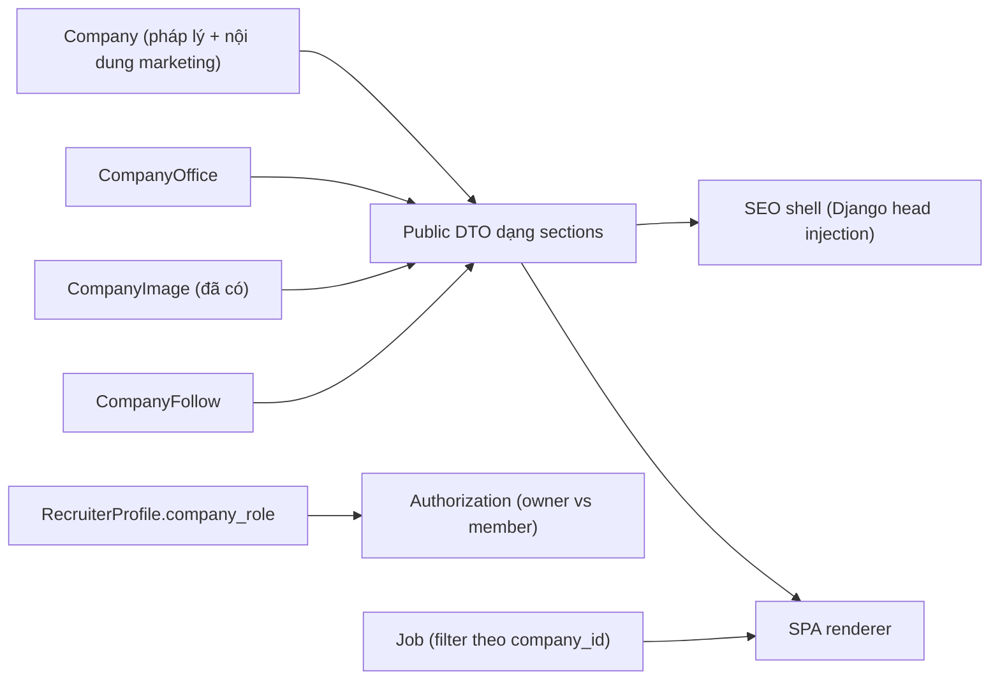

# Kế hoạch Trang công ty và thương hiệu tuyển dụng

> Trạng thái: **đã chốt toàn bộ, triển khai được ngay.** Không còn quyết định treo (§5.0).
> Thay thế bản nháp trước đó.
> Ngày chốt hiện trạng: 2026-07-29.
> Liên quan: [`ke-hoach-thiet-ke-lai-cong-ty-nha-tuyen-dung.md`](./ke-hoach-thiet-ke-lai-cong-ty-nha-tuyen-dung.md),
> [`ke-hoach-chien-dich-va-vong-doi-tin.md`](./ke-hoach-chien-dich-va-vong-doi-tin.md).

---

## 0. Hiện trạng đo được

Số liệu lấy trực tiếp từ DB dev ngày 2026-07-29. Mọi quyết định phạm vi dưới đây dựa trên bảng này, không dựa trên giả định.

| Chỉ số | Giá trị |
|---|---:|
| Tổng số công ty | 11 |
| Trong đó `verification_status=verified` | 11 (100%) |
| Có `logo_url` | 2 |
| Có `description` | 2 |
| Có `employee_benefits` | 1 |
| Có `cover_image_url` | 0 |
| Có ít nhất 1 ảnh gallery | 1 |
| Có lĩnh vực hoạt động | 10 |
| Bật `has_brand_page` | 3 (seed demo) |
| Tổng số tin tuyển dụng | 35 (34 active, 1 rejected) |
| Công ty có tin | 10 |
| Recruiter | 13 (12 đã gắn công ty) |
| Phân bố vai trò | 11 owner, 1 member, 1 chưa gắn |
| Công ty có > 1 recruiter | 1 |
| Công ty có tin từ > 1 người đăng | 0 |

**Ba kết luận bắt buộc rút ra:**

1. **Nút thắt là nội dung, không phải renderer.** 0/11 công ty có ảnh bìa, 2/11 có mô tả. Một trang công ty thiết kế đẹp render lên dữ liệu này sẽ trông như trang lỗi. Mọi khối UI phải có trạng thái rỗng tử tế, và phải có một đợt bổ sung nội dung song song với việc code.
2. **Bộ máy multi-tenant chưa cần tới.** 1 công ty có nhiều recruiter, 0 công ty có tin từ nhiều người đăng. Hệ thống invite/access-request/phân quyền content-editor/hàng chờ duyệt revision là thiết kế cho quy mô chưa tồn tại. Xây bây giờ là chi phí chìm.
3. **Bốn lỗ hổng phân quyền phải vá ngay**, độc lập với toàn bộ kế hoạch trang công ty: member tải được giấy tờ tùy thân của owner; member chiếm được yêu cầu cập nhật pháp lý đang chờ duyệt (cả nội dung lẫn tệp đính kèm); và bất kỳ tài khoản NTD nào cũng liệt kê được toàn bộ công ty kèm mã số thuế và địa chỉ. Tất cả đều nhỏ về code, nghiêm trọng về hậu quả (§1.5).

---

## 1. Quyết định sản phẩm đã chốt

### 1.1. Một content model, hai cấp trình bày — nhưng V1 chỉ làm cấp chuẩn

Không tồn tại hai codebase "company thường" và "brand page". Một public DTO duy nhất, một renderer duy nhất; gói trả phí chỉ mở thêm layout/module/quota qua capability resolve ở backend. Frontend không bao giờ đọc `isPremium`.

V1 **chỉ** xây cấp chuẩn miễn phí. Cấp trả phí ở V3, sau khi có số liệu chứng minh có người dùng cấp chuẩn.

### 1.2. DTO hình khối từ ngày đầu, lưu trữ phẳng cho tới khi cần

Đây là quyết định kiến trúc quan trọng nhất của bản kế hoạch này.

Public DTO trả về **danh sách section có kiểu**, ngay từ V1:

```json
{
  "public_id": "co_...",
  "slug": "acme",
  "canonical_path": "/cong-ty/acme",
  "identity": { "display_name": "...", "logo_url": "...", "legal_verification": {...} },
  "sections": [
    { "type": "about", "title": "Giới thiệu", "body_html": "..." },
    { "type": "benefits", "title": "Phúc lợi", "body_html": "..." },
    { "type": "gallery", "items": [...] },
    { "type": "offices", "items": [...] }
  ]
}
```

Nhưng V1 **không** tạo bảng `CompanyPage`/`CompanyPageRevision`/`CompanyPageBlock`. Backend sinh `sections` trực tiếp từ các cột đã có trên `Company` (`description`, `employee_benefits`, `images`, ...).

Lợi ích: khi V2 giới thiệu block editor thật, backend đổi nguồn dữ liệu của `sections` mà **frontend không phải sửa một dòng nào**. Đây là thứ cho phép cắt phạm vi V1 mà không tạo nợ kỹ thuật.

Ràng buộc để giữ lời hứa đó: FE tuyệt đối không được suy luận từ tên cột `Company`; chỉ được đọc `sections[].type`. Thêm test hợp đồng khóa shape này.

### 1.3. Hai huy hiệu xác thực, hai nhãn khác nhau — không được trộn

Repo hiện có **hai** khái niệm "đã xác thực" khác nhau về ngữ nghĩa:

| Khái niệm | Nguồn | Ý nghĩa |
|---|---|---|
| Pháp nhân | `Company.verification_status` — [company.py:105](../../backend/apps/employers/models/company.py) | Admin đã duyệt hồ sơ pháp lý của **công ty** |
| Người đăng tin | `company_verified` — [verification_badge.py:39](../../backend/apps/jobs/selectors/verification_badge.py) | Tính theo cặp `(company, posted_by)` từ 5 tiêu chí: email domain, SĐT đã xác thực, GPKD **do chính người đó** nộp, tuổi tài khoản, không có report upheld |

Hai cái này có thể lệch nhau: một công ty đã verified vẫn có recruiter chưa đủ 5 tiêu chí. Nếu trang công ty và job card cùng dùng chữ "Đã xác thực" thì người dùng sẽ thấy mâu thuẫn ngay trong một màn hình.

**Chốt:**

- Trang công ty và danh bạ **chỉ** hiển thị huy hiệu pháp nhân, nhãn **"Pháp nhân đã xác thực"**, tooltip nêu rõ: đã đối chiếu giấy đăng ký doanh nghiệp, kèm `verified_at`.
- Job card giữ nguyên logic hiện tại, đổi nhãn thành **"Người đăng đã xác thực"**, tooltip liệt kê 5 tiêu chí như hiện có.
- Filter `verified=1` trong danh bạ ánh xạ tới `Company.verification_status`.
- Không có huy hiệu nào dùng chung màu/icon với nhãn gói trả phí.

Lưu ý vận hành: hiện 11/11 công ty đều verified nên filter này chưa phân loại được gì. Vẫn làm để không phải sửa API sau, nhưng **ẩn filter khỏi UI cho tới khi tỉ lệ verified < 90%**.

### 1.4. Ranh giới tenant `posted_by` được giữ nguyên

[TIEN-DO-DU-AN.md](../TIEN-DO-DU-AN.md) chốt từ EMP-P12: `posted_by` là tenant nghiệp vụ, tin và hồ sơ ứng viên **không** chia sẻ theo company. Code thi hành điều này tại [employer.py:12](../../backend/apps/jobs/selectors/employer.py).

Trang công ty công khai liệt kê tin theo `company_id` — đây là **dữ liệu công khai**, không đụng ranh giới tenant. An toàn.

Tính năng "chọn tin nổi bật" trong workspace NTD **thì có** đụng: owner phải nhìn thấy tin của recruiter khác. Vì vậy:

- V1 **không** làm featured job.
- Khi làm (V3, gói trả phí), bắt buộc qua selector riêng `company_public_jobs(company)` chỉ trả metadata công khai (title, slug, địa điểm, lương, trạng thái, ngày đăng). Không đi qua `employer_jobs_queryset`.
- Ghim tin ghi vào cấu hình trang công ty, **không** ghi vào `Job` — tenant của Job không bị chạm.
- Bắt buộc có test `test_featured_job_picker_does_not_expose_applications`.

### 1.5. Phân quyền thành viên công ty

> **Superseded một phần bởi ER-D04–ER-D07 (2026-08-10):** member không còn bị
> giới hạn chỉ đọc/toàn company dùng chung một pending. Mỗi requester được tạo
> và sửa tối đa một pending riêng trên cùng company; nhiều requester chạy song
> song. Mọi member xem lịch sử với requester summary, nhưng private binary chỉ
> uploader/requester, company owner và admin được ủy quyền mở. Contract hiện
> hành nằm tại
> [kế hoạch hardening employer](./ke-hoach-ra-soat-va-khac-phuc-employer.md).

Phần này đã được rà soát lại sau phản biện và **kết luận ban đầu bị bác bỏ một phần**. Ghi lại cả phần sai để không ai kết luận lại theo hướng cũ.

#### Không phải lỗ hổng — giữ nguyên `JoinCompanyView`

Nhận định ban đầu cho rằng join tức thì tạo ra vector mạo danh: ai cũng join được công ty đã verified rồi đăng tin dưới thương hiệu công ty đó. **Sai.**

Đúng là đăng tin không yêu cầu giấy tờ — [posting.py:214](../../backend/apps/jobs/services/posting.py) tính `job_postable = has_company and count < limit`, và `FREE_JOB_QUOTA = 3`; giấy tờ chỉ nâng quota 3 → 100. Nhưng [publish_job](../../backend/apps/jobs/services/posting.py) đặt `status = Job.Status.PENDING`, và **admin duyệt bắt buộc cho mọi tin** trước khi tin public. Tin mạo danh không bao giờ tới được người dùng cuối.

Vì vậy:

- `JoinCompanyView` giữ nguyên, không thêm bước duyệt.
- **Không** thêm `RecruiterProfile.membership_status`, không có trạng thái `pending_approval`, không có hàng chờ duyệt thành viên.
- Quyết định *"HR join công ty có sẵn: có hiệu lực ngay"* tại [bản thiết kế cũ dòng 205](./ke-hoach-thiet-ke-lai-cong-ty-nha-tuyen-dung.md) **vẫn nguyên hiệu lực**. Không cần ADR.

Còn lại một khoảng trống **vận hành**, không phải bảo mật: hàng chờ kiểm duyệt tin ([moderation.py](../../backend/apps/jobs/api/serializers/moderation.py)) chỉ trả `company_name` và tên/email người đăng. Admin nhìn một tin của "FPT Software" do một Gmail cá nhân đăng thì không có tín hiệu nào cho biết người đó vừa gia nhập công ty. Bổ sung vào serializer kiểm duyệt: `company_role`, thời điểm liên kết công ty, `account_level`, số tin đã được duyệt trước đó. Chi phí nhỏ, đúng chỗ — chốt chặn nằm ở admin thì tín hiệu phải nằm ở màn hình admin.

#### Lỗ hổng thật 1 — lộ giấy tờ tùy thân (nghiêm trọng)

[verification.py:43](../../backend/apps/employers/api/views/verification.py) — `employer_documents_queryset` trả về, cho **bất kỳ** recruiter nào đã liên kết công ty:

```python
| Q(company=recruiter.company, update_request__isnull=False)
```

Tức là mọi tài liệu gắn với mọi update request của công ty, **bất kể ai upload**, gồm `identity_document` (CCCD/hộ chiếu người đại diện), `authorization_letter` và `business_registration`.

[CompanyDocumentContentView:312](../../backend/apps/employers/api/views/verification.py) dùng **đúng queryset đó** để phục vụ nội dung file:

```python
document = employer_documents_queryset(request.user).filter(pk=pk).first()
```

Docstring của view ghi *"the employer's own documents"* — implementation không khớp contract của chính nó.

Chuỗi khai thác, không cần quyền đặc biệt nào; `public_id` công ty có sẵn trong response công khai:

```
1. Đăng ký tài khoản NTD bằng email bất kỳ
2. POST /api/employer/company/join/  {company: "<public_id>"}   → thành member ngay
3. GET  /api/employer/company/documents/                        → thấy giấy tờ của owner
4. GET  /api/employer/company/documents/<pk>/content/           → tải CCCD của owner
```

**Sửa:** giới hạn riêng clause `update_request__isnull=False` cho `company_role == owner`. Member vẫn thấy và tải tài liệu của chính mình; không thấy của người khác. Áp cho cả `CompanyDocumentListCreateView` và `CompanyDocumentContentView` vì hai view dùng chung một selector.

Không siết nhầm `data_processing_agreement`: quyền sở hữu văn bản DLCN đã được tách theo recruiter ở migration `employers.0012`, phải giữ nguyên phạm vi đó.

#### Lỗ hổng thật 2 — ghi đè yêu cầu cập nhật đang chờ duyệt (toàn vẹn dữ liệu)

Phản biện *"member chỉ gửi thôi, admin duyệt nên không duyệt bậy"* là **đúng** với rủi ro phê duyệt sai. Rủi ro thật nằm chỗ khác.

[verification.py:371](../../backend/apps/employers/api/views/verification.py) — `create()` lấy request `pending` của công ty rồi **ghi đè lên chính nó**:

```python
pending = CompanyUpdateRequest.objects.select_for_update().filter(
    company=company, status=PENDING).first()
serializer = self.get_serializer(pending, data=request.data)
update_request = serializer.save(company=company, requested_by=self.request.user, ...)
```

Ràng buộc `uniq_company_pending_update_request` cho phép **đúng một** request pending mỗi công ty, nên đó là một ô duy nhất mà mọi thành viên cùng tranh. Hệ quả:

- Owner nộp yêu cầu đổi tên công ty kèm giấy ủy quyền và CCCD, đang chờ admin duyệt.
- Một member POST vào cùng endpoint → `changes`, `reason`, `proof_type` bị thay, `requested_by` chuyển sang member.
- Tài liệu `is_current` của request bị reset về `PENDING`, xóa `reviewed_by` / `reviewed_at` / `review_note` — hủy phần việc admin đã duyệt.
- Owner không nhận được thông báo nào.

Admin duyệt không bảo vệ được, vì thiệt hại xảy ra **trước** khi admin bấm duyệt.

**Sửa:** chỉ owner được `POST`. Member giữ quyền `GET` để theo dõi trạng thái hồ sơ công ty — phù hợp với [bản thiết kế cũ dòng 485](./ke-hoach-thiet-ke-lai-cong-ty-nha-tuyen-dung.md) *"member approved/pending chỉ xem"*, vốn đã chốt nhưng chưa được thi hành trong code. Đây là bug fix so với thiết kế, không phải quyết định sản phẩm mới.

#### Lỗ hổng thật 3 — member đính kèm và thay giấy tờ của update request công ty

Cùng gốc với lỗ hổng 2, nhưng ở đường khác. [verification.py:144](../../backend/apps/employers/api/views/verification.py) trong `CompanyDocumentListCreateView.post()`:

```python
if update_request_id:
    recruiter = _require_company(request.user)      # ← member cũng qua được
    update_request = CompanyUpdateRequest.objects.filter(
        public_id=update_request_id, company=recruiter.company, status=PENDING).first()
```

Member đính kèm được giấy tờ vào update request đang chờ duyệt của công ty, và luồng thay tệp đánh dấu bản của owner thành `is_current=False`. Kết hợp với lỗ hổng 2, một member chiếm được **toàn bộ** hồ sơ pháp lý đang chờ duyệt: nội dung, lý do, loại chứng minh và tệp đính kèm.

**Sửa:** cùng một bản vá — chỉ owner được ghi vào update request của công ty, kể cả đường đính kèm tài liệu.

#### Lỗ hổng thật 4 — liệt kê toàn bộ công ty kèm MST và địa chỉ

`GET /api/employer/company/search/` ([companies.py:45](../../backend/apps/employers/api/views/companies.py)) chỉ yêu cầu `IsEmployer`. `IsEmployer` = tài khoản NTD đang hoạt động — **không** cần đã xác thực email, **không** cần liên kết công ty, **không** cần cấp tài khoản nào.

[search_companies](../../backend/apps/employers/selectors/companies.py) với `text` rỗng **không lọc gì cả**, chỉ `order_by('-created_at')`. Phân trang 6 bản ghi mỗi trang nhưng không giới hạn số trang. Và `CompanySearchSerializer` trả về `tax_code` cùng `address`.

Nghĩa là bất kỳ ai đăng ký tài khoản NTD đều duyệt được toàn bộ danh mục công ty và thu hoạch mã số thuế + địa chỉ.

Mức nghiêm trọng nằm ở nhóm hộ kinh doanh. Model ghi rõ tại [company.py:76](../../backend/apps/employers/models/company.py): *"Với hộ kinh doanh là MST người đại diện"* — tức là **mã số thuế cá nhân**, và `address` với hộ kinh doanh thường là địa chỉ nhà riêng. Cặp dữ liệu này là dữ liệu cá nhân theo Nghị định 13/2023/NĐ-CP, không phải thông tin doanh nghiệp công khai.

**Sửa:**

- Bắt buộc `q` tối thiểu 3 ký tự; query rỗng trả danh sách rỗng thay vì toàn bộ bảng.
- **Che** `tax_code` trong `CompanySearchSerializer` thành dạng `••••1234`, không bỏ hẳn. [CompanySearchPanel.jsx:99](../../frontend/src/features/manage-employer-company/ui/CompanySearchPanel.jsx) đang hiển thị MST trên từng card để người dùng phân biệt các công ty trùng tên — đó là nhu cầu chính đáng. Bốn số cuối đủ để nhận ra công ty của mình, không đủ để thu hoạch.
- Tìm kiếm theo MST vẫn hoạt động: người nhập đúng MST đầy đủ vẫn tìm ra công ty, chỉ là không đọc ngược được MST từ kết quả.
- Rate limit theo tài khoản.

Cần sửa kèm ở frontend: `CompanySearchPanel.jsx` (hiển thị giá trị đã che), và các mock `tax_code` trong `EmployerCompanySettings.test.jsx`.

Riêng `MyCompanyView`, [CompanyForm.jsx:83](../../frontend/src/features/manage-employer-company/ui/CompanyForm.jsx) dùng `company.tax_code` để tính `isSensitive` (thay đổi MST/tên thì cần hồ sơ chứng minh). Owner phải tiếp tục nhận trường đầy đủ; chỉ member mới nhận serializer rút gọn — nếu che cả owner sẽ vỡ luồng xác định thay đổi nhạy cảm.

#### Vấn đề mức thấp

**`MyCompanyView` trả hồ sơ đầy đủ cho member.** [companies.py:15](../../backend/apps/employers/api/views/companies.py) dùng `_require_company` và `CompanySerializer`, nên member đọc được `tax_code`, `email`, `phone` và `rejected_reason` — trường cuối là ghi chú của admin về lý do từ chối xác thực. Sửa bằng một serializer rút gọn cho member.

**Duyệt hồ sơ một cá nhân lại là quyết định cấp công ty.** [verification.py:452](../../backend/apps/employers/services/verification.py) — khi admin duyệt `EmployerVerificationCase` của một recruiter, hàm gọi `mark_company_verified(case.company, ...)`, tức cả công ty chuyển sang `verified`. Vì join là mở, một người bất kỳ có thể gia nhập công ty chưa xác thực rồi nộp hồ sơ của chính mình, và nếu admin duyệt thì công ty được xác thực theo. **Không phải lỗ hổng** — admin vẫn là chốt chặn — nhưng màn hình duyệt phải nói rõ hệ quả cấp công ty, nếu không admin đang ra một quyết định mà họ không biết mình đang ra.

#### Nguyên nhân gốc

`verification.py` dùng `_require_company` (bất kỳ thành viên) ở **mọi** đường ghi, trong khi [media.py](../../backend/apps/employers/api/views/media.py) và [onboarding.py](../../backend/apps/employers/api/views/onboarding.py) dùng `_require_owner` đúng chuẩn. Đây là một file lệch khỏi quy ước chung của app, không phải thiết kế sai trên diện rộng — nên bản vá gọn và ít rủi ro hồi quy.

Thêm test kiến trúc: mọi view ghi vào dữ liệu cấp công ty phải đi qua `_require_owner`, chặn tái diễn.

#### Đã kiểm tra và không có vấn đề

Ghi lại để không phải audit lại các bề mặt này:

| Bề mặt | Kết luận |
|---|---|
| `CompanyGalleryDeleteView`, các view upload ảnh | `_require_owner` + queryset lọc theo công ty của owner — không IDOR dù dùng `<int:pk>` |
| `RecruiterProfileSerializer` | `read_only_fields = [f for f in fields if f != 'position_title']` — member không tự nâng thành owner |
| `CompanySerializer` | `has_brand_page`, `verification_status`, `verified_at`, `rejected_reason` read-only — không tự xác thực |
| `MyCompanyView` | `RetrieveAPIView`, không có đường `PATCH` trực tiếp vào `Company` |
| Mutation tin tuyển dụng | Mọi hàm trong `posting.py` kiểm `job.posted_by_id != user.id` |
| Hồ sơ ứng tuyển | `Application.objects.filter(job__posted_by=employer)` |
| Chiến dịch tuyển dụng | `RecruitmentCampaign.objects.filter(owner__user=user)` — tra theo `public_id` vẫn an toàn |
| Viewset admin | `HasAdminPermission` |

### 1.6. SEO: shell meta do backend render, không dựng SSR runtime ở V1

Hiện trạng: SPA thuần. [frontend/Dockerfile](../../frontend/Dockerfile) build Vite → nginx tĩnh; [nginx.conf](../../frontend/nginx.conf) `try_files … /index.html`; `VITE_API_BASE_URL` inline lúc build; [index.html](../../frontend/index.html) có `<title>ProCV</title>` cứng và `lang="en"` (sai, site tiếng Việt); toàn bộ SEO hiện chỉ là `document.title` trong [document-title.js](../../frontend/src/app/router/document-title.js). Không có thẻ OG nào.

Dựng SSR đầy đủ trên React 19.2 + react-router 8.3 + **antd 6.5** (CSS-in-JS, phải extract style nếu không muốn FOUC và CLS tăng) + react-query + i18next là một dự án riêng: entry-server, app factory SSR-safe, biến môi trường runtime tách khỏi build-time, container Node mới trong `docker-compose.prod.yml`, cache HTML + purge, bộ test hydration mismatch.

**V1 làm "SEO shell" thay thế:**

- Django phục vụ `GET /cong-ty` và `GET /cong-ty/<slug>`: đọc `index.html` đã build, chèn vào `<head>` các thẻ `title`, `description`, `canonical`, Open Graph, Twitter card, JSON-LD `Organization` + `BreadcrumbList`. `<body>` giữ nguyên → SPA hydrate như thường, **không có nguy cơ hydration mismatch**.
- nginx thêm `location ^~ /cong-ty { proxy_pass <backend>; }`.
- Cache fragment `<head>` trong Redis theo `slug + Company.updated_at`, TTL 1 giờ, purge khi company đổi.
- `GET /sitemap-companies.xml` chỉ chứa URL canonical + `lastmod` chính xác.
- `JobPosting` JSON-LD **chỉ** đặt ở trang chi tiết một tin, không đặt ở danh sách tin của công ty — theo [Google Search Central](https://developers.google.com/search/docs/appearance/structured-data/job-posting).
- Sửa `<html lang="vi">`.

Cái này lấy được ~100% giá trị SEO/OG (crawler của Facebook/Zalo/Twitter **không** chạy JS, nên head injection là bắt buộc; Googlebot chạy JS nhưng index chậm hơn) với khoảng 5% chi phí của SSR.

**Điều kiện mở lại SSR đầy đủ:** có RUM đo được p75 LCP thực tế > 2,5 giây trên `/cong-ty/*` **và** lưu lượng organic vào trang công ty > 1.000 phiên/tháng. Trước khi có RUM thì không cam kết chỉ số p75 nào — chỉ đo lab qua Lighthouse CI và ghi rõ đó là lab.

### 1.7. Kiểm duyệt nội dung: hậu kiểm ở V1

Repo **đã có sẵn** workflow draft → review → apply kèm optimistic lock: `CompanyUpdateRequest` với `changes` (JSON snapshot `{field: giá_trị_mới}`), `lock_version`, `revision`, ràng buộc duy nhất một request `pending` mỗi công ty, cùng UI admin `AdminCompanyUpdateRequestViewSet`. Xây `CompanyPageRevision` mới với đúng ngữ nghĩa đó là làm lại thứ đã có.

**Chốt V1:**

- Trường **pháp lý** (`company_name`, `tax_code`, `business_type`) giữ nguyên luồng `CompanyUpdateRequest` + admin duyệt + `is_sensitive` + giấy tờ. Không đụng vào.
- Trường **marketing** (`headline`, `description`, `employee_benefits`, `culture`, logo, cover, gallery, văn phòng) thuộc allowlist **tự phục vụ, áp dụng ngay**, không qua admin. Logo/cover/gallery vốn đã hoạt động theo cách này qua các endpoint upload riêng — chỉ mở rộng cho nhất quán.
- Kiểm soát rủi ro bằng hậu kiểm: `Company.content_policy_hold` (boolean, admin bật) → ẩn trang khỏi danh bạ và trả 404 + audit; cộng với luồng "Báo cáo thông tin" của người dùng.

Lý do: 11 công ty, tất cả đã verified. Một hàng chờ duyệt tiền kiểm ở quy mô này là chi phí vận hành thuần túy và là cổ chai làm NTD bỏ cuộc giữa chừng.

**Điều kiện mở lại tiền kiểm:** tỉ lệ nội dung bị report upheld > 2% số công ty có trang, hoặc số công ty có trang > 200.

### 1.8. Phản hồi người dùng: chỉ giữ báo cáo, bỏ thang điểm

Thang 1–5 "độ tin cậy" ở V1 sẽ chết yểu: không công khai điểm → ứng viên không có động lực chấm → n nhỏ → không đạt ngưỡng hiển thị → dữ liệu vô dụng. Thêm nữa, các reason code `misleading`/`unverifiable` chồng lấn với luồng "Báo cáo thông tin", tạo hai lối vào cho cùng một ý định và hai hàng chờ cho admin.

**Chốt V1:** chỉ có "Báo cáo thông tin sai", reason code, một hàng chờ moderation, theo đúng khuôn mẫu `JobReport` đã có trong repo. Thang điểm/aggregate để lại V3 trở đi và chỉ khi có lưu lượng thật.

### 1.9. IA: không tạo workspace thứ hai ở V1

Đã tồn tại `/tuyendung/app/account/settings/company` ([employer.routes.jsx:103](../../frontend/src/app/router/routes/employer.routes.jsx)). Tạo thêm `/tuyendung/app/company-page` ở V1 nghĩa là NTD có hai nơi sửa thông tin công ty và sẽ tìm nhầm chỗ — lý do "CompanyForm.jsx đã lớn" là vấn đề tổ chức code, không phải lý do sản phẩm.

**Chốt V1:** thêm một nhóm trường "Trang công ty công khai" ngay trong trang cài đặt hiện có, kèm nút "Xem trang công khai".

**V2** (khi có block editor thật) mới tách workspace riêng, và khi đó phải: đổi tên trang cũ thành "Hồ sơ pháp lý", trang mới là "Trang tuyển dụng công khai", có liên kết hai chiều giữa hai trang.

### 1.10. URL

| Đường dẫn | V1 | Ghi chú |
|---|---|---|
| `/cong-ty` | ✅ | Danh bạ công ty |
| `/cong-ty/:slug` | ✅ | Trang công ty, canonical cho mọi công ty ở V1 |
| `/cong-ty/:slug/tuyen-dung` | ✅ | Toàn bộ tin của công ty |
| `/viec-lam/:slug` | giữ nguyên | Canonical của mọi tin ở V1 |
| `/brand/:slug/tuyen-dung/:jobSlug` | vẫn mở | Không còn được sản phẩm sinh ra; `rel=canonical` trỏ về `/viec-lam/:jobSlug`. Quay lại làm canonical ở V3 cho công ty Career Site Pro — xem dưới |
| `/tai-khoan/cong-ty-dang-theo-doi` | ✅ | Danh sách công ty đang theo dõi |
| `/brand/:slug`, `/brand/:slug/tuyen-dung`, `/brand/:slug/gioi-thieu` | ❌ V3 | Ba trang của career site cao cấp |

Slug hiện **không bao giờ đổi** sau khi tạo ([company.py:130](../../backend/apps/employers/models/company.py) chỉ sinh slug khi rỗng). V1 giữ nguyên tính chất đó và **không** tạo bảng `CompanySlugHistory` — bảng lịch sử chỉ có nghĩa khi tồn tại luồng đổi slug, mà luồng đó chưa có và chưa cần. Khi mở luồng đổi slug (V3), mới thêm bảng + redirect 301.

Trạng thái đặc biệt: `content_policy_hold` → 404 (không cần thêm `noindex`, 404 đã đủ tín hiệu). Xóa vĩnh viễn → 410.

#### Gỡ URL tin dạng `/brand/…` — cơ sở của quyết định

Kiểm tra code cho thấy hai URL tin **render ra trang giống hệt nhau**:

- [main.routes.jsx:65-68](../../frontend/src/app/router/routes/main.routes.jsx) — `/viec-lam/:slug` và `/brand/:companySlug/tuyen-dung/:slug` cùng trỏ `JobDetailPage`.
- [JobDetail.jsx](../../frontend/src/pages/main/jobs/JobDetail.jsx) không import component brand nào. `companySlug` chỉ được dùng trong [use-job-detail-page-data.js:38](../../frontend/src/pages/main/jobs/model/use-job-detail-page-data.js) để so với canonical rồi `navigate(..., {replace: true})`.
- `getJobDetail(slug)` bỏ qua `companySlug` hoàn toàn.
- `BrandHeader` **chưa từng tồn tại**: `git log --all -S "BrandHeader"` chỉ trúng `CHANGELOG.md` và `docs/TIEN-DO-DU-AN.md`, không có commit nào trên bất kỳ nhánh nào thêm file đó.

Vậy [TIEN-DO-DU-AN.md mục 1.20/1.22](../TIEN-DO-DU-AN.md) mô tả sai thực tế khi ghi *"render `BrandHeader` khi `job.brand_slug` có giá trị"* và *"kèm header thương hiệu (banner cover + logo + tên công ty)"*. Cần sửa lại entry đó cho khớp code, đánh dấu là ghi nhận sai chứ không xóa lịch sử.

Chi phí đang trả cho việc giữ hai URL:

- **Trùng lặp nội dung.** Cả hai URL trả HTTP 200 với cùng shell SPA; `navigate(replace)` là redirect **client-side**, không phải 301. Crawler không chạy JS (Facebook, Zalo) thấy hai URL sống với nội dung y hệt. Sau khi làm SEO shell (§1.6) thì nặng hơn: hai URL cùng có meta thật.
- Mọi điểm dựng link phải đi qua `jobDetailPath()` để chọn một trong hai dạng.
- Bật/tắt `has_brand_page` làm đổi URL toàn bộ tin của công ty đó.

Đổi lại: **không có khác biệt nào người dùng nhìn thấy được.**

#### Đối chiếu TopCV: URL brand là hợp lệ, nhưng chỉ khi có career site thật

Khảo sát trang tin của VPBank trên TopCV (`/brand/vpbank/tuyen-dung/<job>`) cho thấy đó **không** phải biến thể URL — nó là một trang **bên trong career site** của công ty:

- Toàn bộ chrome nền tảng bị thay: logo VPBank thay logo TopCV, không còn ô tìm kiếm việc làm toàn site.
- Nav riêng của thương hiệu, tất cả đều brand-scoped: `Tổng quan` → `/brand/vpbank`, `Tin tuyển dụng` → `/brand/vpbank/tuyen-dung`, `Giới thiệu công ty` → `/brand/vpbank/gioi-thieu`, cộng nút `Theo dõi` và lối thoát `Quay lại topcv`.
- Sidebar là "Việc làm cùng công ty" chứ không phải việc làm liên quan chung.
- Quan trọng nhất: thẻ `<link rel="canonical">` của trang trỏ về **chính URL brand đó**, không trỏ về URL tin thường.

Nghĩa là ở TopCV, mỗi tin có **đúng một canonical**, và canonical đó do gói dịch vụ của công ty quyết định: công ty thường thì canonical là URL tin thường, công ty có career site thì canonical là URL brand. Đúng ba đường dẫn mà §1.10 đã dành cho V3.

Kết luận rút ra: URL brand cho tin là **đúng đắn**, nhưng chỉ khi tồn tại career site shell để tin đó nằm trong. Repo hiện không có gì thuộc shell đó.

#### Chốt

**V1 dùng `/viec-lam/:slug` làm canonical cho mọi tin, và giải quyết trùng lặp bằng `rel=canonical` chứ không bằng 301.**

Không dùng 301, vì URL brand **sẽ quay lại** ở V3 làm canonical cho công ty Career Site Pro. Redirect vĩnh viễn bị trình duyệt và crawler cache rất lâu; đảo chiều một 301 tốn kém và bẩn. `rel=canonical` mới là công cụ đúng cho tình huống "cùng nội dung, nhiều URL, một cái được ưu tiên" — và nó chỉ là một giá trị thẻ, đảo chiều bằng cách đổi giá trị.

Phạm vi công việc:

| Việc | Vị trí |
|---|---|
| SEO shell phát `<link rel="canonical">` trỏ `/viec-lam/:slug` khi phục vụ URL dạng brand | Django, cùng cơ chế của §1.6; nginx thêm `location ^~ /brand` |
| `jobDetailPath()` luôn trả `/viec-lam/<slug>` — không còn chỗ nào trong sản phẩm sinh ra URL brand | [job-paths.js](../../frontend/src/entities/job/lib/job-paths.js) + cập nhật 4 case trong `job-paths.test.js` |
| Giữ nguyên route và nhánh redirect client-side | [main.routes.jsx:68](../../frontend/src/app/router/routes/main.routes.jsx), [use-job-detail-page-data.js](../../frontend/src/pages/main/jobs/model/use-job-detail-page-data.js) — URL cũ vẫn mở được, tự đưa người dùng về dạng chuẩn |
| Ngừng đọc `brand_slug` để dựng link | [JobReportQueue.jsx:105](../../frontend/src/features/review-job-reports/ui/JobReportQueue.jsx) |

Không gỡ route, không xóa `brand_slug`, không đụng `document-title.js`. Sau thay đổi này URL brand vẫn sống nhưng **không còn được sản phẩm sinh ra ở đâu**, và công cụ tìm kiếm được chỉ rõ đâu là bản chuẩn. Chi phí giữ lại gần bằng không, và V3 chỉ cần đổi nguồn của canonical thay vì tháo dỡ một redirect.

`has_brand_page` giữ nguyên cột. Sau V1 nó không còn điều khiển URL nữa (vì `jobDetailPath` bỏ qua `brand_slug`); ý nghĩa còn lại là đánh dấu công ty từng được cấp trang thương hiệu, dùng làm đầu vào khi xét legacy grant lúc mở Career Site Pro. Gỡ `list_editable` khỏi Django admin để admin không tưởng rằng bật/tắt còn tác dụng.

#### Ghi chú cho V3 — Career Site Pro

Khi mở gói, khôi phục URL tin dạng brand theo đúng mô hình đã khảo sát:

- Canonical của một tin do **entitlement** quyết định: công ty Free → `/viec-lam/:slug`; công ty Career Site Pro → `/brand/:slug/tuyen-dung/:jobSlug`. Backend quyết định, frontend chỉ đọc — đúng nguyên tắc §1.1.
- Trang tin dưới URL brand phải nằm trong shell riêng: logo công ty thay logo nền tảng, nav `Tổng quan / Tin tuyển dụng / Giới thiệu công ty`, nút `Theo dõi`, lối thoát quay lại nền tảng, sidebar "Việc làm cùng công ty".
- Nếu không dựng được shell đó thì **không** mở URL brand cho tin — quay lại đúng tình trạng hai URL giống hệt nhau mà V1 vừa dọn.
- Đổi canonical khi cấp hoặc thu hồi gói làm đổi URL chuẩn của toàn bộ tin công ty đó. Phải có redirect giữa hai dạng và cập nhật sitemap trong cùng thao tác cấp/thu hồi.

### 1.11. `CompanyUnit` bị hoãn

Bản nháp trước thêm bảng `CompanyUnit` (root/brand/branch) + FK trên `Job` + backfill ngay từ Phase 0, trong khi UI đa thương hiệu mãi tới giai đoạn cuối. Chi phí đó gánh qua mọi truy vấn suốt các giai đoạn giữa, đổi lại không có lợi ích nào trong cùng khoảng thời gian. Vì kế hoạch đã cam kết kỷ luật migration additive + backfill theo lô, thêm bảng này **về sau** tốn đúng bằng thêm bây giờ.

**Chốt:** hoãn. Mở lại khi có công ty thật yêu cầu nhiều thương hiệu con.

### 1.12. Prefix API

Không dùng `/api/employers/`: root URL đã mount `path('api/employer/', include('apps.employers.urls'))`, chênh đúng một ký tự `s` sẽ gây gọi nhầm endpoint, log khó đọc và tag `drf-spectacular` gần trùng.

**Chốt:** public dùng `/api/companies/`. Đây là chệch quy ước `/api/<app>/` trong [AGENTS.md](../../AGENTS.md), nhưng repo đã có tiền lệ `/api/v2/`; ghi một ADR ngắn giải thích: prefix theo **tài nguyên công khai** thay vì theo app, vì `employers` là cổng riêng tư còn `companies` là tài nguyên công khai.

---

## 2. Ngoài phạm vi và điều kiện mở lại

| Hạng mục | Mở lại khi |
|---|---|
| SSR runtime đầy đủ | RUM cho thấy p75 LCP > 2,5s **và** > 1.000 phiên organic/tháng vào `/cong-ty/*` |
| `CompanyPage`/`Revision`/`Block` + block editor | > 30% công ty có trang đã sửa nội dung ít nhất 1 lần |
| Tiền kiểm nội dung | Report upheld > 2% số công ty, hoặc > 200 công ty có trang |
| Gói trả phí, entitlement resolver | Có ít nhất 3 công ty hỏi mua qua form tư vấn hiện có |
| Featured jobs | Đi kèm gói trả phí |
| `CompanyUnit`, đa thương hiệu | Có công ty thật yêu cầu |
| `CompanySlugHistory` | Khi mở luồng đổi slug |
| Trust score 1–5, aggregate | Sau khi có lưu lượng thật và moderation ổn định |
| Analytics funnel, CSV export | Sau khi trang công ty có lưu lượng đo được |
| Alert email việc mới theo công ty | Sau V2, và chỉ khi follower > 0 đáng kể |
| Thanh toán, hóa đơn, gia hạn tự động | Hợp đồng order/invoice/refund/reconciliation được duyệt riêng |
| Localization, custom domain, SSO/SCIM, ATS/HRIS | Không nằm trong lộ trình tài liệu này |

Tiếng Việt là locale vận hành duy nhất của V1.

---

## 3. Trải nghiệm

### 3.1. Danh bạ `/cong-ty`

Mọi bộ lọc lưu trên URL để deep-link, back/forward và SEO hoạt động đúng.

Bộ lọc V1: từ khóa (tên pháp lý, tên thương mại, headline) · tỉnh/thành có văn phòng · lĩnh vực · quy mô · đang tuyển dụng.
Sắp xếp: liên quan · mới có hoạt động tuyển dụng · nhiều việc làm · nhiều người theo dõi.
Filter "đã xác thực" có ở API nhưng ẩn khỏi UI (xem §1.3).

Card hiển thị: logo, tên, huy hiệu pháp nhân, headline, lĩnh vực chính, địa điểm, quy mô, số tin đang tuyển, số người theo dõi.

Điều kiện xuất hiện công khai: không `content_policy_hold` **và** (có ít nhất một tin public **hoặc** `verification_status=verified`). Với dữ liệu hiện tại, 10/11 công ty đủ điều kiện.

Vì chỉ có ~11 công ty, danh bạ phải xử lý tốt trạng thái ít dữ liệu: không phân trang giả, không lưới thưa thớt, và nếu bộ lọc trả 0 kết quả thì gợi ý bỏ bớt điều kiện chứ không trộn kết quả công ty khác.

Chưa có slot "Tài trợ" ở V1. Khi có, phải là slot riêng có nhãn rõ ràng và **không** thay đổi thứ tự organic.

### 3.2. Trang công ty `/cong-ty/:slug`

Bố cục hai cột: trái ~60% nội dung, phải ~40% sidebar (§10.2).

Header **không có ảnh bìa** ở trang chuẩn — cover để dành làm khác biệt hình ảnh của career site ở V3. Header gồm: logo trong khung, tên hiển thị, tên pháp lý khi khác tên thương mại, headline, huy hiệu pháp nhân, website, số follower. CTA: `Theo dõi`, `Chia sẻ`, `Báo cáo thông tin`. Tab `Tổng quan` | `Tin tuyển dụng (N)` — có số đếm ngay trong nhãn.

Cột trái, theo thứ tự (mỗi section tự ẩn khi rỗng, không để lại tiêu đề trống):

1. Giới thiệu doanh nghiệp
2. Việc làm đang tuyển — có ô tìm kiếm + lọc tỉnh/thành ngay trong khối, tối đa 5 tin kèm link sang tab đầy đủ
3. Phúc lợi
4. Văn hóa và môi trường làm việc
5. Gallery

Cột phải:

1. Thông tin chung: năm thành lập, quy mô, lĩnh vực hoạt động (dạng icon + nhãn + giá trị). **Không** có mã số thuế — xem §10.2
2. Địa điểm công ty: địa chỉ chữ + bản đồ nhúng có marker + link mở Maps
3. Chia sẻ công ty: ô hiện URL + nút copy + icon mạng xã hội
4. Công ty cùng lĩnh vực

Card tin trong trang công ty **bỏ logo và tên công ty** — trên trang của chính công ty đó là thông tin thừa; dành chỗ cho chức danh, địa điểm và lương (§10.2).

Nếu công ty chỉ có tên + lĩnh vực (trường hợp 9/11 hiện nay), trang vẫn phải trông hoàn chỉnh: hero + thông tin nhanh + danh sách tin. Đây là trạng thái mặc định phải thiết kế trước, không phải trạng thái ngoại lệ.

Trường nhạy cảm **không** xuất hiện trong public DTO: MST, email/phone nội bộ, `rejected_reason`, tài liệu xác minh, danh tính recruiter, `content_policy_hold`. MST chỉ được công khai sau một quyết định pháp lý riêng; mặc định V1 không public.

### 3.3. Tab việc làm `/cong-ty/:slug/tuyen-dung`

Truy vấn bắt buộc dùng `company_public_id`, không bao giờ search theo tên công ty.

Bộ lọc: từ khóa chức danh · tỉnh/thành · nhóm nghề · hình thức làm việc · loại hợp đồng · kinh nghiệm · khoảng lương · ngày đăng. Sắp xếp: liên quan · mới nhất · lương cao.

Card tin giữ nguyên toàn bộ hành vi hiện có: lưu tin, impression tracking, quick view, lương, địa điểm, độ mới, tier, badge người đăng.

Khi 0 kết quả: gợi ý bỏ bớt bộ lọc, mời theo dõi công ty. Không trộn tin công ty khác vào danh sách chính.

### 3.4. Theo dõi

- Follow là hành động chức năng, **không** phụ thuộc Analytics consent.
- `PUT` và `DELETE` idempotent; unique theo cặp candidate–company.
- Theo dõi **không** đồng nghĩa với đồng ý nhận email. Alert việc mới là preference riêng, mặc định `off`, hoãn sang V2, và khi làm chỉ gửi khi `configured_job_alerts` toàn cục đang bật ([CandidateEmailNotificationSettings](../../backend/apps/candidates/models)).
- Employer **chỉ** thấy tổng số follower, không bao giờ thấy danh sách hay danh tính.
- `Company.follower_count` là cột denormalized, cập nhật qua `F()` trong cùng transaction với follow/unfollow. Không `COUNT(*)` realtime — sắp xếp danh bạ theo follower sẽ quét toàn bảng.
- Rate limit trên endpoint follow và report; tái dùng hạ tầng reCAPTCHA đã có.

### 3.5. Workspace NTD (trong trang cài đặt hiện có)

Nhóm trường mới "Trang công ty công khai": headline · giới thiệu · phúc lợi · văn hóa · gallery · văn phòng · nút xem trang công khai · thanh tiến độ hoàn thiện (completeness) để tạo động lực điền.

| Hành động | Owner | Member |
|---|:--:|:--:|
| Gửi yêu cầu sửa trường pháp lý (`POST` update request) | Có | **Không** |
| Xem trạng thái yêu cầu cập nhật của công ty (`GET`) | Có | Có |
| Xem/tải giấy tờ gắn update request của công ty | Có | **Không**¹ |
| Xem/tải giấy tờ do chính mình nộp | Có | Có |
| Sửa nội dung marketing, media, văn phòng | Có | Không² |
| Đăng tin dưới thương hiệu công ty | Có | Có³ |
| Xem trang công ty ở chế độ quản trị | Có | Có |

¹ Đây là bản vá cho lỗ hổng lộ CCCD/hộ chiếu ở §1.5.
² V1 giữ đúng thiết kế đã chốt "member chỉ xem". Vai trò `content_editor` để V2, khi có công ty thật cần nhiều người biên tập.
³ Không đổi so với hiện tại. Mọi tin đều qua kiểm duyệt admin trước khi public — xem §1.5.

NTD không bao giờ sửa được: huy hiệu xác thực, số follower, HTML/CSS/iframe tùy ý.

### 3.6. Quản trị

Mở rộng trang chi tiết công ty admin hiện có (`AdminCompanyViewSet`) thêm:

- Tab `public-page`: xem trước trang công khai desktop/mobile, bật/tắt `content_policy_hold` kèm lý do và audit.
- Hàng chờ báo cáo thông tin sai.
- Bổ sung tín hiệu vào hàng chờ kiểm duyệt tin (§1.5): `company_role` của người đăng, thời điểm họ liên kết công ty, `account_level`, số tin đã duyệt trước đó. Không tạo màn hình mới, chỉ thêm field vào serializer đã có.

Quyền mới: `company_page.view`, `company_page.moderate`. Phải đăng ký trong [admin_permissions.py](../../backend/apps/accounts/constants/admin_permissions.py), gán vào department tại [admin_departments.py](../../backend/apps/accounts/constants/admin_departments.py), và seed bằng data migration theo đúng khuôn mẫu [0018_admin_employer_operations_permissions.py](../../backend/apps/accounts/migrations/0018_admin_employer_operations_permissions.py). Mọi mutation dùng `record_admin_action`.

---

## 4. Kiến trúc



### 4.1. Thay đổi data model — toàn bộ V1

Chỉ có ba thay đổi. Tất cả additive. Phần phân quyền ở §1.5 **không cần cột mới** — `RecruiterProfile.company_role` đã có sẵn là đủ.

**Trên `Company`:**

- `headline` — `CharField(max_length=160, blank=True)`, EVP một dòng.
- `culture` — `TextField(blank=True)`, rich text hạn chế.
- `follower_count` — `PositiveIntegerField(default=0)`, denormalized.
- `content_policy_hold` — `BooleanField(default=False)`.
- `content_updated_at` — `DateTimeField(null=True)`, dùng cho `lastmod` sitemap và khóa cache; **không** dùng `updated_at` vì cột đó đổi theo mọi thao tác kể cả nội bộ.

**Trên `RecruiterProfile`:** không thay đổi.

**Bảng mới `CompanyOffice`:**

`company` FK · `label` · `address` · `location` FK tới `locations.Location` · `is_primary` · `sort_order`. Ràng buộc duy nhất một `is_primary` mỗi công ty. Backfill: mỗi công ty có `address` không rỗng → một office `is_primary=True`.

Cần bảng này vì `Company.address` là một `TextField` đơn, không lọc theo tỉnh/thành được — mà đó là bộ lọc chính của danh bạ.

**Bảng mới `CompanyFollow`:**

`candidate` FK · `company` FK · `created_at`. Unique `(candidate, company)`. Index trên `(candidate, -created_at)` cho trang "đang theo dõi".

Không tạo ở V1: `CompanyPage`, `CompanyPageRevision`, `CompanyPageBlock`, `CompanyMediaAsset`, `CompanyUnit`, `CompanySlugHistory`, `CompanyTrustFeedback`, `CompanyPageDailyMetric`, `ServicePackageEntitlement`, `CompanyServiceGrant`, `CompanySocialLink`.

### 4.2. Rich text

Tái dùng `common.rich_text.sanitize_rich_text` ([rich_text.py](../../backend/common/rich_text.py)), **không** viết allowlist mới. Sanitize **ở backend lúc lưu** — đây là bắt buộc, vì SEO shell render HTML phía server nên DOMPurify phía client không bảo vệ được.

**Chốt: giữ nguyên allowlist `{p, br, strong, em, u, ul, ol, li}`. Không mở `h3`, không mở `a`.**

Cơ sở — toolbar của editor ở chế độ công ty ([RichTextEditorImpl.jsx:168-189](../../frontend/src/shared/ui/RichTextEditorImpl.jsx)) chỉ có: hoàn tác, làm lại, đậm, nghiêng, gạch dưới, danh sách chấm, danh sách số, tăng/giảm cấp. Các nút `H2`, `H3`, trích dẫn, liên kết đều nằm sau điều kiện `mode === 'blog'`. Tập thẻ mà toolbar công ty sinh ra **khớp chính xác** allowlist hiện tại. Đây là chủ ý, không phải trùng hợp — docstring của module ghi rõ *"The employer editor intentionally supports formatting only"*.

Lý do không mở `a`: sanitizer hiện **bỏ toàn bộ attribute** (chỉ ghi `<{tag}>`), và đó là thiết kế an toàn có chủ đích — *"Dropping every attribute also removes event handlers and dangerous URL-bearing attributes"*. Hỗ trợ `<a href>` buộc phải viết lại hàm thành giữ attribute có chọn lọc, validate scheme, ép `rel`/`target`. Hàm này dùng chung cho mô tả công ty, mô tả tin tuyển dụng và blog — bán kính ảnh hưởng lớn, và đúng loại thay đổi hay sinh ra XSS. Không đáng đổi lấy khả năng gắn link trong đoạn văn về văn hóa công ty, nhất là khi website đã có field riêng và V1 chỉ có hậu kiểm nên link tự do là cửa cho SEO spam.

Lý do không mở `h3`: `culture` là văn xuôi nằm trong một section vốn đã có tiêu đề riêng; thêm heading bên trong là cấu trúc thừa.

#### Sửa kèm — chặn mất định dạng âm thầm

`StarterKit.configure()` ở chế độ công ty **vẫn nạp** extension `heading` và `link`, chỉ ẩn nút bấm. Hệ quả: gõ `## Văn hóa` vẫn tạo `<h2>`, dán nội dung từ Word hay web vẫn mang heading/link vào tài liệu — rồi backend cắt thẻ lúc lưu. Chữ được giữ, định dạng biến mất, người dùng không hiểu vì sao.

Tắt hẳn hai extension đó ở chế độ không phải blog thay vì chỉ ẩn nút:

```js
StarterKit.configure({
  ...(mode === 'blog'
    ? { link: { openOnClick: false }, heading: { levels: [2, 3, 4] } }
    : { heading: false, link: false }),
})
```

Lưu ý khi sửa: blog **vẫn cần** `link: { openOnClick: false }` và heading — đừng gộp chung. Nội dung công ty đã lưu không bị ảnh hưởng vì backend vốn đã cắt các thẻ này, nên không có dữ liệu cũ nào chứa chúng.

Cùng lúc, thêm test khẳng định `sanitize_rich_text` cắt `h1`–`h6`, `a`, `blockquote`, `img`, `table` và giữ nguyên tám thẻ trong allowlist — khóa hợp đồng này lại để lần sau ai muốn đổi phải đổi có ý thức.

### 4.3. API

**Công khai — prefix mới `/api/companies/`:**

| Endpoint | Mô tả |
|---|---|
| `GET /api/companies/` | Danh bạ: filter, sort, pagination |
| `GET /api/companies/{slug}/` | Chi tiết dạng `sections`, public-safe |
| `GET /api/companies/{publicId}/follow/` | Trạng thái follow của viewer |
| `PUT` / `DELETE /api/companies/{publicId}/follow/` | Idempotent |
| `POST /api/companies/{publicId}/reports/` | Báo cáo thông tin sai |
| `GET /api/candidate/followed-companies/` | Công ty đang theo dõi |

Mở rộng endpoint tin đã có: `GET /api/jobs/?company=<company_public_id>` và `GET /api/jobs/facets/?company=…` dùng **cùng một** availability predicate để số đếm facet luôn khớp danh sách.

Public summary gồm: `public_id`, `slug`, `canonical_path`, tên hiển thị, logo thumbnail, headline, `legal_verification` (`{verified: bool, verified_at}`), lĩnh vực, địa điểm, quy mô, số tin đang tuyển, số follower. Không trả `tax_code`, `email`, `phone`, `rejected_reason`, `content_policy_hold`, hay bất kỳ danh tính recruiter nào.

**NTD — trong `/api/employer/*` đã có:**

- `PATCH /api/employer/company/public-page/` — trường marketing tự phục vụ, áp dụng ngay.
- `GET|POST|DELETE /api/employer/company/offices/`.
- `GET /api/employer/company/members/`, `POST .../members/{publicId}/approve|reject|revoke/`.
- Response luôn trả `permissions` do server resolve; FE không tự suy diễn vai trò.

**Admin:** mở rộng `/api/admin/companies/{publicId}/` với `public-page/`, `policy-hold/`, `memberships/`, `reports/`.

### 4.4. Frontend (FSD)

```text
app/router
  → pages/main/companies + pages/employer/app/account/settings/company (mở rộng)
    → widgets/company-directory + public-company-profile
      → features/follow-company, report-company, manage-company-public-page,
        manage-company-members
        → entities/company, job
          → shared/api, shared/ui
```

- Page chỉ đọc params/query và compose.
- Toàn bộ path/query key/canonical helper tập trung tại `entities/company`; không ghép chuỗi URL rải rác — theo đúng tiền lệ [job-paths.js](../../frontend/src/entities/job/lib/job-paths.js).
- Không thêm logic vào `CompanyForm.jsx`; nhóm trường mới là component riêng do trang settings sở hữu.
- Import liên-slice qua `index.js`; feature không import feature.
- Cập nhật ownership map trong [frontend/ARCHITECTURE.md](../../frontend/ARCHITECTURE.md).
- Mọi màn hình responsive từ đầu (Pixel 5 · 834×1112 · desktop), không tràn ngang.
- Skeleton + lazy loading cho danh bạ và trang chi tiết.

### 4.5. Tìm kiếm và query budget

- Bật `pg_trgm`; GIN index trên `company_name`, `trade_name`, `headline`. Repo đã bật `unaccent` và có helper `search_q` — tái dùng, giữ hành vi tìm không dấu đã có.
- Filter địa điểm đọc từ `CompanyOffice`.
- **Không** nhúng danh sách tin vào DTO chi tiết công ty; FE gọi endpoint tin riêng.
- Số tin đang tuyển dùng `annotate(Subquery(...))`, không prefetch.

| Endpoint | Ngân sách | Ghi chú |
|---|---:|---|
| `GET /api/companies/` (guest) | 5 | Phải bằng nhau ở N=1 và N=25 |
| `GET /api/companies/` (đã đăng nhập) | 6 | +1 cho trạng thái follow theo lô |
| `GET /api/companies/{slug}/` | 6 | |
| `GET /api/jobs/?company=…` | **9** | Bằng đúng `JOB_LIST_QUERY_BUDGET` hiện tại (5 + 4 badge) — thêm filter company phải tốn **0** query |
| `GET /api/candidate/followed-companies/` | 5 | |

Mỗi con số phải có test tương ứng trong `tests/test_query_budget.py` của app, theo khuôn mẫu [jobs/tests/test_query_budget.py](../../backend/apps/jobs/tests/test_query_budget.py). Tăng ngân sách phải giải thích trong PR.

### 4.6. Media

Upload hiện đi qua `CompanyImageUploadView` ([media.py:51](../../backend/apps/employers/api/views/media.py)). Bổ sung ở V1, giới hạn trong phạm vi cần thiết:

- Decode ảnh bằng Pillow trước khi lưu; từ chối nếu `width × height` vượt ngưỡng (chống decompression bomb).
- Re-encode và strip EXIF (ảnh công ty thường có GPS).
- Sinh thumbnail cho card danh bạ; ảnh hero để nguyên.
- `alt` bắt buộc cho ảnh gallery (yêu cầu WCAG, và cũng là dữ liệu SEO).
- Giữ nguyên giới hạn 10 ảnh hiện có.

Video: **không** làm ở V1. Khi làm, chỉ nhận allowlist provider + ID, không nhận nhúng HTML tùy ý.

---

## 5. Lộ trình

Ước lượng theo người-ngày cho một lập trình viên full-stack đã quen repo. Ước lượng là để cắt phạm vi, không phải cam kết.

### 5.0. Trạng thái chốt

**Giai đoạn 1 chốt hoàn toàn** — mọi thay đổi đã được đối chiếu với code thật, không còn quyết định nào treo. Bắt đầu được ngay.

**Giai đoạn 2–4 cũng đã chốt.** Hai câu hỏi từng treo ở bản trước đều đã có quyết định, đối chiếu với code và khảo sát thật:

| Câu hỏi | Quyết định | Cơ sở |
|---|---|---|
| Allowlist rich text cho `culture` — có mở `h3` và `a` không? | **Không mở.** Giữ nguyên `{p, br, strong, em, u, ul, ol, li}`. Kèm theo: tắt hẳn extension `heading`/`link` của TipTap ở chế độ công ty thay vì chỉ ẩn nút | §4.2 |
| Ảnh bìa ở trang chuẩn — có vùng cover không? | **Bỏ hẳn.** Cover để dành làm khác biệt hình ảnh của career site ở V3 | §3.2, §10.2 |

Không còn quyết định nào chặn việc bắt đầu. Việc duy nhất phải làm kèm PR đầu tiên của giai đoạn 2 là ADR ngắn cho prefix `/api/companies/` (§1.12) — đó là việc phải làm, không phải câu hỏi treo.

Ngoài ra `/api/companies/` là prefix chệch quy ước `/api/<app>/` của [AGENTS.md](../../AGENTS.md) — cần một ADR ngắn kèm PR đầu tiên của giai đoạn 2 (§1.12). Đây là việc phải làm, không phải quyết định treo.

### Giai đoạn 1 — Vá phân quyền employer↔company (2,5–3,5 ngày)

Không phụ thuộc phần còn lại, ship riêng được. **Làm trước tiên** — lỗ hổng 1 là lộ giấy tờ tùy thân, lỗ hổng 4 là lộ dữ liệu cá nhân hàng loạt.

Theo thứ tự mức nghiêm trọng:

1. **Lỗ hổng 1** — giới hạn clause `update_request__isnull=False` trong `employer_documents_queryset` cho `company_role == owner`. Vá đồng thời `CompanyDocumentListCreateView` và `CompanyDocumentContentView` vì hai view dùng chung selector. Giữ nguyên phạm vi recruiter cho `data_processing_agreement`.
2. **Lỗ hổng 4** — `q` tối thiểu 3 ký tự trong `search_companies`; query rỗng trả rỗng; **che** `tax_code` thành `••••1234` trong `CompanySearchSerializer` (không bỏ hẳn — xem §1.5); rate limit theo tài khoản.
3. **Lỗ hổng 2 + 3** — `IsCompanyOwner` cho `POST` của `CompanyUpdateRequestListCreateView` và cho nhánh `update_request` của `CompanyDocumentListCreateView`. `GET` vẫn mở cho member.
4. **Mức thấp** — serializer rút gọn **chỉ cho member** ở `MyCompanyView` (bỏ `tax_code`, `email`, `phone`, `rejected_reason`). Owner giữ nguyên payload đầy đủ.
5. Bổ sung tín hiệu người đăng vào serializer hàng chờ kiểm duyệt tin, và cảnh báo hệ quả cấp công ty trên màn duyệt `EmployerVerificationCase` (§1.5).
6. Test kiến trúc: mọi view ghi dữ liệu cấp công ty phải đi qua `_require_owner`.

Không migration, không cột mới. Hai thay đổi contract, cả hai đều thu hẹp payload:

| Endpoint | Đổi gì | Điểm chạm frontend đã rà |
|---|---|---|
| `company/search/` | `tax_code` trả dạng che cho mọi người gọi | [CompanySearchPanel.jsx:99](../../frontend/src/features/manage-employer-company/ui/CompanySearchPanel.jsx) hiển thị MST trên card — đổi sang hiển thị giá trị đã che; mock trong `EmployerCompanySettings.test.jsx` |
| `company/` | Member mất `tax_code`/`email`/`phone`/`rejected_reason`; owner không đổi | [CompanyForm.jsx:83](../../frontend/src/features/manage-employer-company/ui/CompanyForm.jsx) dùng `company.tax_code` để tính `isSensitive` — chỉ owner mở form này nên không vỡ; [LinkedCompanyPanel.jsx:111](../../frontend/src/features/manage-employer-company/ui/LinkedCompanyPanel.jsx) hiện dòng "Mã số thuế" — member sẽ thấy trống, cần ẩn dòng đó theo vai trò |

**Hoàn tất khi:** member không liệt kê và không tải được giấy tờ do người khác nộp; member `POST` update request hoặc đính kèm tài liệu vào request công ty đều trả 403; `company/search/` với `q` rỗng hoặc dưới 3 ký tự trả rỗng, và mọi `tax_code` trong response đều ở dạng che; member gọi `company/` không nhận `tax_code`/`email`/`phone`/`rejected_reason` còn owner nhận đủ; member vẫn xem được trạng thái hồ sơ công ty và tài liệu của chính mình; có regression cho từng cặp (vai trò × endpoint × `doc_type`) và một test tái hiện đúng chuỗi 4 bước khai thác ở §1.5.

### Giai đoạn 2 — Trang công ty và danh bạ (10–14 ngày)

- Migration: `headline`, `culture`, `follower_count`, `content_policy_hold`, `content_updated_at`, `CompanyOffice` + backfill từ `address`.
- Public serializer dạng `sections` + test hợp đồng khóa shape.
- `GET /api/companies/` với filter/sort/pagination; `pg_trgm` + GIN index.
- `GET /api/companies/{slug}/`.
- Mở rộng `/api/jobs/?company=…` + facets, giữ nguyên ngân sách 9 query.
- FE: `/cong-ty`, `/cong-ty/:slug`, `/cong-ty/:slug/tuyen-dung`, có skeleton, trạng thái rỗng, responsive.
- Nhóm trường "Trang công ty công khai" trong settings NTD + completeness.
- Chuyển mọi liên kết công ty đang dựa trên tên sang `public_id`/`slug`.

**Hoàn tất khi:** truy cập trực tiếp bằng URL hoạt động; không lộ trường nhạy cảm (có snapshot test); query budget phẳng ở N=1 và N=25; công ty chỉ có tên + lĩnh vực vẫn render ra trang trông hoàn chỉnh.

### Giai đoạn 3 — SEO shell và hợp nhất URL tin (5–7 ngày)

- Django view chèn head cho `/cong-ty` và `/cong-ty/:slug`; cache Redis theo `slug + content_updated_at`.
- OG, Twitter card, canonical, JSON-LD `Organization` + `BreadcrumbList`.
- `/sitemap-companies.xml`.
- nginx `location ^~ /cong-ty`; sửa `<html lang="vi">`.
- **Hợp nhất canonical URL tin (§1.10)**: nginx `location ^~ /brand`; SEO shell phát `rel=canonical` trỏ `/viec-lam/:slug` khi phục vụ URL dạng brand; rút gọn `jobDetailPath()` để không nơi nào sinh ra URL brand nữa; `JobReportQueue` ngừng đọc `brand_slug`; gỡ `list_editable` của `has_brand_page` trong Django admin. Không gỡ route, không redirect vĩnh viễn, không xóa `brand_slug`.
- Sửa lại entry mô tả sai về `BrandHeader` trong [TIEN-DO-DU-AN.md](../TIEN-DO-DU-AN.md).
- Test: crawler không chạy JS vẫn nhận đủ meta; SPA hydrate không đổi hành vi.

**Hoàn tất khi:** `curl` một URL công ty trả về HTML có đủ `title`/`description`/OG/JSON-LD; kiểm chứng bằng công cụ debug chia sẻ của Facebook/Zalo; `curl` một URL `/brand/…/tuyen-dung/…` trả HTML có `rel=canonical` trỏ `/viec-lam/…`; không còn URL nào trong sản phẩm sinh ra dạng `/brand/…/tuyen-dung/…`; URL brand cũ vẫn mở được trong trình duyệt và tự đưa về dạng chuẩn.

### Giai đoạn 4 — Theo dõi và báo cáo (5–7 ngày)

- `CompanyFollow` + endpoint idempotent + `follower_count` qua `F()`.
- `/tai-khoan/cong-ty-dang-theo-doi`.
- Báo cáo thông tin sai + hàng chờ admin + `content_policy_hold`.
- Rate limit.

**Hoàn tất khi:** follow idempotent dưới truy cập đồng thời (test concurrency); `follower_count` khớp `COUNT(*)` sau chuỗi thao tác ngẫu nhiên; employer không có đường nào đọc được danh tính follower; không có email nào được gửi mặc định.

### Song song — bổ sung nội dung (không phải việc code)

Bắt đầu **cùng lúc với giai đoạn 2**, không đợi xong:

- Liên hệ NTD hiện có, hỗ trợ điền logo, headline và mô tả — ba thứ quyết định trang có trông hoàn chỉnh hay không.
- Cập nhật `seed_demo_jobs` để dữ liệu demo có đủ logo/headline/mô tả/gallery.
- Mục tiêu trước khi mở công khai: ≥ 70% công ty có **logo + mô tả**, ≥ 50% có **headline**.

Không đặt mục tiêu cho ảnh bìa: trang chuẩn V1 không có vùng cover (§3.2). Cover chỉ cần khi mở career site ở V3.

Nếu không đạt mục tiêu này thì đừng mở danh bạ — trang rỗng gây hại nhiều hơn là không có trang.

### Sau đó

Chỉ mở giai đoạn tiếp theo khi điều kiện ở §2 được thỏa mãn, dựa trên số đo chứ không theo lịch.

---

## 6. Kiểm thử

**Backend**

- Ma trận phân quyền: owner × member-active × member-pending × không đăng nhập, cho từng endpoint mới và từng endpoint đã sửa.
- Regression cho bốn lỗ hổng ở §1.5: member không liệt kê/tải được giấy tờ của người khác (tái hiện đúng chuỗi 4 bước khai thác); member `POST` update request trả 403 và không ghi đè được request pending của owner; member không đính kèm được tài liệu vào update request công ty; `company/search/` với `q` rỗng hoặc dưới 3 ký tự trả rỗng và không response nào chứa `tax_code`.
- Test kiến trúc: liệt kê mọi view ghi dữ liệu cấp công ty và khẳng định chúng đi qua `_require_owner`.
- Snapshot public serializer — khóa danh sách trường, chặn rò rỉ về sau.
- Hành vi `content_policy_hold` → 404.
- XSS: rich text với `<script>`, `javascript:`, `data:`, thẻ ngoài allowlist; kiểm tra cả đường SEO shell (HTML server-render).
- Media: decompression bomb, EXIF bị strip, file sai định dạng.
- Follow concurrency + tính đúng của `follower_count`.
- Query budget cho từng endpoint ở §4.5, có kiểm chứng N=1 vs N=25.
- Migration/backfill + `makemigrations --check`.

**Frontend**

- Path/canonical helper, serialize bộ lọc, query key.
- `jobDetailPath()` sau khi rút gọn: mọi input (có `brand_slug`, không có, `null`, job rỗng) đều ra `/viec-lam/…` hoặc `/viec-lam` — cập nhật 4 case sẵn có trong `job-paths.test.js` thay vì xóa.
- Trạng thái: rỗng · thiếu dữ liệu · nội dung dài · 0 tin · loading · lỗi · 404.
- Follow optimistic rollback khi API lỗi; nhắc đăng nhập khi chưa đăng nhập.
- Hiển thị theo vai trò owner/member.
- Không tràn ngang ở ba viewport bắt buộc.

**E2E**

- Danh bạ: lọc, phân trang, back/forward giữ nguyên trạng thái.
- Vào thẳng URL trang công ty; điều hướng sang tab tin; lưu tin; quick view.
- Vào một URL `/brand/…/tuyen-dung/…` cũ → vẫn mở đúng tin và tự chuyển về `/viec-lam/…`, không qua trang 404 trung gian.
- Follow/unfollow còn giữ sau khi tải lại; xuất hiện đúng ở trang "đang theo dõi".
- NTD sửa nội dung → thấy ngay trên trang công khai.
- Bàn phím/focus/reduced motion.

**Quality gate trước bàn giao**

```bash
cd frontend && npm run lint && npm run check:architecture && npm run test:coverage && npm run build && npm run test:e2e:smoke
```

```bash
cd backend && ruff check . && ruff format --check . && lint-imports && python manage.py makemigrations --check --dry-run && pytest --cov --cov-fail-under=84
```

Hoặc `./scripts/check_all.sh`. Lưu ý chạy `manage.py` **qua `docker exec`**, không chạy trên host — host trỏ nhầm cổng Postgres.

---

## 7. Migration và rollout

- Chỉ migration additive. Không xóa `has_brand_page`, `RecruiterProfile.company` hay `company_role` trong bất kỳ release nào của kế hoạch này.
- `has_brand_page` sau Giai đoạn 3 không còn điều khiển hành vi nào (§1.10). Giữ cột như dấu vết lịch sử; **không** ánh xạ thành gói trả phí — nó đang bật cho 3 công ty seed demo, biến thành "Career Site Pro vĩnh viễn" là tặng không quyền lợi lớn nhất cho dữ liệu demo. Khi mở gói thật, quyết định cấp legacy grant cho ba công ty này phải là quyết định riêng, có người duyệt.
- `brand_slug` trong API giữ nguyên, không đổi giá trị và không xóa — V3 sẽ dùng lại nó (hoặc trường thay thế do entitlement quyết định) để dựng canonical cho công ty Career Site Pro.
- Backfill `CompanyOffice` chạy trong data migration, quy mô 11 công ty nên không cần chia lô.
- Feature flag riêng cho: danh bạ · trang chi tiết · SEO shell · follow. Mỗi cái tắt được độc lập.
- Thứ tự mở: nội bộ → công ty đã verified opt-in → mọi công ty có tin public.

---

## 8. Chỉ số

**Chỉ số dẫn dắt (đo được ngay ở V1):** tỉ lệ công ty có trang đạt completeness ≥ 60%.

Đây mới là chỉ số của V1. North Star "số hồ sơ ứng tuyển có nguồn từ phiên company-page" đòi hỏi analytics funnel chưa xây và lưu lượng chưa có — đặt nó làm North Star ngay bây giờ là tự đo bằng thước không tồn tại.

**Hỗ trợ:** số phiên vào trang công ty (đếm thô từ log, không cần hệ thống analytics) · tỉ lệ click từ trang công ty sang tin · số follower · tỉ lệ NTD mở trang sửa nội dung.

**Guardrail:** số báo cáo thông tin sai · tỉ lệ lỗi upload media · thời gian phản hồi p95 của `/api/companies/` · số query thực tế so với ngân sách.

Khi lưu lượng đủ để phân tích, mới xây analytics funnel và đổi North Star.

---

## 9. Đối chiếu với bản nháp trước

| Bản nháp trước | Bản này | Lý do |
|---|---|---|
| `CompanyPage` + `Revision` + `Block` + `MediaAsset` từ đầu | Render từ `Company`, DTO dạng sections | 2/11 công ty có mô tả — chưa có ai để phục vụ; DTO hình khối giữ đường nâng cấp mở |
| SSR đầy đủ trong Phase 0 | SEO shell do Django render | SSR trên antd 6 CSS-in-JS + react-router 8 là dự án riêng; shell lấy ~100% giá trị SEO/OG với ~5% chi phí |
| `/api/employers/` | `/api/companies/` | Chênh một ký tự với `/api/employer/` đang tồn tại |
| Thay join bằng invite/access request | Giữ nguyên join tức thì | Nhận định "vector mạo danh" đã bị bác bỏ: mọi tin đều qua kiểm duyệt admin. Thay bằng vá hai lỗ hổng thật (lộ giấy tờ, ghi đè update request) — xem §1.5 |
| `CompanyUnit` + `CompanySlugHistory` từ Phase 0 | Hoãn cả hai | Chưa có luồng đổi slug, chưa có công ty đa thương hiệu; thêm sau tốn đúng bằng thêm bây giờ |
| Mọi publish qua admin duyệt | Hậu kiểm + `content_policy_hold` | Tiền kiểm cho 11 công ty đã verified là cổ chai thuần túy |
| Trust feedback thang 1–5 | Chỉ giữ báo cáo | Không công khai điểm thì không ai chấm; chồng lấn với luồng báo cáo |
| Workspace `/tuyendung/app/company-page` riêng | Mở rộng trang settings hiện có | Tránh hai nơi sửa cùng một thứ |
| Huy hiệu "Đã xác thực" chung | Hai nhãn tách bạch | Hai nguồn sự thật khác nhau đang cùng tồn tại trong repo |
| `has_brand_page` → Career Site Pro vĩnh viễn | Cột thành dấu vết lịch sử, không điều khiển gì | Đang bật cho dữ liệu seed demo |
| Giữ URL tin `/brand/…` như hiện tại | Ngừng sinh ra nó; `rel=canonical` trỏ `/viec-lam/:slug`; V3 đảo lại cho công ty Career Site Pro | Hai URL đang render trang giống hệt nhau và `BrandHeader` chưa từng tồn tại, nhưng URL brand là hợp lệ khi có career site shell (đối chiếu TopCV) — nên không redirect vĩnh viễn |
| Cam kết p75 LCP/INP/CLS | Chỉ đo lab cho tới khi có RUM | Không có field data thì không đo được p75 |
| 6 giai đoạn tới enterprise SSO/ATS | 4 giai đoạn, phần còn lại có điều kiện mở | Cam kết xa không giúp quyết định gì hôm nay |

---

## 10. Trang tham khảo giao diện

Dùng khi dựng UI ở Giai đoạn 2 trở đi. Ghi rõ **lấy gì** và **không lấy gì** ở mỗi trang, để tham khảo không biến thành sao chép.

### 10.1. Đã tự kiểm chứng (2026-07-30)

| Trang | Ứng với | Ghi chú |
|---|---|---|
| [TopCV — LG CNS (trang chuẩn)](https://www.topcv.vn/cong-ty/cong-ty-tnhh-lg-cns-viet-nam/139535.html) | `/cong-ty/:slug` — **mục tiêu trực tiếp của Giai đoạn 2** | Xem §10.2 |
| [TopCV — ILA (career site)](https://www.topcv.vn/brand/trung-tam-anh-ngu-ila) | `/brand/:slug` — V3 | Xem §10.3 |
| [TopCV — tin của VPBank trong career site](https://www.topcv.vn/brand/vpbank/tuyen-dung/gd-gdcc-quan-he-khach-hang-hcm-hn-id366-j2248804.html) | Trang tin trong shell thương hiệu — V3 | Cơ sở của quyết định ở §1.10 |

### 10.2. Trang công ty chuẩn — đọc từ trang LG CNS

**Bố cục hai cột**, trái ~60% nội dung, phải ~40% sidebar.

Nên lấy:

- **Không có ảnh bìa.** Trang chuẩn chỉ có logo vuông bo góc trong khung trắng + tên + website + số người theo dõi + nút `Theo dõi`. Cover là đặc quyền của career site. Đây là cơ sở của quyết định bỏ vùng cover ở §3.2.
- Tab `Tổng quan` | `Tin tuyển dụng (20)` — **có số đếm ngay trong nhãn tab**.
- Sidebar `Thông tin chung` dạng icon + nhãn + giá trị: năm thành lập, quy mô, lĩnh vực hoạt động.
- Sidebar `Địa điểm công ty`: địa chỉ chữ + bản đồ nhúng có marker + link `Mở trong Maps`.
- Sidebar `Chia sẻ công ty`: ô hiện URL + nút copy, kèm icon mạng xã hội.
- **Ô tìm kiếm + lọc tỉnh/thành đặt ngay trong khối tin tuyển dụng**, không bắt người dùng sang trang khác — khớp §3.3.
- Thanh CTA sticky đáy màn hình mời theo dõi, có nút đóng.

Không lấy:

- **Mỗi job card lặp lại logo và tên công ty.** Trên trang công ty thì đó là thông tin thừa, chiếm chỗ và làm danh sách rối. Card tin trong trang công ty của ta nên bỏ hai thứ đó, dành chỗ cho chức danh, địa điểm và lương.
- **Công khai mã số thuế** trong khối `Thông tin chung`. §3.2 đã chốt không public MST ở V1. Với doanh nghiệp thì MST tra cứu được công khai nên TopCV làm vậy không sai, nhưng model của ta dùng chung cột `tax_code` cho cả hộ kinh doanh — nơi giá trị đó là **MST người đại diện**, tức dữ liệu cá nhân. Không có cách phân biệt an toàn ở tầng hiển thị, nên giữ nguyên quyết định không public.
- Trường "Độ tuổi trung bình" — ta không có dữ liệu này, đừng thêm cột chỉ để giống.

### 10.3. Career site — đọc từ trang ILA và VPBank

Chỉ dùng cho V3. Ghi lại để khỏi khảo sát lại:

- **Chrome nền tảng bị thay hoàn toàn**: logo công ty thay logo nền tảng, mất ô tìm kiếm việc làm toàn site.
- Nav thương hiệu cố định 4 mục: `Tổng quan` · `Tin tuyển dụng` · `Giới thiệu công ty` · `Quay lại <nền tảng>`, cộng nút `Theo dõi`. Breadcrumb vẫn giữ.
- Hero chia đôi: trái là tên công ty cỡ lớn + hai CTA (`Tìm hiểu thêm`, `Cơ hội việc làm`), phải là carousel ảnh có chấm chỉ mục.
- Trang tin trong shell dùng sidebar **"Việc làm cùng công ty"** thay cho việc làm liên quan chung.
- `rel=canonical` của trang tin trỏ về chính URL brand — xem §1.10.

### 10.4. Tham khảo mô hình sản phẩm (từ bản nháp gốc, chưa tự kiểm chứng)

- [LinkedIn Career Pages](https://business.linkedin.com/in/en/hire/company-career-pages) — cách thương mại hóa rich media, trình chỉnh sửa, nội dung theo đối tượng.
- [Indeed Company Pages](https://www.indeed.com/hire/resources/howtohub/how-to-position-your-company-to-get-qualified-applicants?co=US&hl=en) — cách phân tách trang cơ bản với gói có theme, video, analytics.

Hai nguồn này chỉ dùng cho quyết định đóng gói dịch vụ ở V3, không dùng làm tham chiếu giao diện.

### 10.5. Tiêu chuẩn kỹ thuật

- [Google Search Central — JobPosting](https://developers.google.com/search/docs/appearance/structured-data/job-posting) — ràng buộc ở §1.6: chỉ đặt JSON-LD `JobPosting` trên trang chi tiết một tin.
- [Core Web Vitals](https://web.dev/articles/vitals) — định nghĩa LCP/INP/CLS; lưu ý §1.6 chỉ cam kết đo lab cho tới khi có RUM.
- [WCAG 2.2 AA](https://www.w3.org/WAI/WCAG22/quickref/) — chuẩn tiếp cận cho mọi màn hình mới.
