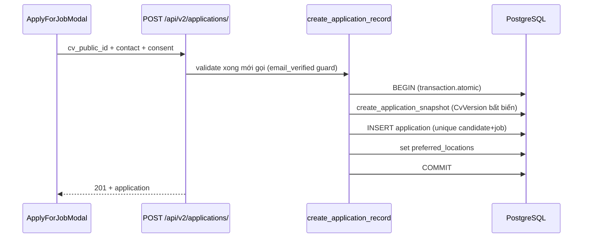

# Audit 3 luồng nghiệp vụ trọng yếu (AR-P4, 2026-07-21)

Kết luận tổng: cả 3 luồng **đã đạt** các tiêu chí an toàn chính; nợ còn lại là
2 điểm email đồng bộ (ghi ở cuối). Số query các endpoint list được khóa bằng
test hợp đồng `test_query_budget.py`.

## Luồng A — Ứng tuyển (applications)

- ✅ **Idempotency**: `UniqueConstraint(candidate, job)` — double-submit thành
  IntegrityError, không tạo 2 bản ghi.
- ✅ **Transaction boundary**: snapshot + application + M2M trong một
  `transaction.atomic`; **không có email/side-effect nào trong transaction**.
- ✅ Snapshot CV bất biến (`CvVersion`) — NTD xem đúng CV tại thời điểm nộp.
- Query budget list ứng viên: **5** (auth + session + count + 1 JOIN + 1 prefetch).

## Luồng B — CV Builder lưu & render PDF (cvs)

- ✅ **Render PDF (WeasyPrint) không bao giờ chạy trong request** — chỉ trong
  Celery: `generate_cv_thumbnail`, `render_cv_export_job` (soft/hard limit 50/60s
  cho import).
- ✅ **Chống race autosave**: `CvDraft` compare-and-swap bằng `lock_version`
  (test `test_draft_compare_and_swap_rejects_a_stale_write`), stale write bị từ
  chối thay vì ghi đè.
- ✅ **Recovery**: export/import dùng job-state machine (PENDING → PROCESSING →
  DONE/FAILED, đếm attempts) + task beat `dispatch_pending_cv_export_jobs` /
  `dispatch_pending_auth_email_jobs` vớt job kẹt khi web process không đẩy được
  vào broker — mô hình at-least-once, task tự idempotent (guard đầu task +
  fingerprint cho snapshot template).
- ✅ Thumbnail idempotent: kiểm `default_storage.exists` trước khi render lại.

## Luồng C — Tìm kiếm việc làm (jobs)

- ✅ `active_jobs_queryset`: `select_related(company)` + 3 `prefetch_related`
  + `defer` các cột text lớn ở chế độ list — số query **phẳng theo số bản ghi**.
- ✅ Full-text: dùng `unaccent` (extension bật qua migration) + fold accents ở
  `common/db/search.py`.
- ✅ Query budget: **5** cho `GET /api/jobs/` (khóa bằng test).
- Index: `status`, `candidate`, `job` đã có; các cột filter chính đi qua FK đã
  index mặc định.

## Nợ còn lại (ghi nhận, chưa sửa)

1. **Email đồng bộ trong request** ở các luồng phụ: 2FA gửi mã, password reset,
   welcome, onboarding employer (`send_html_email` trực tiếp, `EMAIL_TIMEOUT=10`).
   SMTP chậm sẽ giữ request tối đa 10s. Luồng verify email đã dùng
   `AuthEmailJob` + Celery — nên mở rộng pattern đó cho 2FA/reset khi rảnh.
   (Không sửa ngay: đổi sang async đòi UX chờ mã phức tạp hơn.)
2. `generate_template_color_snapshot` chưa có `autoretry_for` — lỗi transient
   của R2 phải chờ lần regenerate kế tiếp. Chấp nhận được vì là tác vụ cosmetic
   có fingerprint idempotent.
