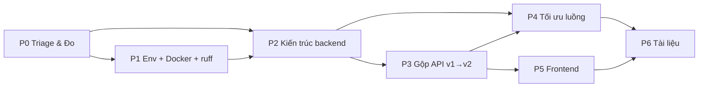

# Kế hoạch Tổng Kiểm Tra & Tái Cấu Trúc (Audit & Refactor Plan)

> Lập ngày 2026-07-21. Phạm vi: toàn repo `ai-recruitment-platform`.
> Ràng buộc đã chốt: **thực thi solo**, mục tiêu **dọn nợ kỹ thuật để đi tiếp**,
> triển khai đích **VPS + Docker Compose**, **được phép breaking change cả API
> lẫn schema**.

---

## 0. Kết quả audit — hiện trạng đo được

Đây là số liệu quét thực tế, không phải ước lượng. Mọi mục tiêu ở các Phase bên
dưới đều tham chiếu về đây.

### 0.1 Quy mô

| Hạng mục | Số đo |
| --- | --- |
| Backend Python (trừ migrations) | ~29.300 dòng, 16 Django app |
| Frontend JS/JSX | ~37.300 dòng |
| File test backend | 22 file |
| Biến trong `backend/.env.example` | ~97 |
| Nhánh local | 32 (15 nhánh chưa merge vào `main`) |
| TODO/FIXME/HACK trong source | 7 |

### 0.2 Những gì ĐANG TỐT — không được phá khi refactor

Đây là điểm quan trọng: giả định ban đầu "codebase rối, kiến trúc bị bỏ ngỏ"
**không đúng với repo này**. Repo đã có nền tảng tốt hơn mức trung bình:

- Frontend theo **FSD** (`app → pages → widgets → features → entities → shared`)
  và **được enforce tự động** bằng `dependency-cruiser` + `oxlint` + 2 script
  boundary riêng (`check_api_boundary.sh`, `check_feature_boundary.sh`).
- **9 ADR** trong `docs/adr/` ghi lại quyết định kiến trúc.
- Settings backend đã tách `base / development / production / test`.
- `.env.example` đã có comment giải thích theo từng nhóm — chất lượng tốt.
- **`.gitignore` đã đúng**: `.env`, `venv/`, `*.rdb`, `celerybeat-schedule*`,
  `__pycache__`, `media/` đều **không bị commit**. (Các file này có trên đĩa
  local nhưng untracked — chỉ là rác local, không phải rủi ro lộ secret.)
- CI 2 workflow, có gate migration treo, coverage gate, bundle artifact.
- Có `docs/TIEN-DO-DU-AN.md` theo dõi 59/84 hạng mục.

→ Kế hoạch này là **hoàn thiện một nền móng đã dựng dở**, không phải viết lại.

### 0.3 Nợ kỹ thuật thật — xếp theo mức độ tổn hại

**N1 — Backend tồn tại 3 layout app khác nhau cùng lúc.** (nghiêm trọng nhất)

Quét `backend/apps/` cho ra 3 thế hệ cấu trúc chồng lên nhau:

| Thế hệ | App | Đặc điểm |
| --- | --- | --- |
| **A — chuẩn mới** | `jobs`, `employers`, `privacy` | có `api/` package, `services/`, `selectors/`, `models/` tách file |
| **B — quá độ** | `cvs`, `applications`, `cv_templates` | `views.py` + `api_v2_views.py` + `urls.py` + `urls_v2.py` song song, có services/selectors |
| **C — legacy** | `ai_core`, `dashboard`, `interviews`, `locations`, `skills`, `services` | `views.py` + `serializers.py` phẳng, **không có service layer** — business logic nằm trong view |

Hệ quả: không có "chỗ đúng" để đặt code mới, mỗi lần thêm tính năng phải quyết
lại kiến trúc từ đầu. `ADR-0003` đã định nghĩa service/selector nhưng chỉ mới áp
dụng cho một nửa số app.

**N2 — API v1/v2 chạy song song không có ngày kết thúc.**

`config/urls.py` mount cả `/api/...` (v1) lẫn `/api/v2/...` cho `cvs`,
`cv_templates`, `applications`. `.env.example` có biến deprecation header nhưng
đây là **duplicate surface**: mỗi thay đổi nghiệp vụ phải sửa 2 nơi. Ba app này
chính là 3 app đang ở layout B — hai vấn đề là một.

**N3 — Backend không có linter/formatter.**

Không có `ruff`, `black`, `pyproject.toml`, `pre-commit`. Frontend có oxlint +
depcruise + 2 script boundary; backend chỉ có `manage.py check`. Chênh lệch tiêu
chuẩn giữa hai nửa dự án rất lớn.

**N4 — Coverage gate frontend đo trên allowlist 11 đường dẫn.**

`vite.config.js` khai báo `coverage.include` là danh sách trắng thủ công (guards,
session, auth api, saved-jobs, search-jobs, một hook, vài file `shared/api`). Con
số "84%" trong tracker **chỉ nói về ~11 file**, không phải 37k dòng. Đây là nợ
**đo lường** — nguy hiểm vì nó tạo cảm giác an toàn sai.

**N5 — Test backend chưa tách; file test khổng lồ.**

`accounts/tests.py` 1.350 dòng, `cvs/tests_v2.py` 1.268 dòng,
`employers/tests/test_api.py` 943 dòng. Chỉ 22 file test cho 16 app. Không có
`pytest`, không có coverage gate backend trong CI.

**N6 — Không có Docker/docker-compose.**

Giai đoạn 8 (Deployment) = 0/2 trong tracker. `check_all.sh` phụ thuộc
`backend/venv/` trên máy local. Không có đường tái lập môi trường.

**N7 — 15 nhánh chưa merge vào `main`.**

Mỗi nhánh treo là một vùng conflict tương lai. Refactor cấu trúc thư mục backend
sẽ làm **toàn bộ** các nhánh này conflict nặng nếu không xử lý trước.

**N8 — File frontend quá lớn.**

`ApplyForJobModal.jsx` 609, `CvSourcePanel.jsx` 451, `use-cv-draft-editor.js`
424, `JobList.jsx` 423, `CvDraftEditor.jsx` 421. Đây là mức "còn đọc được" nhưng
đã vượt ngưỡng dễ test.

**N9 — Fallback hardcode trong `shared/api/client.js`.**

`import.meta.env.VITE_API_BASE_URL || 'http://localhost:8000/api'` — production
build thiếu biến sẽ **im lặng** trỏ về localhost thay vì fail. Đây là nhóm lỗi
tệ nhất: không có triệu chứng cho tới khi lên prod.

---

## 1. Nguyên tắc điều hành (solo, 1 người)

Vì thực thi solo, kế hoạch bỏ mọi nghi thức Scrum không tạo giá trị và thay bằng
**cơ chế tự động thay cho code review**:

1. **Mỗi Phase = 1 nhánh `refactor/phaseN-*`, merge vào `main` qua PR.** Tự PR
   cho chính mình vẫn có giá trị: buộc đọc lại diff toàn cảnh + CI chạy đủ.
2. **Không refactor và thêm tính năng trong cùng một commit.** Commit refactor
   thuần phải giữ test xanh mà không sửa test.
3. **Mọi rule đã dọn phải được đóng đinh bằng công cụ**, không dựa vào trí nhớ.
   Dọn xong mà không có linter chặn = sẽ bẩn lại trong 3 tuần.
4. **Đơn vị thời gian là "phiên 3 giờ"**, không phải sprint 2 tuần. Ước lượng
   dưới đây tính theo phiên để dễ đặt lịch thật.
5. **Cập nhật `docs/TIEN-DO-DU-AN.md` ngay trong commit hoàn thành**, theo đúng
   quy ước đã ghi ở đầu file đó.

---

## 2. Lộ trình

Tổng: **~9 tuần part-time (~55 phiên)**. Mục §9 có phương án cắt còn 6 tuần.

```
Phase 0  Triage & Đo baseline           ~4 phiên   ← không đổi code sản phẩm
Phase 1  Nền tảng môi trường + Docker   ~8 phiên   ← unblock mọi phase sau
Phase 2  Chuẩn hóa kiến trúc backend    ~16 phiên  ← lõi
Phase 3  Gộp API v1→v2, dọn schema      ~8 phiên   ← breaking change
Phase 4  Tối ưu luồng nghiệp vụ         ~8 phiên
Phase 5  Frontend: tách file + coverage ~8 phiên
Phase 6  Tài liệu & chốt sổ             ~3 phiên
```

---

### Phase 0 — Triage & Đo baseline (~4 phiên)

**Mục đích**: dọn vùng chiến đấu và có số liệu gốc để chứng minh cải thiện.
Không sửa logic sản phẩm ở phase này.

#### Checklist

- [ ] **0.1** Kiểm kê 15 nhánh chưa merge. Với mỗi nhánh, quyết định một trong
      ba: `merge ngay` / `cherry-pick phần còn giá trị rồi xóa` / `xóa`.
      Ghi quyết định vào `docs/09-refactor/branch-triage-2026-07.md`.
      ```bash
      for b in $(git branch --no-merged main --format='%(refname:short)'); do
        echo "$b | $(git log -1 --format='%ci %s' "$b") | +$(git rev-list --count main..$b) commit"
      done
      ```
- [ ] **0.2** Dọn rác local (không ảnh hưởng git, chỉ giảm nhiễu khi grep):
      `backend/celerybeat-schedule*`, `dump.rdb`, `.DS_Store`.
- [ ] **0.3** Đo coverage frontend **thật** — chạy một lần với `coverage.include`
      bị vô hiệu hóa để biết con số toàn repo. Ghi lại. **Chưa** sửa config.
- [ ] **0.4** Đo baseline backend: số endpoint (`manage.py show_urls` hoặc đếm
      từ schema spectacular), thời gian chạy test suite, số query của 3 endpoint
      nặng nhất (dùng `django-debug-toolbar` hoặc `CaptureQueriesContext`).
- [ ] **0.5** Đo bundle frontend: `npm run build` + `check:bundle-budget`.
- [ ] **0.6** Viết `docs/09-refactor/baseline-2026-07.md` chứa toàn bộ số trên.
- [ ] **0.7** Snapshot API contract hiện tại làm mốc so sánh cho Phase 3:
      ```bash
      python manage.py spectacular --file docs/04-api/openapi-baseline-2026-07.yaml
      ```

#### Tiêu chí nghiệm thu

- `git branch --no-merged main` trả về **≤ 2** nhánh (chỉ nhánh đang làm việc).
- `docs/09-refactor/baseline-2026-07.md` tồn tại, có đủ 5 nhóm số: LOC, coverage
  thật FE + BE, số endpoint, thời gian test, bundle size gzip.
- `openapi-baseline-2026-07.yaml` được commit — đây là hợp đồng để Phase 3
  chứng minh "không mất endpoint ngoài ý muốn".
- Không có thay đổi nào trong `backend/apps/` và `frontend/src/`.

---

### Phase 1 — Nền tảng môi trường, cấu hình, Docker (~8 phiên)

**Mục đích**: làm cho môi trường tái lập được **trước khi** động vào cấu trúc
code. Đây là đảo thứ tự có chủ ý — Compose sẽ được dùng để chạy test cho toàn bộ
các Phase sau, và nó là phase rủi ro thấp nhất nên phù hợp để lấy đà.

#### 1A. Chuẩn hóa quản lý biến môi trường

- [ ] **1.1** Phân loại lại ~97 biến trong `.env.example` thành 3 nhóm và đánh
      dấu rõ trong file:
      - `# BẮT BUỘC` — thiếu thì app phải **crash lúc khởi động**, không fallback.
      - `# TÙY CHỌN (có default an toàn)` — ghi kèm giá trị default.
      - `# CHỈ PRODUCTION` — chỉ đọc khi `ENVIRONMENT=production`.
- [ ] **1.2** Thêm **fail-fast validation** ở `config/settings/base.py`: build
      một danh sách `REQUIRED_ENV` và raise `ImproperlyConfigured` liệt kê **tất
      cả** biến thiếu cùng lúc (không raise từng cái một).
- [ ] **1.3** Xóa fallback nguy hiểm ở frontend (**N9**). Trong
      `shared/api/client.js`, giữ default `localhost` **chỉ khi** `import.meta.env.DEV`;
      ở build production, thiếu `VITE_API_BASE_URL` phải throw lúc load module.
- [ ] **1.4** Viết script `scripts/check_env_sync.sh`: so khớp key giữa `.env` và
      `.env.example` (cả backend và frontend), báo lỗi nếu `.env.example` thiếu
      key mà code thực sự đọc. Đưa vào CI.
- [ ] **1.5** Quét hardcode còn sót:
      ```bash
      grep -rnE "https?://(localhost|127\.0\.0\.1|[a-z0-9.-]+\.(vn|com))" \
        backend/apps backend/common frontend/src \
        --include="*.py" --include="*.js" --include="*.jsx" \
        | grep -vE "\.test\.|tests?\.py|/tests/"
      ```
      Mọi kết quả phải chuyển thành setting/env hoặc hằng số có tên trong
      `shared/config/` (frontend) / `settings` (backend).

#### 1B. Docker Compose

- [ ] **1.6** `backend/Dockerfile` multi-stage. Lưu ý bắt buộc với repo này:
      WeasyPrint cần system libs (`libpango`, `libcairo`, `libgdk-pixbuf`,
      `libffi`) — phải cài ở cả stage build lẫn runtime. Chạy bằng user không
      phải root.
- [ ] **1.7** `frontend/Dockerfile` (build vite → serve bằng nginx tĩnh).
- [ ] **1.8** `docker-compose.yml` (dev) với service: `db` (postgres:16, bật
      extension `unaccent` qua init script), `redis`, `backend`, `worker`
      (celery), `beat` (celery beat), `frontend`. Healthcheck cho `db` và
      `redis`, `depends_on: condition: service_healthy`.
- [ ] **1.9** `docker-compose.prod.yml` (override): thêm `nginx` reverse proxy,
      bỏ volume mount source, `DJANGO_SETTINGS_MODULE=config.settings.production`,
      restart policy, giới hạn tài nguyên.
- [ ] **1.10** Viết lại `scripts/check_all.sh` để không phụ thuộc
      `backend/venv/` — chạy qua Compose (`docker compose run --rm backend ...`)
      với fallback về venv nếu Docker không có.

#### 1C. Linter & formatter backend (N3)

- [ ] **1.11** Thêm `backend/pyproject.toml` với `ruff` (lint + format, thay cả
      black/isort/flake8). Cấu hình bắt đầu **nới tay**: bật `E,F,I,UP,B,DJ`
      (`DJ` = rule riêng cho Django), `line-length = 100`.
- [ ] **1.12** Chạy `ruff format` một lần trên toàn backend trong **một commit
      riêng, chỉ format**, rồi ghi hash commit đó vào `.git-blame-ignore-revs`.
- [ ] **1.13** Sửa hết `ruff check` violations trong commit thứ hai (tách khỏi
      commit format để diff đọc được).
- [ ] **1.14** Thêm `.pre-commit-config.yaml`: ruff, ruff-format,
      `check-merge-conflict`, `detect-private-key`, `end-of-file-fixer`, và
      oxlint cho frontend.
- [ ] **1.15** Thêm bước `ruff check` + `ruff format --check` vào
      `backend-ci.yml`.

#### Tiêu chí nghiệm thu

- `docker compose up` từ máy **sạch** (chỉ có Docker) cho ra app chạy được ở
  `localhost` — kiểm chứng bằng cách `git clone` vào thư mục mới và chạy.
- Xóa 1 biến `BẮT BUỘC` khỏi `.env` → backend crash lúc start với thông báo nêu
  **đích danh** biến thiếu. Xóa `VITE_API_BASE_URL` → `npm run build` fail.
- `ruff check backend/` và `ruff format --check backend/` đều pass; cả hai đã
  nằm trong `backend-ci.yml`.
- Lệnh grep ở mục 1.5 trả về **0 kết quả** ngoài file test.
- `scripts/check_env_sync.sh` pass và đã có trong CI.
- `docs/06-deployment/` có hướng dẫn chạy Compose dev + prod.

---

### Phase 2 — Chuẩn hóa kiến trúc backend (~16 phiên) ★ lõi

**Mục đích**: đưa 16 app về **một** layout duy nhất, xóa bỏ N1.

#### 2.1 Chốt layout chuẩn (1 phiên) — làm trước, không thương lượng lại

Lấy layout của `jobs`/`employers` (thế hệ A) làm chuẩn vì nó đã tồn tại và đã
được chứng minh trong repo:

```text
backend/apps/<app>/
├── api/
│   ├── serializers/       # tách theo resource khi > 300 dòng
│   ├── views/             # chỉ HTTP: parse request → gọi service/selector → trả response
│   └── urls.py
├── models/                # tách file khi > 300 dòng; __init__.py re-export
├── services/              # ghi: mọi thao tác thay đổi state, giữ transaction boundary
├── selectors/             # đọc: mọi truy vấn phức tạp, tối ưu N+1 tại đây
├── tasks/                 # Celery task — chỉ orchestrate, gọi vào services/
├── tests/
│   ├── test_api.py        # tầng HTTP
│   ├── test_services.py   # tầng nghiệp vụ
│   └── test_selectors.py  # tầng truy vấn
├── admin.py
└── apps.py
```

**Quy tắc phụ thuộc (sẽ được enforce ở 2.6):**

```
api/ → services/ → models/
api/ → selectors/ → models/
tasks/ → services/
```

- `api/` **không được** import `models` trực tiếp cho logic (chỉ cho type hint /
  serializer `Meta.model`).
- `services/` **không được** import `api/` hay `rest_framework`.
- App **không được** import `services`/`selectors` của app khác — giao tiếp
  cross-app đi qua service công khai được re-export ở `<app>/services/__init__.py`.

- [ ] Ghi layout này thành **ADR-0010** (`docs/adr/0010-canonical-backend-app-layout.md`),
      nêu rõ nó thay thế/mở rộng ADR-0003.

#### 2.2 Di trú app thế hệ C — legacy, chưa có service layer (6 phiên)

Thứ tự làm từ nhỏ đến lớn để tích lũy kinh nghiệm trước khi vào app khó:

- [ ] `locations` (nhỏ, gần như CRUD thuần — dùng làm app mẫu)
- [ ] `skills`
- [ ] `dashboard` (chú ý: đây là app dễ có N+1 nhất vì aggregate nhiều domain)
- [ ] `services`
- [ ] `interviews`
- [ ] `ai_core` (đặc thù: `cv_import.py` chứa logic parse — chuyển thành
      `services/cv_import.py`, tách phần gọi model AI ra `services/providers/`
      để về sau đổi provider không phải sửa nghiệp vụ)

Với mỗi app, quy trình cố định:

1. Viết test đặc tả hành vi hiện tại **trước** (characterization test) — nếu app
   chưa có test, đây là bước bắt buộc, không được bỏ.
2. Tạo cấu trúc thư mục mới, `git mv` file cũ vào.
3. Rút business logic từ `views.py` → `services/` (ghi) và `selectors/` (đọc).
4. View chỉ còn: validate input → gọi service/selector → serialize output.
5. Chạy test, phải xanh **không sửa test**.
6. Commit riêng cho từng app.

#### 2.3 Di trú app thế hệ B (4 phiên)

`cvs`, `applications`, `cv_templates` — chỉ chuẩn hóa **cấu trúc thư mục** ở
phase này; việc xóa v1 để Phase 3 làm, tránh trộn hai loại rủi ro trong một
commit.

- [ ] Gộp `views.py` + `api_v2_views.py` → `api/views/` (giữ cả hai class, chưa
      xóa).
- [ ] Gộp `serializers.py` + `api_v2_serializers.py` → `api/serializers/`.
- [ ] Tách `cvs/models.py` (553 dòng) → `models/` package.
- [ ] Tách `cv_templates/models.py` (498 dòng) → `models/` package.
- [ ] `cvs/composition.py`, `completeness.py`, `pdf_renderer.py` → `services/`.

#### 2.4 Chuẩn hóa app thế hệ A (1 phiên)

- [ ] `jobs`, `employers`, `privacy`: rà cho khớp 100% layout ở 2.1 (chủ yếu là
      bổ sung `tasks/`, `tests/` tách 3 tầng).
- [ ] `accounts`, `blog`, `candidates`, `sitecontent`: đã có services/selectors
      nhưng còn `views/` + `serializers.py` phẳng → đưa vào `api/`.

#### 2.5 Tách test (2 phiên) — xử lý N5

- [ ] `accounts/tests.py` (1.350 dòng) → `tests/test_api.py`,
      `test_services.py`, `test_two_factor.py`, `test_oauth.py`.
- [ ] `cvs/tests_v2.py` (1.268) và `employers/tests/test_api.py` (943) → tách
      theo cùng nguyên tắc.
- [ ] Chuyển sang `pytest` + `pytest-django` + `pytest-cov` (fixture tái sử dụng
      được, chạy song song bằng `pytest-xdist` — quan trọng khi suite lớn dần).
- [ ] Thêm `factory-boy` thay các helper tạo object thủ công.

#### 2.6 Đóng đinh bằng công cụ (2 phiên) — **bước quan trọng nhất của Phase**

Dọn xong mà không có gì chặn thì sẽ bẩn lại. Bắt buộc:

- [ ] Thêm **`import-linter`** (`backend/.importlinter`) với các contract:
      - `layers`: `api` → `services`/`selectors` → `models` (contract type
        `layers`, ép chiều phụ thuộc).
      - `forbidden`: `services` không được import `rest_framework`.
      - `independence`: các app không được import `services`/`selectors` nội bộ
        của nhau.
- [ ] Thêm bước `lint-imports` vào `backend-ci.yml` — **fail build** khi vi phạm.
- [ ] Thêm coverage gate backend: `pytest --cov --cov-fail-under=<baseline>`,
      lấy `<baseline>` từ Phase 0 (ratchet: chỉ được tăng, không được giảm).

#### Tiêu chí nghiệm thu

- **16/16 app** khớp layout ở 2.1. Kiểm chứng tự động bằng script:
  ```bash
  for a in $(ls backend/apps | grep -v "__"); do
    for d in api services tests; do
      [ -d "backend/apps/$a/$d" ] || echo "THIẾU: $a/$d"
    done
  done
  ```
  → output rỗng.
- `lint-imports` pass và đã nằm trong `backend-ci.yml`.
- **Không còn file `views.py`/`serializers.py` phẳng** ở cấp app:
  `find backend/apps -maxdepth 2 -name "views.py" -o -maxdepth 2 -name "serializers.py"`
  → rỗng.
- Không còn file Python nào (trừ migrations) **> 400 dòng**.
- Coverage backend ≥ baseline Phase 0, và gate đã bật trong CI.
- `python manage.py spectacular` diff so với `openapi-baseline-2026-07.yaml`:
  **không có endpoint nào biến mất** (Phase 2 là refactor thuần).

---

### Phase 3 — Gộp API v1 → v2, dọn schema (~8 phiên)

**Mục đích**: xóa N2. Đây là phase **breaking change có chủ đích** — đã được cho
phép.

#### Checklist

- [ ] **3.1** Lập ma trận đối chiếu v1 ↔ v2 cho `cvs`, `cv_templates`,
      `applications`: mỗi endpoint v1 map sang v2 nào, hay không có tương đương.
      Ghi vào `docs/04-api/v1-v2-migration-matrix.md`.
- [ ] **3.2** Với endpoint v1 **không** có tương đương v2 → port lên v2 trước.
- [ ] **3.3** Quét frontend tìm mọi chỗ còn gọi v1:
      ```bash
      grep -rn "api/cvs\|api/cv-templates\|api/applications" frontend/src \
        --include="*.js" --include="*.jsx" | grep -v "/v2/"
      ```
      Chuyển hết sang v2. Đây là phần **phải làm trước** khi xóa backend.
- [ ] **3.4** Xóa `urls_v2.py` và gộp về một `api/urls.py` duy nhất. Quyết định
      versioning: hoặc **bỏ hẳn tiền tố version** (đơn giản nhất cho dự án chưa
      có client bên thứ ba), hoặc giữ `/api/v2/` cho mọi app. Chọn **một**, ghi
      vào ADR-0011, áp dụng đồng loạt 16 app.
- [ ] **3.5** Xóa toàn bộ code v1: view, serializer, url, và các biến
      deprecation header trong `.env.example` + settings.
- [ ] **3.6** Dọn schema DB đi kèm: rà `models/` tìm field
      `null=True, blank=True` không còn ai dùng, index thiếu trên FK hay được
      filter, và các bảng/cột phục vụ riêng v1. Viết migration dọn.
- [ ] **3.7** Squash migrations cho các app có > 15 migration
      (`manage.py squashmigrations`) — giảm thời gian dựng DB test.
- [ ] **3.8** Regenerate OpenAPI schema, cập nhật `docs/04-api/`.

#### Tiêu chí nghiệm thu

- `grep -rn "v2\|_v2" backend/apps` → chỉ còn khớp trong tên biến nghiệp vụ, hết
  file `*_v2_*.py` và `urls_v2.py`.
- `config/urls.py` mount đúng **một** tiền tố API thống nhất cho mọi app.
- Diff `openapi.yaml` mới vs baseline được **liệt kê tường minh** trong
  `v1-v2-migration-matrix.md` — mọi endpoint mất đi đều có dòng giải thích.
- E2E smoke frontend (`npm run test:e2e:smoke`) xanh — đây là bằng chứng chính
  cho thấy breaking change đã được frontend hấp thụ đủ.
- `makemigrations --check --dry-run` sạch.

---

### Phase 4 — Tối ưu luồng nghiệp vụ & performance (~8 phiên)

**Mục đích**: gỡ rối logic 3 luồng nặng nhất. Nguyên tắc: **đo trước, sửa sau,
đo lại** — không tối ưu theo cảm giác.

#### 4.1 Dựng khả năng đo (1 phiên)

- [ ] Thêm `django-debug-toolbar` (chỉ development) và `nplusone` (chế độ raise
      trong `config/settings/test.py` → test sẽ **fail** khi có N+1 mới).
- [ ] Thêm test helper `assertNumQueries` cho các endpoint list quan trọng, chốt
      số query thành hợp đồng.

#### 4.2 Ba luồng ưu tiên

Chọn theo mức độ phức tạp đo được ở Phase 0:

- [ ] **Luồng A — Ứng tuyển (`applications` + `ApplyForJobModal.jsx` 609 dòng)**
      - Vẽ sequence diagram hiện trạng vào `docs/07-algorithms/`.
      - Rà transaction boundary: tạo application + snapshot CV + gửi mail +
        cập nhật đếm phải nằm đúng chỗ. **Việc gửi mail không được nằm trong
        transaction** — phải đẩy sang Celery và gọi bằng
        `transaction.on_commit()`.
      - Rà idempotency: double-submit / double-click phải không tạo 2 bản ghi.
      - Kiểm tra `cv_snapshot_preflight` (đã có management command) có chạy đúng
        chỗ trong luồng không.

- [ ] **Luồng B — CV Builder lưu & render PDF (`cvs`)**
      - `use-cv-draft-editor.js` (424 dòng) + `CvDraftEditor.jsx` (421) +
        `composition.py` + `pdf_renderer.py` là một luồng xuyên tầng.
      - Autosave: kiểm tra debounce, chống race giữa save và load, xử lý
        conflict khi 2 tab cùng mở.
      - Render PDF (WeasyPrint) là tác vụ **nặng CPU** → bắt buộc chạy trong
        Celery worker riêng, không trong request cycle. Kiểm tra hiện trạng và
        sửa nếu đang chạy đồng bộ.

- [ ] **Luồng C — Tìm kiếm việc làm (`jobs` + `JobList.jsx` 423 dòng)**
      - Đây là endpoint chịu tải cao nhất → ưu tiên `select_related` /
        `prefetch_related` / `only()` trong `selectors/`.
      - Kiểm tra index DB khớp với các cột thực sự được filter/sort.
      - Rà chiến lược cache (`common/cache_utils.py` đã tồn tại) — key có bao
        gồm đủ tham số filter không, invalidation ở đâu.
      - Kiểm tra pagination (`common/pagination.py`) có dùng
        `count()` tốn kém trên mỗi request không.

#### 4.3 Dọn ngang

- [ ] Rà `common/` (13 module): mỗi module phải có owner rõ ràng. Module chỉ 1
      app dùng → chuyển về app đó. `common/` không phải bãi rác.
- [ ] Rà Celery: mọi task phải có `max_retries`, `autoretry_for`, và
      `acks_late` phù hợp. Task không idempotent mà có retry là bug chờ nổ.

#### Tiêu chí nghiệm thu

- 3 sequence diagram trong `docs/07-algorithms/` phản ánh đúng code sau sửa.
- Số query của 3 endpoint mục tiêu **giảm so với baseline Phase 0**, và được
  khóa bằng `assertNumQueries` trong test.
- `nplusone` bật chế độ raise trong settings test, suite vẫn xanh.
- Không còn tác vụ gửi mail / render PDF nào chạy đồng bộ trong request — kiểm
  chứng bằng grep các lời gọi `send_mail` / render ngoài `tasks/`.
- Mọi Celery task đều khai báo retry policy.

---

### Phase 5 — Frontend: tách file lớn & coverage thật (~8 phiên)

**Mục đích**: xóa N4 và N8. Kiến trúc FSD đã tốt, phase này lo **kích thước** và
**đo lường**.

#### Checklist

- [ ] **5.1** Sửa `coverage.include` trong `vite.config.js`: bỏ allowlist 11
      đường dẫn, chuyển sang `src/**/*.{js,jsx}` với `exclude` cho file thực sự
      không đo được (`main.jsx`, `*.test.jsx`, `src/test/`, barrel `index.js`).
- [ ] **5.2** Đặt `thresholds` bằng **đúng con số thật** đo ở Phase 0.3 (sẽ thấp
      hơn 84% nhiều — đó là điều đúng đắn). Ghi rõ trong tracker rằng con số tụt
      là do **sửa cách đo**, không phải chất lượng giảm.
- [ ] **5.3** Ratchet: mỗi PR sau đó chỉ được tăng threshold, không giảm.
- [ ] **5.4** Tách 5 file lớn nhất theo đúng mô hình FSD đã dùng ở FE-P3/FE-P4
      (model hook + UI component con):
      - `ApplyForJobModal.jsx` (609) → hook `use-apply-form` + 3 step component.
      - `CvSourcePanel.jsx` (451)
      - `use-cv-draft-editor.js` (424) → tách theo mối quan tâm: autosave /
        selection / history.
      - `JobList.jsx` (423) → tách filter panel + result list.
      - `CvDraftEditor.jsx` (421)
      Mỗi file tách xong phải kèm test cho phần logic vừa rút ra.
- [ ] **5.5** Thêm rule chặn file quá lớn: `max-lines` (oxlint) ở mức 300 cho
      `src/**`, warning trước, error sau khi 5.4 xong.
- [ ] **5.6** Rà responsive theo quy ước dự án — mọi component vừa tách phải
      giữ nguyên breakpoint `sm:/md:/lg:`, kiểm bằng Playwright ở viewport mobile.
- [ ] **5.7** Rà i18n: chuỗi hardcode tiếng Việt trong component vừa tách phải
      đi qua `i18next`.
- [ ] **5.8** Đưa `npm run test:e2e:smoke` vào `frontend-ci.yml` (hiện CI chỉ có
      lint/architecture/unit/build — e2e đang nằm ngoài).

#### Tiêu chí nghiệm thu

- `coverage.include` không còn allowlist thủ công; threshold khớp số đo thật và
  đang được CI enforce.
- Không còn file trong `frontend/src/` **> 300 dòng** (trừ file test).
  ```bash
  find frontend/src -name "*.jsx" -o -name "*.js" | grep -v test | xargs wc -l \
    | sort -rn | awk '$1 > 300'
  ```
  → rỗng.
- `npm run quality` + `npm run test:e2e:smoke` xanh.
- `check:architecture` (depcruise) vẫn 0 vi phạm.
- E2E smoke đã chạy trong CI.

---

### Phase 6 — Tài liệu & chốt sổ (~3 phiên)

**Mục đích**: đảm bảo tài liệu mô tả hệ thống **sau** refactor, không phải trước.
Làm cuối cùng có chủ ý — viết docs giữa chừng sẽ phải viết lại.

#### Danh sách tài liệu bắt buộc cập nhật

| Tài liệu | Vị trí | Nội dung phải sửa sau refactor |
| --- | --- | --- |
| **README.md** | root | Thay hướng dẫn setup thủ công bằng `docker compose up`; cập nhật stack; badge CI |
| **AGENTS.md** | root | Hiện chỉ nói về frontend — **phải bổ sung phần backend**: layout chuẩn 2.1, quy tắc phụ thuộc, lệnh verify backend |
| **Kiến trúc hệ thống** | `docs/02-tong-quan/` | Sơ đồ C4 mức Context + Container, phản ánh Compose topology (web/worker/beat/db/redis/nginx) |
| **API** | `docs/04-api/` | Regenerate OpenAPI; `v1-v2-migration-matrix.md`; hướng dẫn dùng Swagger UI qua drf-spectacular |
| **Database schema** | `docs/03-database/` | ERD cập nhật sau migration dọn ở 3.6; ghi rõ các bảng/cột đã xóa |
| **Deployment** | `docs/06-deployment/` | Quy trình deploy VPS: chuẩn bị máy, secret, `docker compose -f ... -f docker-compose.prod.yml up -d`, backup DB, rollback |
| **ADR** | `docs/adr/` | Thêm 0010 (backend layout), 0011 (API versioning); đánh dấu ADR bị thay thế |
| **Thuật toán/luồng** | `docs/07-algorithms/` | 3 sequence diagram từ Phase 4 |
| **Tiến độ** | `docs/TIEN-DO-DU-AN.md` | Cập nhật Giai đoạn 8 (Deployment) từ 0/2; thêm epic refactor này |
| **Setup dev** | `docs/setup-development.md` | Viết lại theo Compose |

#### Checklist bổ sung

- [ ] **6.1** Thêm `docs/09-refactor/results-2026-XX.md`: bảng **baseline vs sau
      refactor** cho mọi số ở Phase 0. Đây là bằng chứng ROI.
- [ ] **6.2** Rà `docs/09-refactor/archive/` — chuyển các file phase cũ (3→10)
      vào archive để thư mục gốc chỉ còn tài liệu đang hiệu lực.
- [ ] **6.3** Cập nhật `.github/pull_request_template.md` với checklist mới
      (ruff, lint-imports, coverage ratchet).

#### Tiêu chí nghiệm thu

- Người lạ clone repo, đọc `README.md`, chạy được app trong **≤ 3 lệnh**, không
  cần hỏi thêm. (Tự kiểm chứng: clone vào thư mục mới, làm theo đúng chữ trong
  README, không dùng kiến thức sẵn có.)
- `AGENTS.md` mô tả cả frontend lẫn backend.
- Swagger UI hiển thị đúng tập endpoint sau khi xóa v1.
- ERD khớp với `manage.py inspectdb` thực tế.
- `results-2026-XX.md` có đủ cặp số trước/sau.

---

## 3. Bộ công cụ đề xuất

| Nhóm | Công cụ | Vai trò | Phase |
| --- | --- | --- | --- |
| Python lint/format | **ruff** | Thay black + isort + flake8 + pyupgrade, nhanh hơn nhiều lần | 1 |
| **Kiến trúc backend** | **import-linter** | Đóng đinh quy tắc layer — tương đương depcruise của frontend | 2 |
| Test backend | **pytest** + pytest-django + pytest-cov + pytest-xdist | Fixture, chạy song song, coverage gate | 2 |
| Test data | **factory-boy** | Thay helper tạo object thủ công | 2 |
| Phát hiện N+1 | **nplusone** | Raise trong test → chặn regression | 4 |
| Profiling | **django-debug-toolbar**, **django-silk** | Đo query/thời gian mỗi request | 4 |
| Bảo mật deps | **pip-audit**, **npm audit**, **Dependabot** | Quét CVE, tự PR nâng version | 1 |
| Secret scanning | **gitleaks** (trong pre-commit) | Chặn commit secret — quan trọng khi có 97 biến env | 1 |
| Git hooks | **pre-commit** | Chạy ruff/oxlint/gitleaks trước mỗi commit | 1 |
| Frontend (đã có) | oxlint, dependency-cruiser, vitest, playwright | Giữ nguyên, chỉ siết thêm rule | 5 |
| Đo phức tạp | **radon** (Python), **oxlint max-lines** | Tìm hàm/file cần tách | 2, 5 |
| Docs API | **drf-spectacular** (đã có) | Regenerate mỗi lần đổi API | 3, 6 |
| Sơ đồ | **Mermaid** trong markdown | Sequence + ERD versioned cùng code | 4, 6 |

**Không đề xuất**: mypy/type hints toàn diện ở giai đoạn này — chi phí cho một
người quá cao so với lợi ích, và nó cạnh tranh trực tiếp với thời gian dành cho
Phase 2. Cân nhắc lại sau khi kiến trúc đã ổn định.

---

## 4. Quản lý tiến độ cho mô hình solo

### 4.1 Nhịp làm việc

Không dùng sprint 2 tuần. Dùng **chu kỳ Phase**, mỗi Phase kết thúc bằng một PR
merge vào `main`. Trong Phase, chia theo phiên 3 giờ.

**Quy tắc 70/30**: nếu cần vừa dọn vừa ra tính năng, dành 70% thời gian cho Phase
hiện tại và 30% cho tính năng — **không đảo ngược tỉ lệ**, vì refactor bị ngắt
quãng dài sẽ để lại trạng thái nửa vời (thứ tệ hơn cả không refactor). Phase 2
là ngoại lệ: nên chạy 100% cho tới xong, vì trạng thái "16 app, 2 layout" tệ hơn
"16 app, 3 layout".

### 4.2 Theo dõi

Thêm vào `docs/TIEN-DO-DU-AN.md` một epic mới:

```markdown
## Epic Audit & Refactor toàn dự án (2026-07-21, nhánh `refactor/phase*`)

| Phase | Nội dung | Trạng thái |
| --- | --- | --- |
| AR-P0 | Triage nhánh, đo baseline, snapshot OpenAPI | ⬜ |
| AR-P1 | Env fail-fast, xóa hardcode, Docker Compose, ruff + pre-commit | ⬜ |
| AR-P2 | Chuẩn hóa 16 app về 1 layout, import-linter, tách test, pytest | ⬜ |
| AR-P3 | Gộp API v1→v2, dọn schema, squash migrations | ⬜ |
| AR-P4 | Tối ưu 3 luồng: ứng tuyển, CV builder, tìm việc | ⬜ |
| AR-P5 | Coverage thật, tách 5 file > 400 dòng, e2e vào CI | ⬜ |
| AR-P6 | Cập nhật 10 nhóm tài liệu, báo cáo kết quả | ⬜ |
```

### 4.3 Chỉ số theo dõi hàng tuần

Ghi 6 số này vào cuối `docs/09-refactor/baseline-2026-07.md` mỗi tuần:

1. Số app chưa khớp layout chuẩn (mục tiêu: 16 → 0)
2. Số file > 300 dòng, backend và frontend (mục tiêu: giảm đều)
3. Coverage thật, backend và frontend (mục tiêu: tăng đơn điệu)
4. Số vi phạm `lint-imports` + `check:architecture` (mục tiêu: luôn 0)
5. Thời gian chạy full test suite (canh không để vượt 5 phút)
6. Số nhánh chưa merge (mục tiêu: ≤ 2)

Nếu chỉ số 5 vượt 5 phút, dừng lại xử lý ngay — suite chậm sẽ khiến chính bạn bỏ
chạy test, và khi đó mọi gate ở trên đều vô nghĩa.

---

## 5. Rủi ro & cách giảm thiểu

| Rủi ro | Mức | Giảm thiểu |
| --- | --- | --- |
| Phase 2 `git mv` hàng loạt làm mất lịch sử file | Trung bình | Dùng `git mv` (không xóa+tạo); commit move **tách riêng** khỏi commit sửa nội dung |
| Phase 3 xóa v1 làm hỏng frontend âm thầm | **Cao** | Bắt buộc làm 3.3 (chuyển frontend) **trước** 3.5 (xóa backend); E2E smoke là cổng chặn |
| Migration dọn schema làm mất dữ liệu | **Cao** | Backup DB trước; viết migration có `reverse`; test trên bản sao dữ liệu thật |
| Refactor kéo dài, mất động lực | Cao (solo) | Phase 0 và 1 cho kết quả thấy được ngay; mỗi app ở Phase 2 là một commit hoàn chỉnh — luôn có điểm dừng an toàn |
| Squash migrations gây lệch giữa dev và prod | Trung bình | Chỉ squash khi **chưa** có prod; nếu đã deploy thì bỏ mục 3.7 |
| Coverage tụt số sau 5.1 gây hiểu nhầm | Thấp | Ghi rõ lý do trong tracker và trong PR description |

---

## 6. Thứ tự phụ thuộc giữa các Phase



- **P0 phải xong trước mọi thứ** — đặc biệt là triage nhánh, vì P2 sẽ làm mọi
  nhánh treo conflict nặng.
- P4 và P5 **có thể đảo chỗ** nếu muốn thấy kết quả frontend sớm.
- P6 bắt buộc làm cuối.

---

## 7. Ba việc nên làm ngay hôm nay (< 1 giờ)

Nếu chưa muốn khởi động toàn bộ kế hoạch, ba việc này có tỉ lệ lợi ích/chi phí
cao nhất và không phụ thuộc phase nào:

1. **Sửa fallback `localhost` trong `frontend/src/shared/api/client.js`** (mục
   1.3). Đây là bug production đang chờ xảy ra, sửa mất 10 phút.
2. **Chạy `git branch --no-merged main`** và xóa những nhánh chắc chắn đã chết.
   Mỗi nhánh xóa hôm nay là một conflict không phải xử lý ở Phase 2.
3. **Thêm `ruff` + chạy `ruff check backend/`** để nhìn thấy con số vi phạm thực
   tế. Biết mình đang ở đâu quan trọng hơn là bắt đầu sửa.

---

## 8. Phương án rút gọn còn 6 tuần

Nếu quỹ thời gian chỉ có 6 tuần, cắt theo thứ tự sau (cắt từ dưới lên):

- **Giữ nguyên**: P0, P1, P2 (đây là 3 phase tạo ra thay đổi cấu trúc thật).
- **Rút gọn P3**: chỉ chuyển frontend sang v2 và **đánh dấu** v1 deprecated,
  hoãn việc xóa code và dọn schema sang đợt sau. Tiết kiệm ~4 phiên.
- **Rút gọn P4**: chỉ làm 4.1 (dựng khả năng đo) + **một** luồng nặng nhất, thay
  vì ba. Tiết kiệm ~5 phiên.
- **Rút gọn P5**: chỉ làm 5.1–5.3 (sửa cách đo coverage) + tách **2** file lớn
  nhất. Tiết kiệm ~4 phiên.
- **Giữ nguyên P6** nhưng thu về README + AGENTS.md + Deployment + ADR; hoãn ERD
  và sequence diagram.

**Không được cắt trong mọi trường hợp**: mục 2.6 (import-linter) và mục 1.11–1.15
(ruff + CI). Bỏ hai mục này thì toàn bộ công dọn dẹp sẽ mất trong vòng một tháng.
